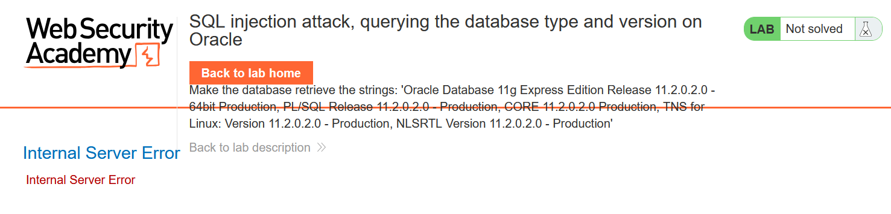
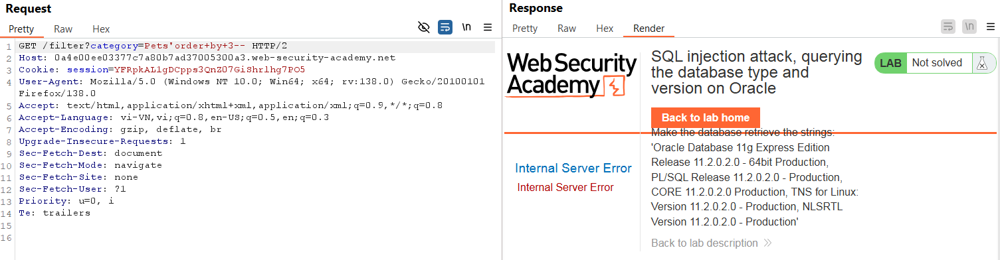
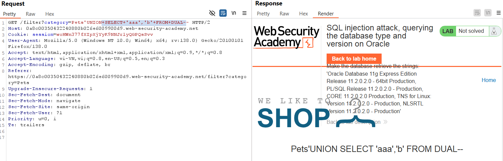
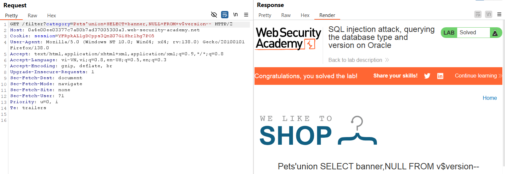

# Write-up: SQL injection attack, querying the database type and version on Oracle

### Tổng quan
Ghi lại quá trình khai thác SQLi để lấy thông tin phiên bản DB trong một lab của PortSwigger.

### Mục tiêu
Trích xuất thông tin phiên bản DB.

### Công cụ:
- BurpSuite Community
- Firefox Browser

### Các bước thực hiên
1. **Thu thập thông tin(Recon):**
- Kiểm tra tham số `category` trong URL (`filter?category=Pets`) và thêm dấu `'` để kích hoạt lỗi SQL:
  - **Kết quả:** lỗi SQL xuất hiện, xác nhận lỗ hổng
    

- Xác định số cột hiển thị trong chuỗi bằng:
  - Payload:
    ```
    'ORDER BY 3--
    ```
    -**Kết quả:** có 2 cột trong bảng
    

- Kiểm tra xem đây là loại DB nào
  - Payload:
    ```
    'UNION SELECT 'aaa','b' FROM DUAL--
    ```
    -**Kết quả:** DB là Oracle
    
    *note:Trong Oracle, DUAL là một bảng thật nằm trong     schema SYS.

2. **Tạo Payload:**
- Tạo payload kiểu tấn công UNION để trích xuất thông tin phiên bản của Oracle
    ```
    'UNION SELECT banner,NULL FROM v$version--
    ```
    - **Kết quả**
        

### Bài học rút ra
- Nâng cao kĩ năng UNION để trích xuất dữ liệu đa cột và lấy thông tin phiên bản.

### Tài liệu tham khảo
- PortSwigger: SQL Injection cheat sheet

### Kết luận
Lab này giúp tôi hoàn thiện kỹ năng SQL injection và sử dụng Burp Suite. Xem portfolio đầy đủ tại https://github.com/Furu2805/Lab_PortSwigger 

*Viết bởi Toàn Lương, Tháng 5/2025*.