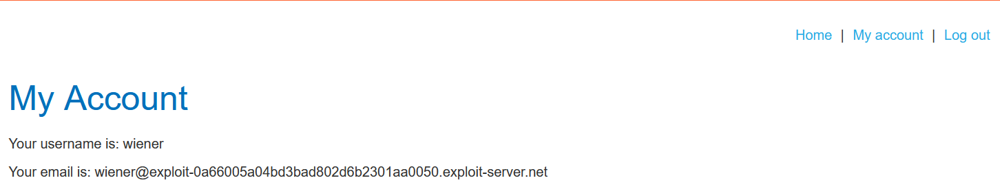
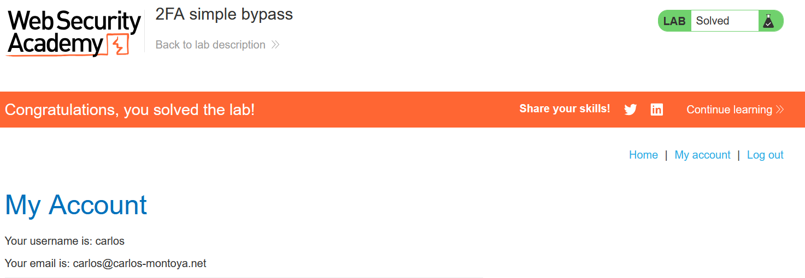

# write-up: 2FA simple bypass

### Tổng quan
Ghi lại quá trình khai thác lỗ hổng bypass cơ chế xác thực hai yếu tố (2FA) để đăng nhập vào tài khoản nạn nhân mà không cần mã xác thực.

### Thông tin đăng nhập:
- Tài khoản của bạn: wiener:peter
- Tài khoản nạn nhân: carlos:montoya

### Mục tiêu 
- Bypass cơ chế 2FA
- Đăng nhập vào tài khoản carlos

### Công cụ sử dụng
- Firefox Browser

### Quy trình khai thác
1. **Thu thập thông tin (Recon)**
- Đăng nhập bằng tài khoản `wiener`:`peter` trên trang cá nhân
- Sau khi đăng nhập đúng thông tin, ứng dụng yêu cầu mã 2FA, nhập code để xác nhận tài khoản 
- Sau khi đăng nhập thành công trình duyệt chuyển hướng đến URL:
    ```
    `web-security-academy.net/my-account?id=wiener` 
    ```
    đây là trang tài khoản của `wiener`
    

- **Phân tích**: Tham số id=wiener trong URL gợi ý rằng ứng dụng sử dụng tham số này để xác định tài khoản được truy cập. Điều này có thể là điểm yếu nếu ứng dụng không kiểm tra chặt chẽ quyền truy cập sau khi bỏ qua 2FA.
- **Kết luận**: Cơ chế 2FA có thể bị bypass nếu ứng dụng cho phép truy cập trực tiếp vào trang tài khoản thông qua tham số id mà không yêu cầu xác thực mã 2FA.

2. **Khai thác (Exploitation)**
- Đăng nhập bằng tài khoản `carlos`:`montoya` 
- Sau khi đăng nhập, thay vì nhập code 2FA trực tiếp sửa URL trong trình duyệt thành:
    ``` 
    my-account?id=carlos` 
    ```
 
- **Kết quả**: Truy cập thành công vào trang tài khoản của carlos mà không cần mã 2FA
    

- **Lý do**: Ứng dụng không kiểm tra xem mã 2FA đã được xác thực hay chưa trước khi cho phép truy cập trang tài khoản qua tham số `id`.

### Bài học rút ra
- Hiểu được lỗ hổng trong cơ chế 2FA khi ứng dụng không kiểm tra đầy đủ các bước xác thực.
- Nhận thức tầm quan trọng của việc kiểm tra quyền truy cập và xác thực tham số URL để ngăn chặn bypass trái phép.

### Tài liệu tham khảo
- PortSwigger: Two-factor authentication

### Kết luận
Lab này giúp tôi nắm rõ cách khai thác lỗ hổng bypass 2FA thông qua việc thao tác tham số URL và phân tích hành vi ứng dụng. Kỹ năng này nhấn mạnh tầm quan trọng của việc kiểm tra logic xác thực trong các hệ thống web. Xem portfolio đầy đủ tại https://github.com/Furu2805/Lab_PortSwigger 

*Viết bởi Toàn Lương, Tháng 5/2025*.
