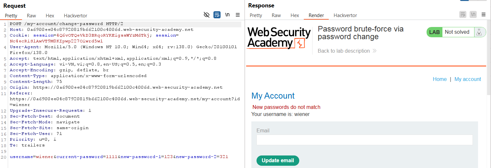
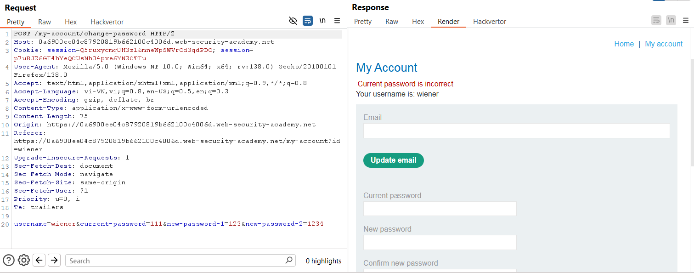
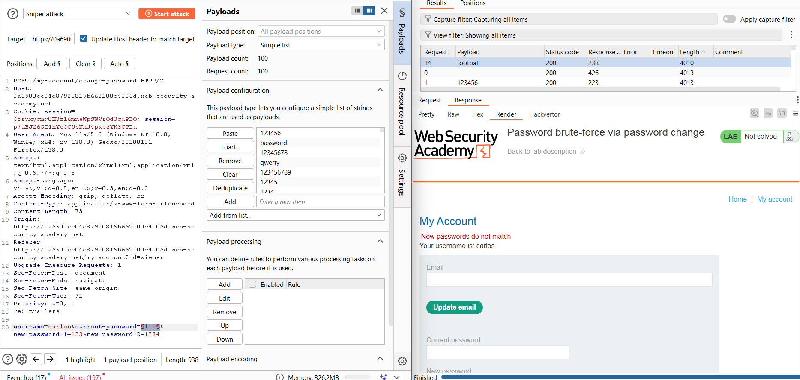
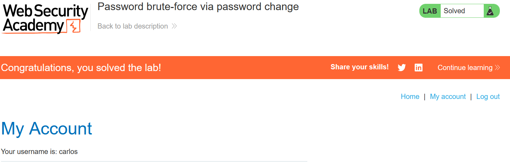

# Write-up: Password brute-force via password change

### Tổng quan
Ghi lại quá  trình khai thác lỗ hổng trong chức năng thay đổi mật khẩu để brute-force mật khẩu và đăng nhập vào tài khoản nạn nhân: `carlos`, sau đó đăng nhập vào tài khoản nạn nhân.

### Mục tiêu
- Brute-force mật khẩu của tài khoản `carlos` bằng cách khai thác chức năng thay đổi mật khẩu.
- Đăng nhập vào hệ thống bằng tài khoản nạn nhân

### Thông tin đăng nhập
- Tài khoản đăng nhập `wiener`:`peter`
- Tài khoản nạn nhân `carlos`

### Công cụ sử dụng
- Burpsuite Community
- Firefox Browser

### Quy trình khai thác 
1. **Thu thập thông tin (Recon)**
- Đăng nhập vào trang `/my-account` bằng tài khoản `wiener`:`peter`
- Kiểm tra chức năng thay đổi mật khẩu:
    - Nhập mật khẩu hiện tại (`peter`) đúng, nhưng hai trường `new password` không khớp
        - Phản hồi: `New passwords do not match`
            
    - Nhập mật khẩu hiện tại sai và hai trường `new password` không khớp. 
        - Phản hồi: `Current password is incorrect`
            
- **Phân tích**:  Ứng dụng trả về phản hồi khác nhau dựa trên tính đúng đắn của mật khẩu hiện tại:
    - Mật khẩu hiện tại đúng → `New passwords` do not match (vì new password không khớp).
    - Mật khẩu hiện tại sai → `Current password is incorrect.`
- **Kết luận**: Có thể brute-force mật khẩu của bất kỳ tài khoản nào (như `carlos`) bằng cách gửi yêu cầu thay đổi mật khẩu với username của họ và kiểm tra phản hồi.

2. **Brute-force mật khẩu**
- Bắt POST request gửi đến chức năng thay đổi mật khẩu `/my-account/change-password` bằng Burp Suite: 

- Sử dụng Burp Intruder để brute-force mật khẩu của carlos với danh sách [Candidate passwords](https://portswigger.net/web-security/authentication/auth-lab-passwords):
    - Cấu hình payload:
        - Đặt username=`carlos`.
        - Payload cho current-password=§111§
        - Giữ new-password-1 và new-password-2 không khớp để kích hoạt phản hồi.
        
    
    - **Kết quả**: Trả về mật khẩu `football`

3. **Khai thác (Exploitation)**
- Vào phần `/login` và đăng nhập `carlos`:`football` và hoàn thành lab
    

### Bài học rút ra
- Hiểu cách khai thác lỗ hổng trong chức năng thay đổi mật khẩu khi ứng dụng trả về phản hồi khác nhau dựa trên tính đúng đắn của mật khẩu hiện tại.
- Nhận thức tầm quan trọng của việc thiết kế cơ chế bảo vệ để phản hồi đồng đều, tránh rò rỉ thông tin nhạy cảm như mật khẩu.

### Tài liệu tham khảo
- PortSwigger: Authentication lab passwords

### Kết luận
Lab này giúp tôi rèn luyện kỹ năng phân tích lỗi logic trong chức năng thay đổi mật khẩu và sử dụng Burp Suite để brute-force mật khẩu dựa trên phản hồi khác nhau. Kỹ năng này nhấn mạnh tầm quan trọng của việc thiết kế cơ chế bảo mật chặt chẽ. Xem portfolio đầy đủ tại https://github.com/Furu2805/Lab_PortSwigger 

*Viết bởi Toàn Lương, Tháng 5/2025*.