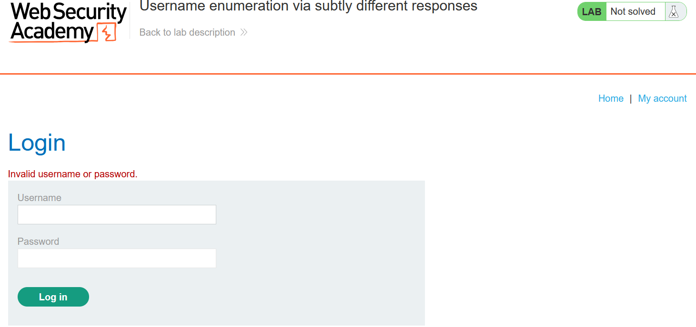
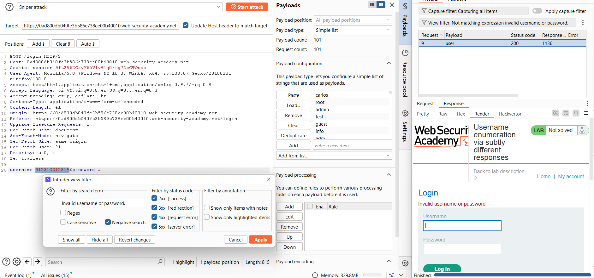
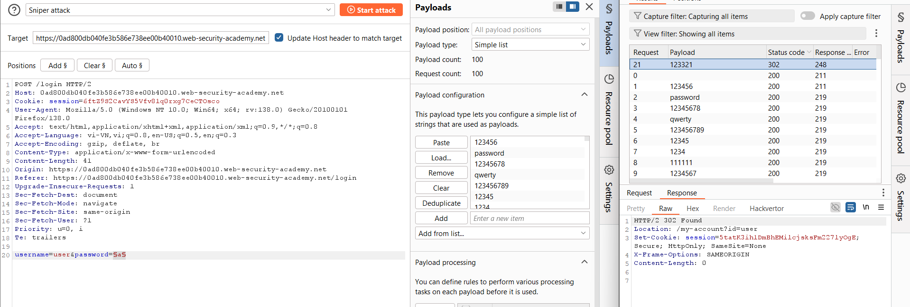
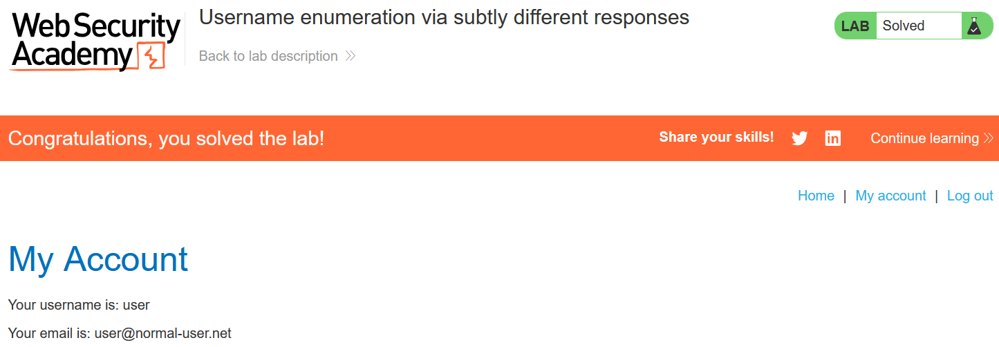

# Write-up: Username enumeration via subtly different responses

### Tổng quan
Ghi lại quá trình quá trình khai thách lỗ hổng liệt kê tên người dùng, sau đó brute-force mật khẩu để đăng nhập vào hệ thống

### Mục tiêu
- Xác định tên người dùng hợp lệ
- Brute-force mật khẩu của tài khoản
- Đăng nhập vào hệ thống dưới tên người dùng đó

### Công cụ sử dụng
- Burpsuite Community
- Firefox Browser

### Quy trình khai thác 
1. **Thu thập thông tin (Recon)**
- Quan sát phản hồi của ứng dụng khi nhập sai tên đăng nhập và mật khẩu
    
    - **Kết luận**: Lỗi `Invalid username or password.`
    

- **Phân tích**: Lỗi chung Invalid username or password không tiết lộ rõ username có hợp lệ hay không. Tuy nhiên, lab gợi ý có "sự khác biệt tinh vi" (subtle differences), như độ dài phản hồi, thời gian phản hồi, hoặc một dấu hiệu nhỏ trong nội dung. 

- Xác định username hợp lệ, gửi POST request qua Burp Intruder và thiết lập sử dụng danh sách [Candidate username](https://portswigger.net/web-security/authentication/auth-lab-usernames)
    
     - **Kết quả**: Xác nhận `username` = `user` hợp lệ
 
2. **Brute-force mật khẩu**
- Bruteforce mật khẩu của tài khaorn `antivirus` bằng danh sách mật khẩu [Candidate passwords](https://portswigger.net/web-security/authentication/auth-lab-passwords)
    
    - **Kết quả**: Xác nhận mật khẩu `123321`

3. **Khai thác (Exploitation)**
- Vào phần `/login` và đăng nhập `user` : `123321` và hoàn thành lab
    

### Bài học rút ra
- Hiểu cách khai thác lỗ hổng liệt kê username thông qua các dấu hiệu tinh vi trong phản hồi, như độ dài hoặc thời gian xử lý.
- Nhận thức tầm quan trọng của việc thiết kế ứng dụng để che giấu thông tin nhạy cảm, tránh để lộ username hợp lệ.

### Tài liệu tham khảo
- PortSwigger: Authentication lab usernames
- PortSwigger: Authentication lab passwords

### Kết luận
Lab này giúp tôi rèn luyện kỹ năng phân tích phản hồi ứng dụng để phát hiện sự khác biệt tinh vi và sử dụng công cụ như Burp Suite để khai thác lỗ hổng liệt kê username và brute-force mật khẩu. Xem portfolio đầy đủ tại https://github.com/Furu2805/Lab_PortSwigger 

*Viết bởi Toàn Lương, Tháng 5/2025*.