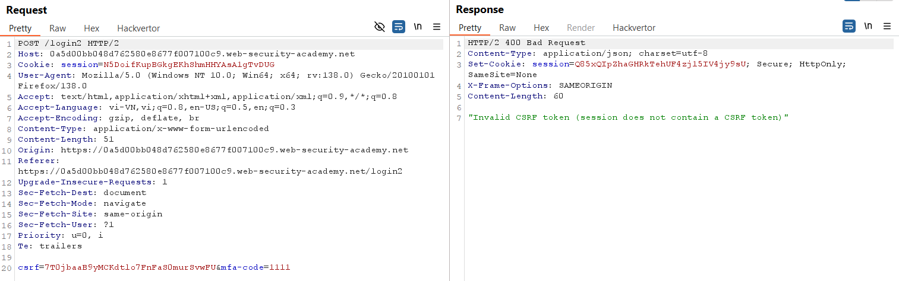
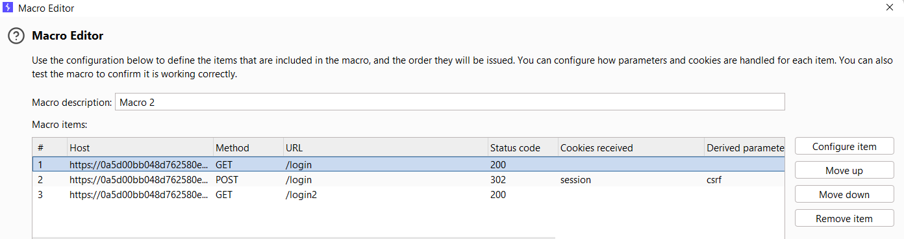
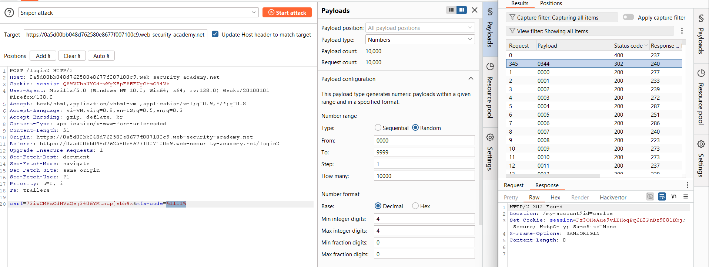
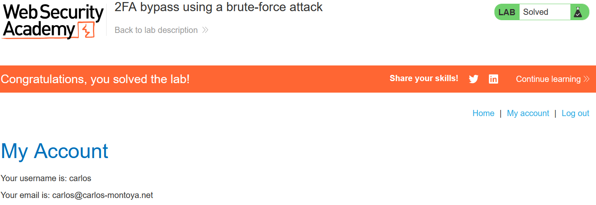

# Write-up: 2FA bypass using a brute-force attack

### Tổng quan
Khai thác lỗ hổng trong cơ chế xác thực hai yếu tố (2FA) bằng cách brute-force mã MFA của tài khoản carlos, vượt qua hạn chế reset token để đăng nhập và truy cập trang tài khoản.

### Mục tiêu
- Brute-force mã MFA 4 chữ số của `carlos`.
- Đăng nhập và truy cập trang "My account" của `carlos`.

### Thông tin đăng nhập
- Tài khoản nạn nhân: carlos:montoya

### Công cụ sử dụng
- Burp Suite Community
- Firefox Browser

### Quy trình khai thác
1. **Thu thập thông tin (Recon)**
- Đăng nhập với `carlos`:`montoya`, truy cập `/login2` để nhập mã MFA.
    - Thử gửi nhiều lần với mã MFA sai, nhận thông báo lỗi:
        
    - **Phân tích**: Web reset token MFA sau vài lần gửi sai (thường sau 2 lần), yêu cầu đăng nhập lại để nhận token mới.

2. **Cấu hình macro để tự động đăng nhập (Preparation)**
- Trong Burp Suite, tạo macro để tự động đăng nhập lại `carlos` trước mỗi yêu cầu brute-force:
    - Vào **Settings > Sessions > Session Handling Rules > Add**.
    - Scope: **Include all URLs**.
    - Rule Action: **Run a macro**.
    - Chọn 3 yêu cầu:
        ```
        GET /login
        POST /login
        GET /login2
        ```
    - Test macro: Xác nhận phản hồi cuối chứa trang yêu cầu mã MFA 4 chữ số. 
        
- **Kết quả**: Macro tự động đăng nhập lại, lấy token MFA mới trước mỗi yêu cầu brute-force.

3. **Brute-force mã MFA (Exploitation)**
- Gửi yêu cầu `POST /login2` tới Burp Intruder
- Cấu hình Intruder:
    - Payload position: `mfa-code=§code§`.
    - Payload type: Numbers, range `0000-9999`, step `1`, min/max digits `4`.
    - Resource pool: **Maximum concurrent requests** = 1 (để tránh gửi quá nhanh, gây reset token).
- Chạy tấn công:
    - Nếu token reset (lỗi "Token does not exist"), macro tự động đăng nhập lại để lấy token mới.
    - Kiểm tra phản hồi: Mã đúng trả về HTTP 302 Found.
- **Kết quả**: Tìm được mã MFA đúng và đăng nhập thành công vào tài khoản `carlos`
    
    

### Bài học rút ra
- Hiểu cách brute-force mã MFA khi cơ chế 2FA không giới hạn số lần thử.
- Nhận thức tầm quan trọng của việc giới hạn số lần thử và bảo vệ token MFA.

### Tài liệu tham khảo
- PortSwigger: Authentication vulnerabilities

### Kết luận
Lab này giúp tôi nắm rõ cách bypass 2FA bằng brute-force mã MFA, sử dụng Burp Suite macro để xử lý reset token và Intruder để tìm mã đúng.  Xem portfolio đầy đủ tại https://github.com/Furu2805/Lab_PortSwigger 

*Viết bởi Toàn Lương, Tháng 5/2025*.