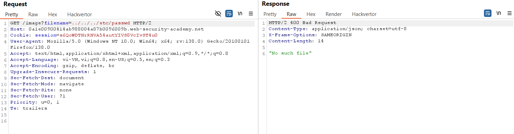
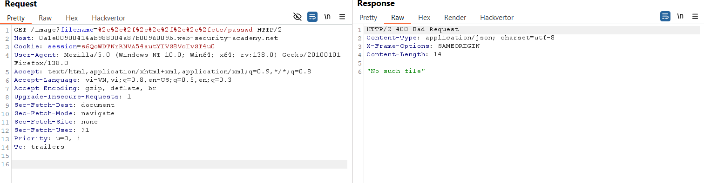
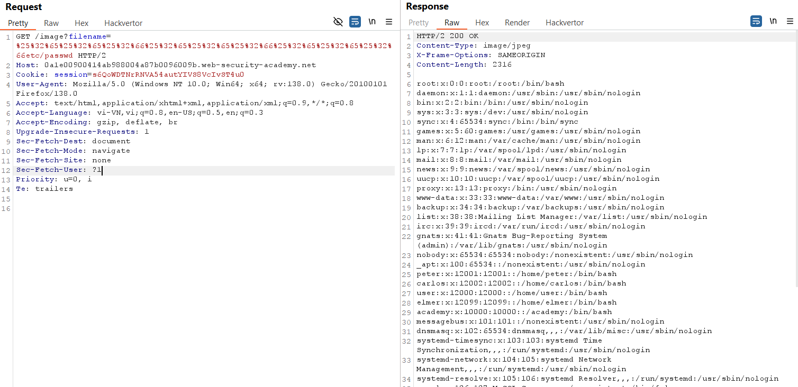

# Write-up: File path traversal, traversal sequences stripped with superfluous URL-decode

### Tổng quan
Khai thác lỗ hổng file path traversal trong chức năng hiển thị hình ảnh, bypass cơ chế lọc và URL-decode bằng cách mã hóa hai lần chuỗi `../` để lấy nội dung tệp `/etc/passwd`.

### Mục tiêu
- Lấy nội dung tệp `/etc/passwd` bằng cách thao túng tham số filename với mã hóa hai lần.

### Công cụ sử dụng
- Burp Suite Community
- Firefox Browser

### Quy trình khai thác
1. **Thu thập thông tin (Reconnaissance)**
- Click chuột phải vào hình ảnh sản phẩm, chọn **Open image in new tab**.
    - Nhận đường dẫn: `https://lab-id.web-security-academy.net/image?filename=45.jpg`

- Trong Burp Proxy HTTP History, gửi yêu cầu `GET /image?filename=45.jpg` tới Repeater.
- Sửa tham số `filename=../../../etc/passwd` và gửi:
    - **Kết quả**: nhận phản hồi `No such file`
        

- Thử mã hóa `../` thành `%2e%2e%2f`:
    - **Kết quả**: Vẫn nhận lỗi `No such file`.
        

- **Phân tích**: Ứng dụng lọc hoặc decode input, có thể decode URL trước khi kiểm tra, cho phép bypass bằng mã hóa hai lần.

2. **Khai thác (Exploitation)**
- Mã hóa hai lần chuỗi `../` (`%2e%2e%2f` thành `%25%32%65%25%32%65%25%32%66`) và gửi yêu cầu trong Repeater:
    
    - **Kết quả**: Ứng dụng decode hai lần, trả về `../../../etc/passwd`, cho phép đọc nội dung tệp `/etc/passwd`, hoàn thành lab:

### Bài học rút ra
- Hiểu cách bypass cơ chế lọc traversal sequences bằng mã hóa URL hai lần.
- Nhận thức tầm quan trọng của việc kiểm tra và xử lý input trước khi decode URL.

### Tài liệu tham khảo
- PortSwigger: File path traversal

### Kết luận
Lab này giúp tôi nắm rõ cách bypass cơ chế lọc traversal sequences với mã hóa hai lần, sử dụng Burp Suite để lấy nội dung tệp `/etc/passwd`. Xem portfolio đầy đủ tại https://github.com/Furu2805/Lab_PortSwigger.

*Viết bởi Toàn Lương, Tháng 5/2025.*