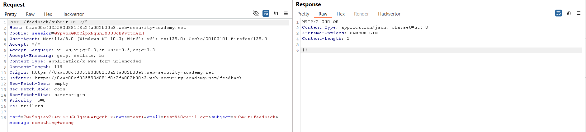
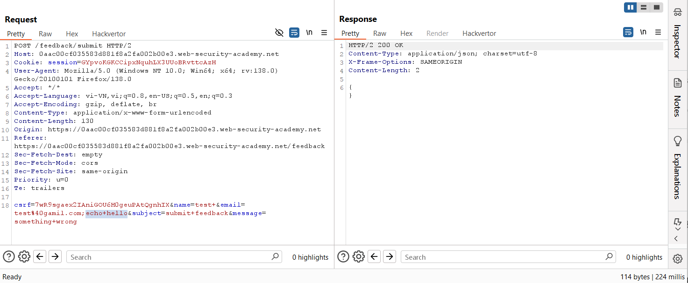
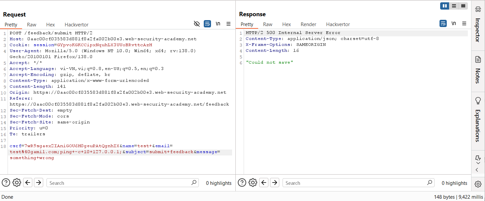
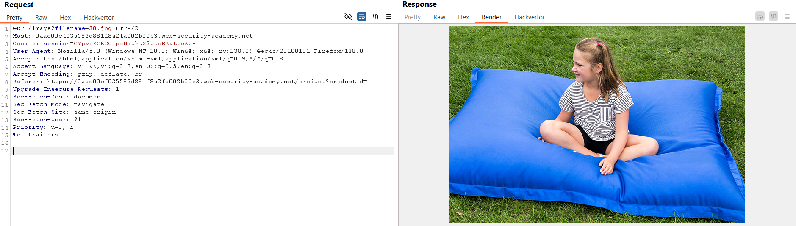
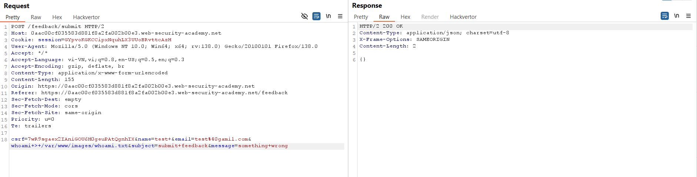
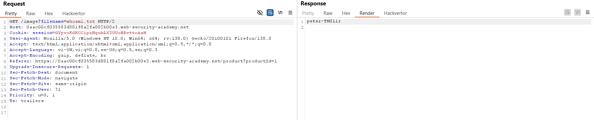
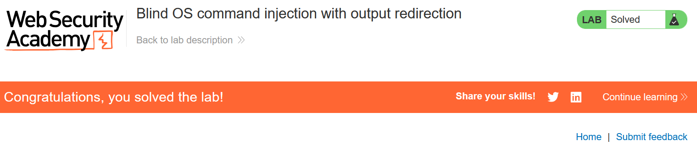

# Write-up: Blind OS command injection with output redirection

### Tổng quan
Khai thác lỗ hổng blind OS command injection trong chức năng feedback, sử dụng kỹ thuật output redirection để ghi kết quả lệnh `whoami` vào tệp và truy xuất nội dung qua URL tải hình ảnh.
### Mục tiêu
- Thực thi lệnh `whoami` và lấy output từ tệp được ghi trong thư mục `/var/www/images/`.

### Công cụ sử dụng
- Burp Suite Community
- Firefox Browser 

### Quy trình khai thác
1. **Thu thập thông tin (Reconnaissance)**
- Gửi feedback bất kỳ, bắt yêu cầu POST tới `/feedback/submit` trong Burp Proxy HTTP History:
    - Gửi yêu cầu này tới Repeater để thử nghiệm.
    
- Thử chèn lệnh `echo` vào tham số `email`: `email=test%40gamil.com;echo hello`
    - **Kết quả**: không nhận được nội dung trong phản hồi, nghi ngờ blind OS command injection
        

- Xác nhận lỗ hổng bằng lệnh gây độ trễ: `email=test%40gamil.com;ping -c 10 127.0.0.1;`
    - Gửi yêu cầu, nhận phản hồi sau 10 giây, xác nhận blind OS command injection.
        

-  Click chuột phải vào hình ảnh sản phẩm, chọn **Open image in new tab**.
    - Nhận đường dẫn: `https://lab-id.web-security-academy.net/image?filename=30.jpg`
        
    - Xác nhận file ảnh được lưu trong đường dẫn `/var/www/images/`

2. **Khai thác (Exploitation)**
- Dùng kỹ thuật redirection để ghi output lệnh `whoami` vào `/var/www/images/whoami.txt`:
    ```
    email=test%40gamil.com&whoami > /var/www/images/whoami.txt&
    ```
- Gửi yêu cầu trong Repeater:
    - **Kết quả**: Nhận phản hồi `"Could not save"` sau khoảng 10 giây, xác nhận lệnh `ping -c 10 127.0.0.1` được thực thi, hoàn thành lab:
        

- Sửa tham số `filename` trong GET request `/image?filename=whoami.txt` và lấy được nội dung lệnh `whoami`: `peter-TN0lir` và hoành thành lab 
    
    

### Bài học rút ra
- Hiểu cách khai thác blind OS command injection bằng output redirection khi không có output trực tiếp.
- Nhận thức tầm quan trọng của việc kiểm tra dữ liệu người dùng và bảo vệ thư mục ghi trong ứng dụng.

### Tài liệu tham khảo
- PortSwigger: OS command injection

### Kết luận
Lab này cung cấp kinh nghiệm thực tiễn trong việc khai thác blind OS command injection, sử dụng output redirection để ghi và truy xuất kết quả lệnh `whoami`. Xem portfolio đầy đủ tại https://github.com/Furu2805/Lab_PortSwigger.

*Viết bởi Toàn Lương, Tháng 5/2025.*