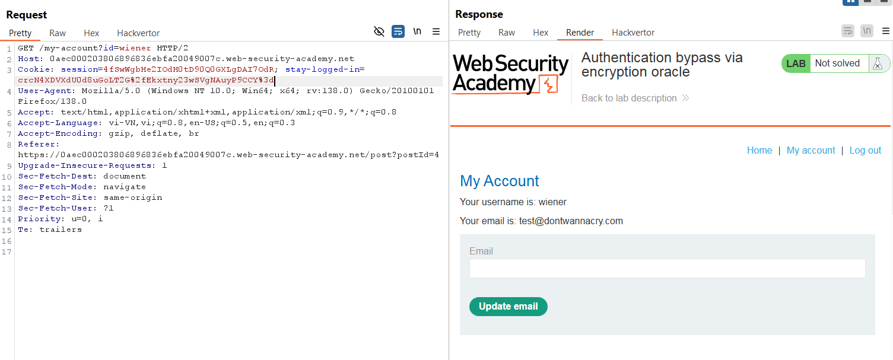
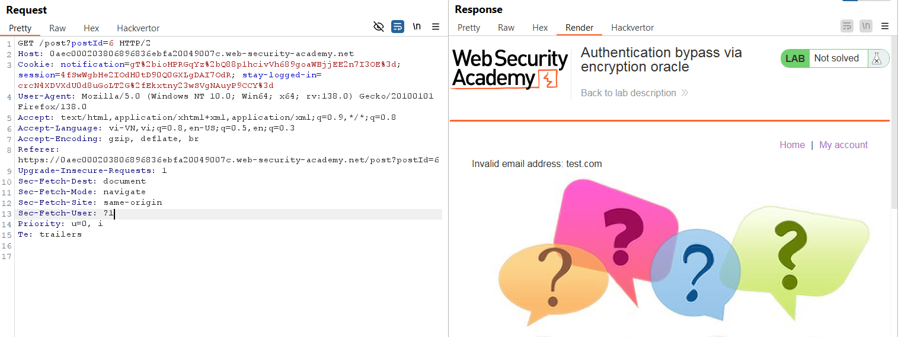
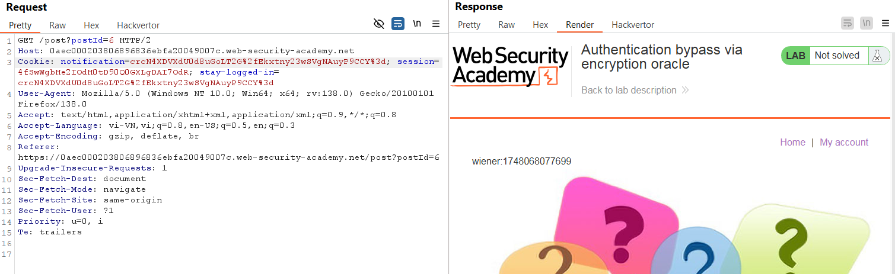
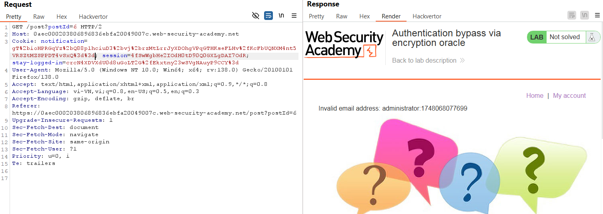
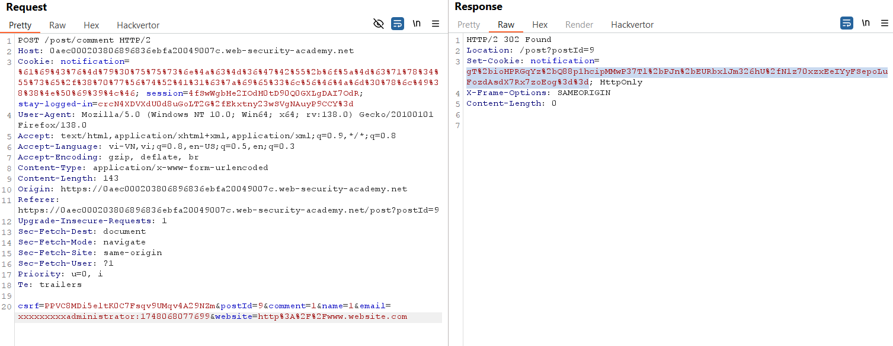
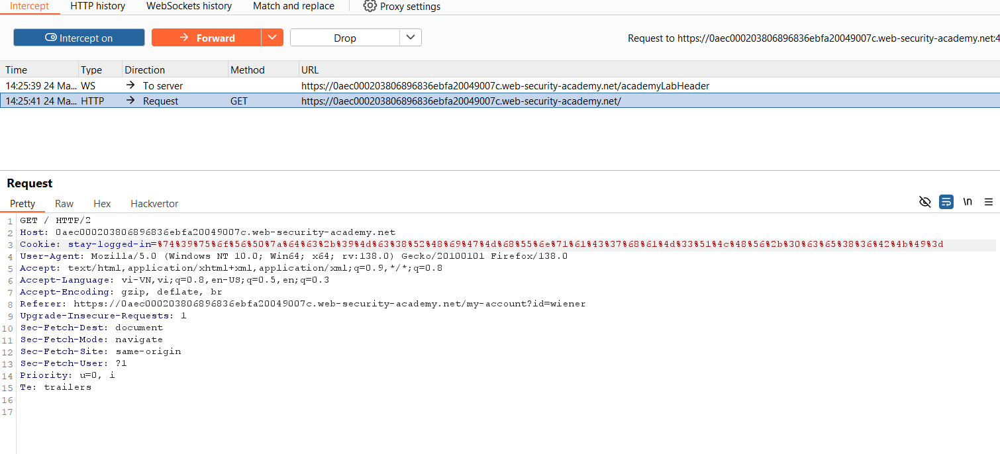
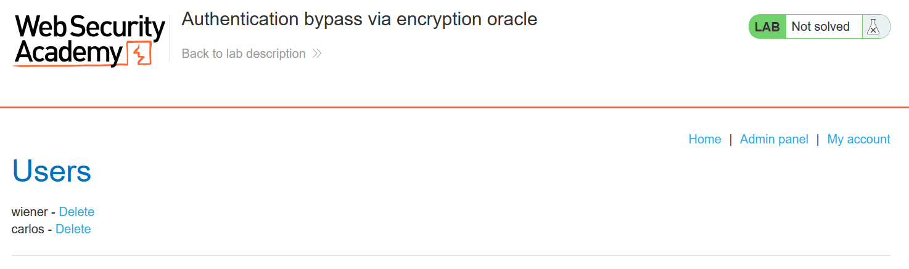
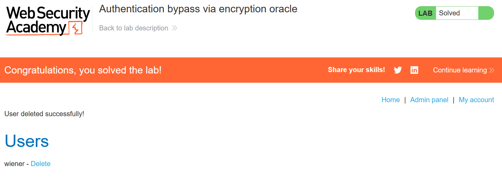

# Write-up: Authentication bypass via encryption oracle

### Tổng quan
Khai thác lỗ hổng logic trong cơ chế mã hóa cookie, lợi dụng chức năng bình luận để mã hóa và giải mã dữ liệu tùy ý, tạo cookie `stay-logged-in` cho tài khoản `administrator`, truy cập admin panel và xóa tài khoản `carlos`

### Mục tiêu
- Truy cập tài khoản admin panel và xóa tài khoản `carlos`

### Công cụ sử dụng
- Burp Suite Community
- Firefox Browser

### Quy trình khai thác
1. **Thu thập thông tin (Reconnaissance)**
- Đăng nhập vào tài khoản `wiener`:`peter` với tùy chọn "Stay logged in"
    
    - Nhận cookie `stay-logged-in=crcN4XDVXdU0d8uGoLT2G%2fEkxtny23wSVgNAuyP9CCY%3d`

- Đăng bình luận với email không hợp lệ
    - Phản hồi chuyển hướng đến `/post?postId=6` và đặt `notification=gT%2bioHPRGqYz%2bQ88p1hcivVh689goaWBjjEE2n7I3OE%3d`
    - **Nhận lỗi**: `Invalid email address: test.com`, suy ra notification chứa email mã hóa
        

- Gửi `POST /post/comment` và `GET /post?postId=6` đến Repeater, đặt tên tab là `encrypt` và `decrypt`

2. **Khai thác (Exploitation)**
- Trong tab `decrypt` thay cookie `notification` bằng cookie `stay-logged-in` của `wiener`:
    - **Phản hồi**: `wiener`:`1748068077699`, tiết lộ định dạng `username`:`timestamp`
        

- Trong tab `encrypt`, mã hóa `administrator:1748068077699`
    - Lấy cookie notification từ phản hồi `gT%2bioHPRGqYz%2bQ88p1hciuD3%2bvj%2brzMtLrrJyXDOhgVPqGTHKseFLHv%2fKcFbUQNXM4nt5VRSZtMZSPPDT4vSxQ%3d%3d`.

- Trong tab `decrypt`, thử giải mã cookie `notification` mới:
    - **Phản hồi**: `Invalid email address: administrator:1748068077699`, có tiền tố 23 ký tự
        

- Trong Burp Decoder, giải mã URL và Base64 cookie `notification`, xóa 23 byte đầu (tiền tố), mã hóa lại
    - **Kết quả**: lỗi `Input length must be multiple of 16` do độ dài không chia hết cho block 16 byte
        

- Trong tab `encrypt`, thêm 9 ký tự x vào đầu để tổng tiền tố (23 + 9 = 32 byte) chia hết cho 16
    - Lấy cookie `notification` mới (`gT%2bioHPRGqYz%2bQ88p1hcipMMwP37Tl%2bPJn%2bEURbxlJm326hU%2fN1z70xzxEeIYyFSepoLuFozdAsdX7Rx7zoEog%3d%3d`)
        

- Trong Decoder, giải mã URL và Base64, xóa 32 byte đầu, mã hóa lại và dùng trong tab decrypt
    - **Phản hồi**: `administrator:1748068077699`, không còn tiền tố

- Gửi `GET /` với cookie `stay-logged-in` mới, xóa cookie `session` bằng burp intercept
    
    - **Kết quả**: Đăng nhập với tư cách administrator, admin panel tại /admin xuất hiện:
        

- Xóa tài khoản `carlos` và hoàn thành lab
    

### Bài học rút ra
- Hiểu cách khai thác lỗ hổng logic khi ứng dụng để lộ cơ chế mã hóa/giải mã dữ liệu nhạy cảm.
- Nhận thức tầm quan trọng của việc bảo vệ dữ liệu mã hóa và kiểm tra đầu vào phía server.

### Tài liệu tham khảo
- PortSwigger: Business logic vulnerabilities

### Kết luận
Lab này cung cấp kinh nghiệm thực tiễn trong việc khai thác lỗ hổng mã hóa, sử dụng Burp Repeater và Decoder để tạo cookie admin và xóa tài khoản. Xem portfolio đầy đủ tại https://github.com/Furu2805/Lab_PortSwigger.

*Viết bởi Toàn Lương, Tháng 5/2025.*