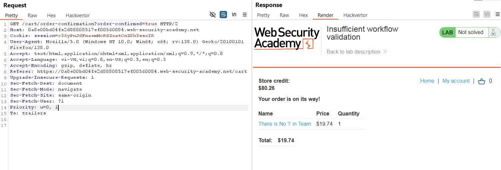

# Write-up: Insufficient workflow validation

### Tổng quan
Khai thác lỗ hổng logic trong quy trình mua hàng, lợi dụng việc thiếu xác thực thứ tự các bước để gửi yêu cầu xác nhận đơn hàng trước khi thanh toán, cho phép mua `Lightweight l33t Leather Jacket` mà không trừ store credit.

### Mục tiêu
- Mua sản phẩm `Lightweight l33t Leather Jacket` bằng cách khai thác lỗi quy trình.

### Công cụ sử dụng
- Burp Suite Community
- Firefox Browser

### Quy trình khai thác
1. **Thu thập thông tin (Reconnaissance)**
- Đăng nhập vào tài khoản `wiener`:`peter`.
- Mua một món đồ bất kỳ có giá trong phạm vi store credit (100$):
    - Thêm món đồ vào giỏ hàng, thanh toán và quan sát Burp Proxy HTTP History thấy yêu cầu POST /cart/checkout chuyển hướng đến trang xác nhận đơn hàng:
        
    - Gửi yêu cầu GET này tới Repeater để thử nghiệm:

2. **Khai thác (Exploitation)**
- Thêm sản phẩm Lightweight l33t Leather Jacket vào giỏ hàng:
- Trong Repeater, gửi lại yêu cầu `GET /cart/order-confirmation?order-confirmed=true`:
    - **Kết quả**: Đơn hàng được hoàn tất, Lightweight l33t Leather Jacket được mua mà không trừ credit, hoàn thành lab:
        

### Bài học rút ra
- Hiểu cách khai thác lỗ hổng logic khi ứng dụng không xác thực thứ tự các bước trong quy trình.
- Nhận thức tầm quan trọng của việc kiểm tra trạng thái và thứ tự yêu cầu phía server.

### Tài liệu tham khảo
- PortSwigger: Business logic vulnerabilities

### Kết luận
Lab này cung cấp kinh nghiệm thực tiễn trong việc khai thác lỗ hổng quy trình, sử dụng Burp Suite để bỏ qua bước thanh toán và mua hàng thành công. Xem portfolio đầy đủ tại https://github.com/Furu2805/Lab_PortSwigger.

*Viết bởi Toàn Lương, Tháng 5/2025.*