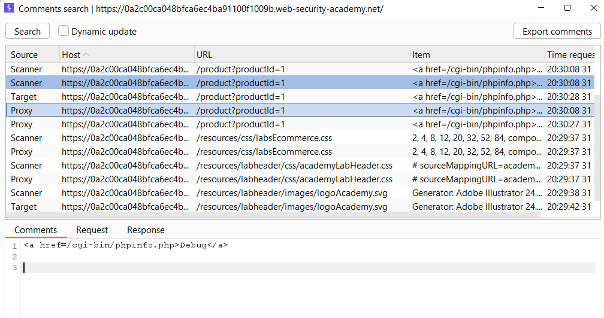
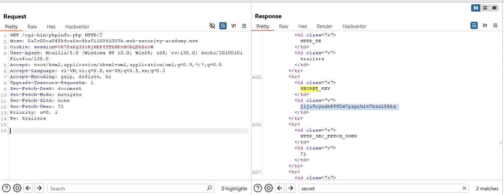
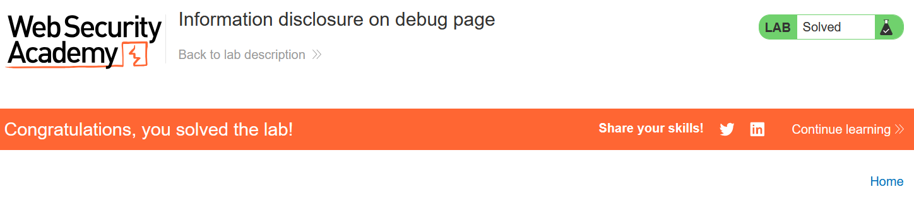

# Write-up: Information disclosure on debug page

### Tổng quan
Khai thác lỗ hổng rò rỉ thông tin trên trang debug bị bỏ quên, sử dụng engagement tools để tìm bình luận tiết lộ đường dẫn, truy cập trang debug và thu thập biến môi trường `SECRET_KEY` để hoàn thành lab.

### Mục tiêu
- Xác định và submit giá trị của biến môi trường `SECRET_KEY`.

### Công cụ sử dụng
- Burp Suite Pro
- Firefox Browser

### Quy trình khai thác
1. **Thu thập thông tin (Reconnaissance)**
- Sử dụng `Engagement Tools` trong Burp Suite, chọn tính năng `Find Comments` để tìm bình luận trong mã nguồn các trang web:
    - Tìm thấy bình luận đề cập đến một trang debug còn sót lại `<a href=/cgi-bin/phpinfo.php>Debug</a>`
        

- Truy cập trang debug tại `/cgi-bin/phpinfo.php` 
    - Trang debug hiển thị thông tin nhạy cảm, bao gồm biến môi trường `SECRET_KEY` : `j1jo9oyxsb4992w7pzgrhlt7bzx154kz`
        
    - **Giải thích**: Trang debug, thường dùng để kiểm tra trong quá trình phát triển, bị bỏ quên và không được bảo vệ, dẫn đến rò rỉ thông tin nhạy cảm như `SECRET_KEY`

2. **Khai thác (Exploitation)**
- Submit `SECRET_KEY` và hoàn thành lab
    

### Bài học rút ra
- Hiểu cách khai thác thông tin nhạy cảm từ các trang debug còn sót lại.
- Nhận thức tầm quan trọng của việc vô hiệu hóa hoặc bảo vệ các trang debug trong môi trường production.

### Tài liệu tham khảo
PortSwigger: Information disclosure

### Kết luận
Lab này cung cấp kinh nghiệm thực tiễn trong việc tìm kiếm và khai thác rò rỉ thông tin từ trang debug, sử dụng Burp Suite để thu thập SECRET_KEY và hoàn thành mục tiêu. Xem portfolio đầy đủ tại https://github.com/Furu2805/Lab_PortSwigger.

*Viết bởi Toàn Lương, Tháng 5/2025.*