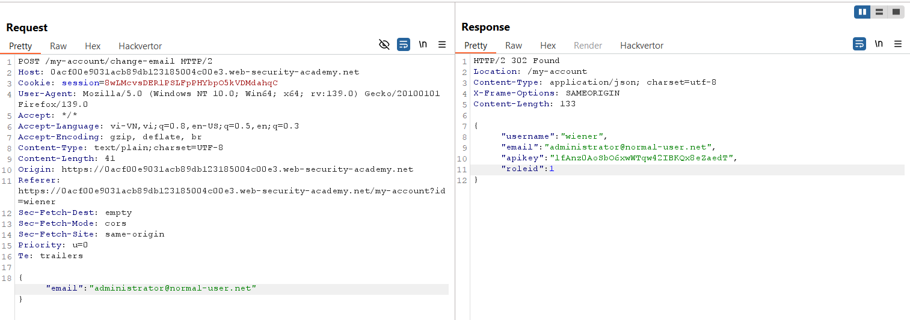
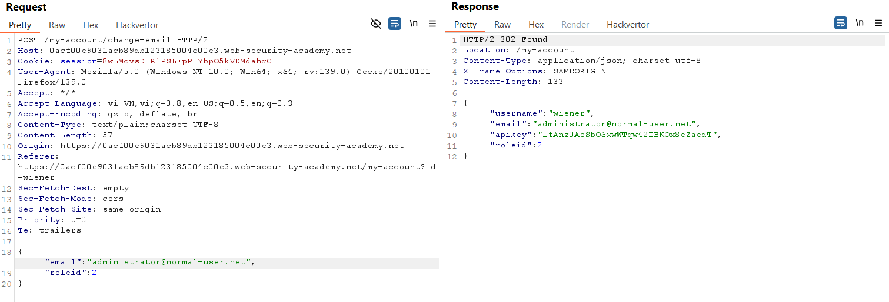
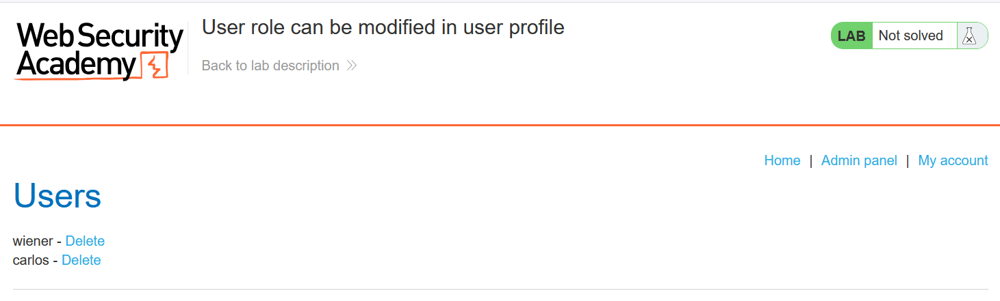
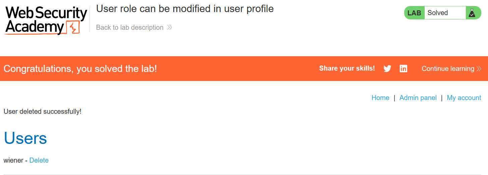

# Write-up: User role can be modified in user profile

### Tổng quan
Khai thác lỗ hổng cho phép sửa đổi vai trò người dùng qua JSON trong yêu cầu cập nhật email, thay đổi `roleid` thành 2 để truy cập admin panel tại `/admin` và xóa tài khoản `carlos`.

### Mục tiêu
- Truy cập admin panel và xóa tài khoản `carlos`.

### Công cụ sử dụng
- Burp Suite Community
- Firefox Browser

### Quy trình khai thác
1. **Thu thập thông tin (Reconnaissance)**
- Đăng nhập với tài khoản `wiener`:`peter` rồi truy cập trang tài khoản người dùng (`/my-account`) 

- Sử dụng chức năng cập nhật email trên trang tài khoản, gửi yêu cầu bằng Burp Suite:
    - Phản hồi chứa thông tin vai trò:
        

- **Giải thích**: Ứng dụng trả về `roleid=1` (người dùng thường), gợi ý rằng `roleid=2` là vai trò admin theo yêu cầu lab.

2. **Khai thác (Exploitation)**
- Trong Burp Repeater, sửa yêu cầu cập nhật email, thêm `roleid:2` vào JSON:
    - Phản hồi xác nhận roleid đã thay đổi thành 2:
        

- Truy cập admin panel tại `/admin`:
    - **Kết qu**ả: Truy cập thành công admin panel:
        

- Xóa tài khoản `carlos` và hoàn thành lab
    

- **Giải thích**: Ứng dụng không kiểm tra quyền khi xử lý tham số `roleid` trong JSON, cho phép người dùng nâng cấp vai trò thành `admin`.

### Bài học rút ra
- Hiểu cách khai thác lỗ hổng kiểm soát quyền truy cập qua tham số JSON có thể sửa đổi.
- Nhận thức tầm quan trọng của việc xác thực vai trò người dùng phía server để ngăn chặn leo thang đặc quyền.

### Tài liệu tham khảo
- PortSwigger: Access control vulnerabilities

### Kết luận
Lab này cung cấp kinh nghiệm thực tiễn trong việc khai thác lỗ hổng kiểm soát vai trò qua JSON, sử dụng Burp Repeater để nâng quyền admin và xóa tài khoản mục tiêu. Xem portfolio đầy đủ tại https://github.com/Furu2805/Lab_PortSwigger.

*Viết bởi Toàn Lương, Tháng 6/2025.*