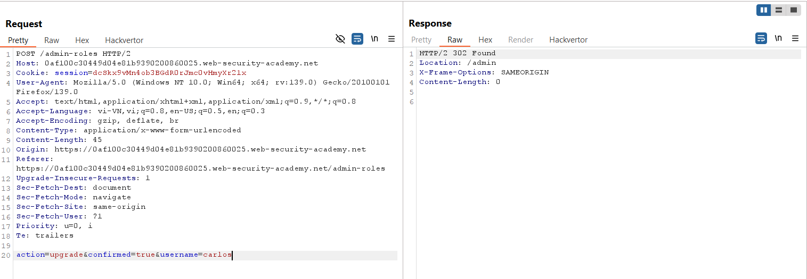
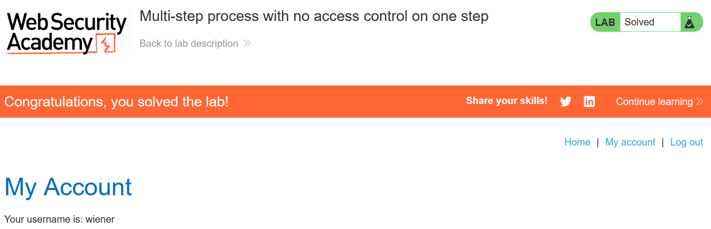

# Write-up: Multi-step process with no access control on one step

### Tổng quan
Khai thác lỗ hổng kiểm soát truy cập dựa trên header `Referer`, sử dụng tài khoản admin để xác định cơ chế nâng quyền, sau đó dùng tài khoản `wiener` để giả mạo cookie session và header `Referer` nhằm nâng quyền admin.

### Mục tiêu
- Nâng quyền tài khoản `wiener` thành `admin`.

### Công cụ sử dụng
- Burp Suite Community
- Firefox Browser

### Quy trình khai thác
1. **Thu thập thông tin (Reconnaissance)**
- Đăng nhập với tài khoản `administrator`:`admin`
- Truy cập admin panel và sử dụng chức năng nâng quyền tài khoản `carlos`:
    - Phản hồi xác nhận nâng quyền thành công:
        

- **Quan sát**: Yêu cầu POST đến `/admin/upgrade` yêu cầu header `Referer` trỏ đến `/admin`, gợi ý ứng dụng kiểm soát truy cập dựa trên `Referer`

- Đăng nhập lại với tài khoản `wiener`:`peter`:
    - Ghi lại cookie session của wiener

2. **Khai thác (Exploitation)**
- Trong Burp Repeater, gửi lại yêu cầu nâng quyền từ tài khoản admin, nhưng thay cookie session bằng cookie của wiener, sửa `username=carlos` thành `username=wiener`, và thêm header `Referer`: `https://lab-id.web-security-academy.net/admin`
    - **Kết quả**: Tài khoản wiener được nâng quyền thành admin và hoàn thành lab
        
    - **Giải thích**: Ứng dụng chỉ kiểm tra header `Referer` để xác nhận yêu cầu đến từ admin panel, nhưng không xác thực vai trò admin thực sự, dẫn đến lỗ hổng leo thang đặc quyền dọc.

### Bài học rút ra
- Hiểu cách khai thác lỗ hổng kiểm soát truy cập dựa trên header `Referer`.
- Nhận thức tầm quan trọng của việc xác thực vai trò người dùng phía server, không phụ thuộc vào các header có thể giả mạo.

### Tài liệu tham khảo
- PortSwigger: Access control vulnerabilities

### Kết luận
Lab này cung cấp kinh nghiệm thực tiễn trong việc khai thác lỗ hổng kiểm soát truy cập dựa trên header Referer, sử dụng Burp Repeater để giả mạo yêu cầu và nâng quyền admin. Xem portfolio đầy đủ tại https://github.com/Furu2805/Lab_PortSwigger.

*Viết bởi Toàn Lương, Tháng 6/2025.*