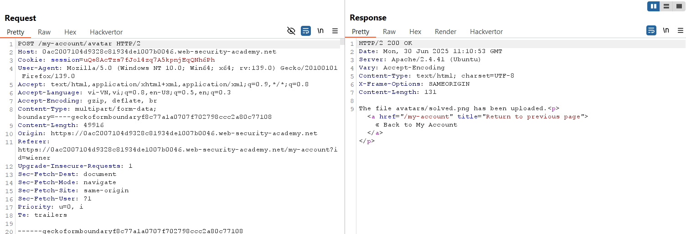
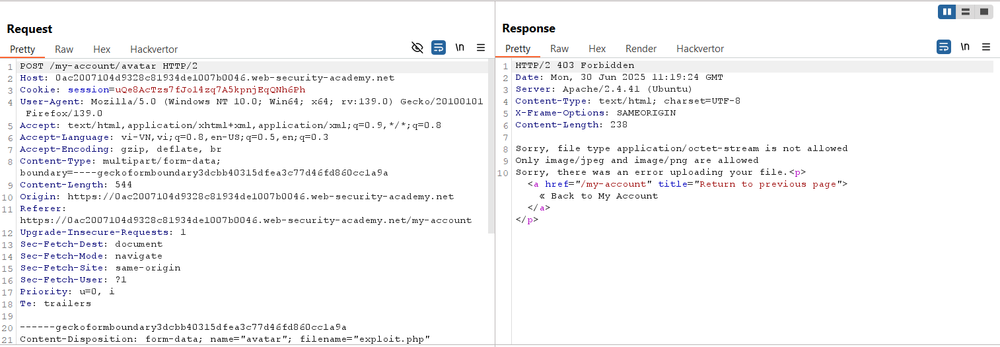
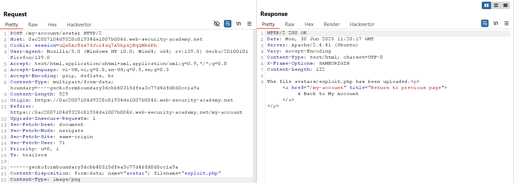
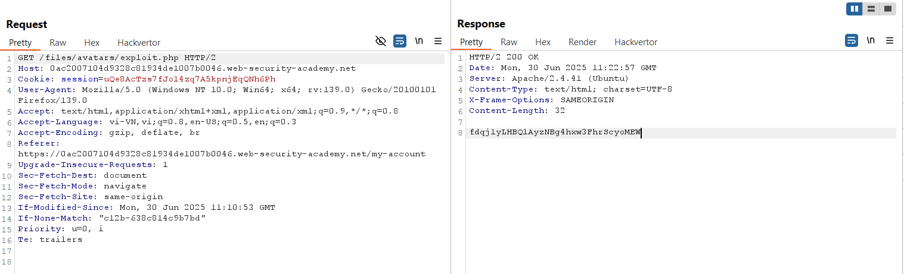
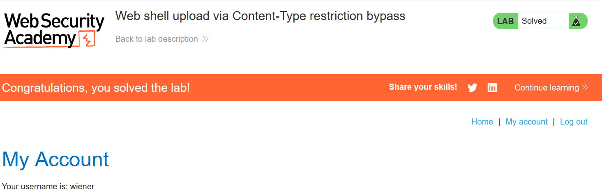

# Write-up: Web shell upload via Content-Type restriction bypass

### Tổng quan
Khai thác lỗ hổng trong chức năng upload file avatar, bypass kiểm tra `Content-Type` để upload file web shell PHP, thực thi mã để đọc nội dung file `/home/carlos/secret` và submit secret để hoàn thành lab.

### Mục tiêu
- Upload web shell PHP, đọc nội dung file `/home/carlos/secret`, và submit secret.

### Công cụ sử dụng
- Burp Suite Community
- Firefox Browser

### Quy trình khai thác 
1. **Thu thập thông tin (Reconnaissance)**
- Đăng nhập với tài khoản `wiener`:`peter`
- Truy cập chức năng upload avatar , upload một file ảnh hợp lệ  `solved.png`
    
    - Xem ảnh tại `/files/avatars/solved.png`:

- Thử upload file web shell `exploit.php` với nội dung:
    
    - **Phản hồi**: Server từ chối do `Content-Type: application/octet-stream`
    

2. **Khai thác (Exploitation)**
- Trong Burp Repeater, sửa `Content-Type` của file `exploit.php` thành `image/png`
    - **Kết quả**: File `exploit.php` được upload thành công
        

- Truy cập file web shell để thực thi mã:
    - Phản hồi trả về nội dung file `/home/carlos/secret`: 
        ```    
        fdqj1yLHBQ1AyzNBg4hxw3FhrScyoMEW
        ```
        
    - **Giải thích**: Server chỉ kiểm tra `Content-Type`, không xác thực nội dung file, dẫn đến lỗ hổng upload file độc hại và thực thi mã từ xa (RCE).

- Submit secret và hoàn thành lab
    

### Bài học rút ra
- Hiểu cách khai thác lỗ hổng upload file bằng cách bypass kiểm tra `Content-Type`
- Nhận thức tầm quan trọng của việc kiểm tra nội dung file và giới hạn loại file được upload để ngăn chặn thực thi mã từ xa.

### Tài liệu tham khảo
- PortSwigger: File upload vulnerabilities

### Kết luận
Lab này cung cấp kinh nghiệm thực tiễn trong việc khai thác lỗ hổng upload file, sử dụng Burp Repeater để bypass kiểm tra `Content-Type`, upload web shell PHP và đọc file bí mật. Xem portfolio đầy đủ tại https://github.com/Furu2805/Lab_PortSwigger.

*Viết bởi Toàn Lương, Tháng 7/2025.*