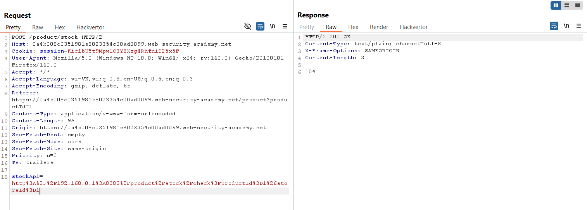
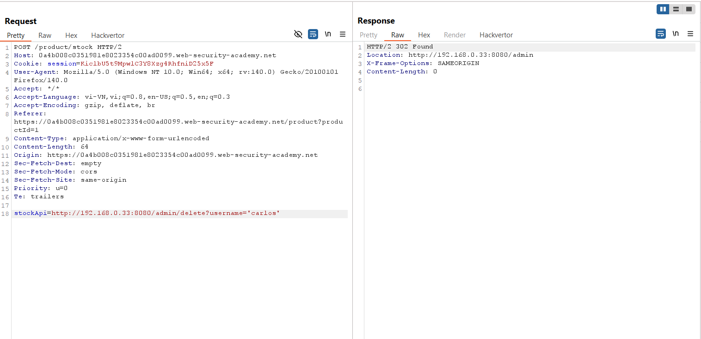

# Write-up: Basic SSRF against another back-end system

### Tổng quan
Khai thác lỗ hổng Server-Side Request Forgery (SSRF) trong chức năng kiểm tra kho hàng (stock check), quét dải IP nội bộ `192.168.0.1-255` để tìm admin panel tại `192.168.0.33:8080/admin`, sau đó sử dụng SSRF để xóa tài khoản `carlos` và hoàn thành lab.

### Mục tiêu
- Sử dụng chức năng check stock để quét dải IP nội bộ, tìm `admin panel`, và xóa tài khoản `carlos`.

### Công cụ sử dụng
- Burp Suite Community
- Firefox Browser

### Quy trình khai thác
1. **Thu thập thông tin (Reconnaissance)**
- Kiểm tra chức năng check stock trên giao diện web với một sản phẩm bất kỳ (ví dụ: productId=1).
- Trong Burp Suite Proxy, bắt được yêu cầu:
    
    - **Quan sát**: Tham số `stockApi` chứa URL gọi tới hệ thống nội bộ, gợi ý khả năng tồn tại lỗ hổng SSRF.

2. **Khai thác (Exploitation)**
- Gửi yêu cầu `POST /product/stock` tới Burp Intruder để quét dải IP nội bộ `192.168.0.1-255`:
    - Cấu hình payload:
        `stockApi=http://192.168.0.§1§:8080/admin`
    - Thiết lập vị trí payload tại §1§ với danh sách số từ 1-255.
    - **Phản hồi**: Tìm thấy admin panel tại `http://192.168.0.33:8080/admin` (dựa trên mã trạng thái hoặc nội dung trả về):
        

- Trong Burp Repeater, thay đổi tham số `stockApi` để xóa tài khoản `carlos`:
    ```
    stockApi=http://192.168.0.33:8080/admin/delete?username=carlos
    ```
    - **Phản hồi**: Tài khoản carlos bị xóa:
        

    - **Giải thích**: Lỗ hổng SSRF cho phép gửi yêu cầu tới hệ thống nội bộ (`192.168.0.33:8080`), truy cập endpoint admin và thực hiện hành động xóa tài khoản mà không cần xác thực.

- Hoàn thành lab:
    

### Bài học rút ra
- Hiểu cách khai thác lỗ hổng SSRF để quét và truy cập các hệ thống nội bộ, thực hiện hành động không được phép.
- Nhận thức tầm quan trọng của việc kiểm tra và lọc đầu vào URL trong các chức năng gọi API nội bộ để ngăn chặn SSRF.

### Tài liệu tham khảo
- PortSwigger: Server-Side Request Forgery (SSRF)
- OWASP: Server-Side Request Forgery

### Kết luận
Lab này cung cấp kinh nghiệm thực tiễn trong việc khai thác lỗ hổng SSRF, sử dụng Burp Intruder để quét dải IP nội bộ, truy cập admin panel, và xóa tài khoản mục tiêu. Xem portfolio đầy đủ tại https://github.com/Furu2805/Lab_PortSwigger.

*Viết bởi Toàn Lương, Tháng 7/2025.*