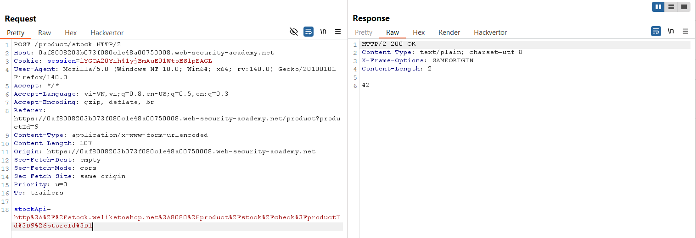
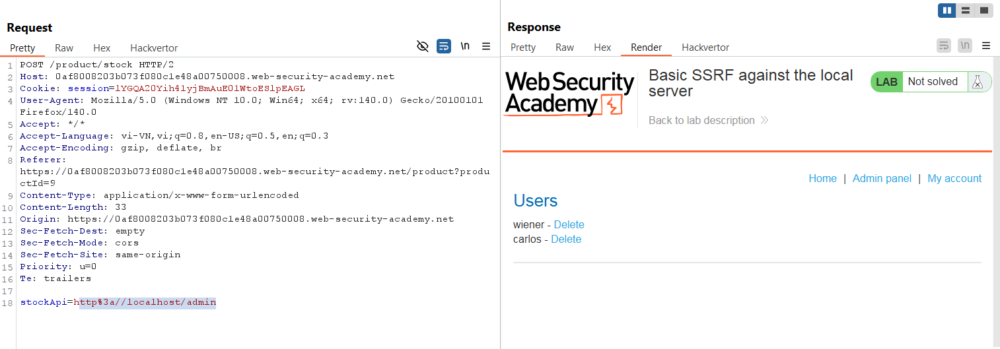
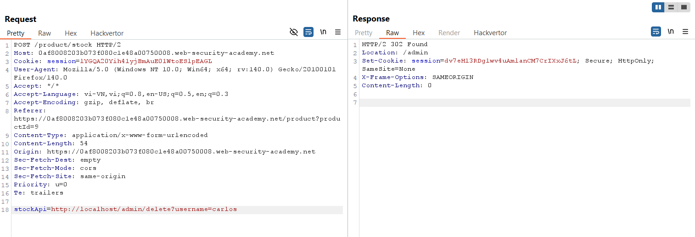

# Write-up: Basic SSRF against the local server

### Tổng quan
Khai thác lỗ hổng Server-Side Request Forgery (SSRF) trong chức năng kiểm tra kho hàng (stock check), thay đổi tham số `stockApi` để truy cập hệ thống nội bộ tại `http://localhost/admin`, sau đó xóa tài khoản `carlos` để hoàn thành lab.

### Mục tiêu
- Khai thác SSRF để truy cập admin panel tại `http://localhost/admin` và xóa tài khoản `carlos`

### Công cụ sử dụng
- Burp Suite Community
- Firefox Browser

### Quy trình khai thác
1. **Thu thập thông tin (Reconnaissance)**
- Kiểm tra chức năng check stock trên giao diện web với một sản phẩm bất kỳ (ví dụ: productId=1).
- Trong Burp Suite Proxy, bắt được yêu cầu:
    
    - **Quan sát**: Tham số `stockApi` chứa URL gọi tới hệ thống nội bộ, gợi ý khả năng tồn tại lỗ hổng SSRF

2. **Khai thác (Exploitation)**
- Gửi yêu cầu `POST /product/stock` tới Burp Repeater, thay đổi tham số `stockApi=http://localhost/admin`:
    - **Phản hồi**: Nhận được nội dung admin panel:
        

- Sửa tham số `stockApi` để xóa tài khoản `carlos`
    - **Phản hồi**: Tài khoản carlos bị xóa:
        

    - **Giải thích**: Lỗ hổng SSRF cho phép gửi yêu cầu tới hệ thống nội bộ (`localhost`), truy cập endpoint admin và thực hiện hành động xóa tài khoản mà không cần xác thực.

- Lab hoàn thành:
    

### Bài học rút ra
- Hiểu cách khai thác lỗ hổng SSRF để truy cập hệ thống nội bộ và thực hiện các hành động không được phép.
- Nhận thức tầm quan trọng của việc kiểm tra và lọc đầu vào URL trong các chức năng gọi API nội bộ để ngăn chặn SSRF.

### Tài liệu tham khảo
- PortSwigger: Server-Side Request Forgery (SSRF)
- OWASP: Server-Side Request Forgery

### Kết luận
Lab này cung cấp kinh nghiệm thực tiễn trong việc khai thác lỗ hổng SSRF, sử dụng Burp Repeater để thao túng yêu cầu tới hệ thống nội bộ, truy cập admin panel, và xóa tài khoản mục tiêu. Xem portfolio đầy đủ tại https://github.com/Furu2805/Lab_PortSwigger.

*Viết bởi Toàn Lương, Tháng 7/2025.*