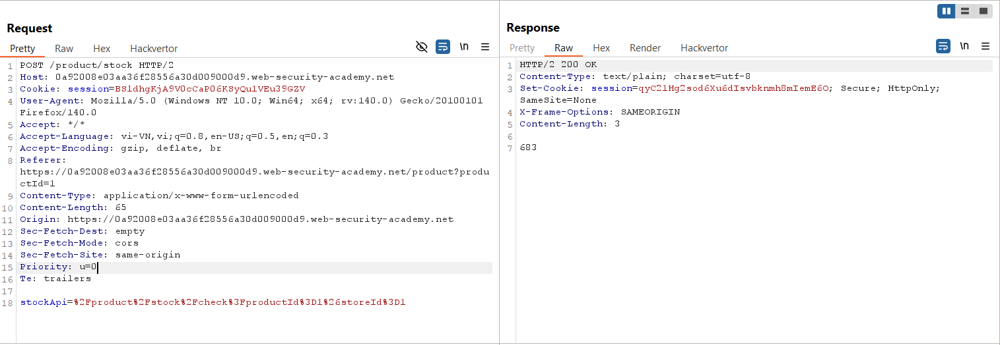
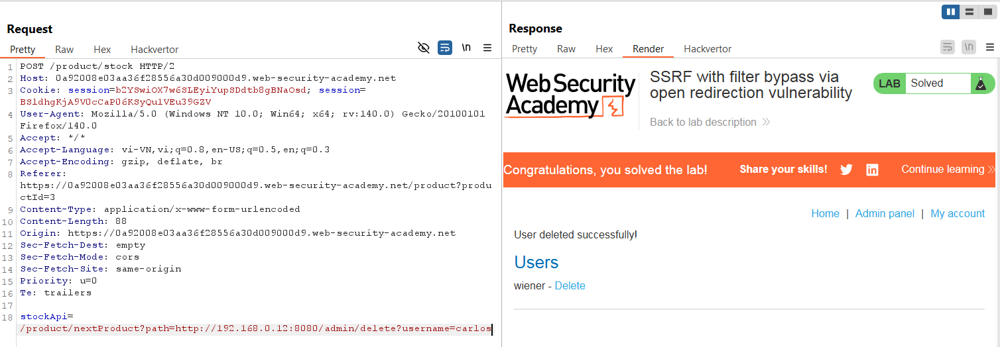

# Write-up: SSRF with filter bypass via open redirection vulnerability

### Tổng quan
Khai thác lỗ hổng Server-Side Request Forgery (SSRF) trong chức năng kiểm tra kho hàng (stock check), sử dụng lỗ hổng open redirection trong endpoint `/product/nextProduct` để bypass bộ lọc hạn chế truy cập nội bộ, truy cập admin panel tại `http://192.168.0.12:8080/admin`, và xóa tài khoản `carlos` để hoàn thành lab.

### Mục tiêu
- Tìm lỗ hổng open redirection để bypass bộ lọc SSRF, truy cập admin panel tại `http://192.168.0.12:8080/admin`, và xóa tài khoản `carlos`.

### Công cụ sử dụng
- Burp Suite Community
- Firefox Browser

### Quy trình khai thác
1. **Thu thập thông tin (Reconnaissance)**
- Kiểm tra chức năng check stock trên giao diện web với một sản phẩm bất kỳ
- Trong Burp Suite Proxy, bắt được yêu cầu:
    
    - **Quan sát**: Tham số **stockApi** chứa đường dẫn nội bộ, gợi ý khả năng tồn tại lỗ hổng SSRF nhưng bị hạn chế bởi bộ lọc:

- Thử thay đổi `stockApi` thành `http://192.168.0.12:8080/admin` trong Burp Repeater:
    
    - **Phản hồi**: `"Invalid external stock check URL 'Invalid URL'"`, xác nhận bộ lọc chặn truy cập bên ngoài.

- Kiểm tra chức năng `next product` tại `/product/nextProduct?currentProductId=2&path=/product?productId=3`:
    
    - **Quan sát**: Tham số `path` cho phép chuyển hướng tới đường dẫn bất kỳ, gợi ý lỗ hổng open redirection.

2. **Khai thác (Exploitation)**
- Sử dụng open redirection để bypass bộ lọc SSRF, thay đổi `stockApi` trong Burp Repeater:
    
    - Phản hồi: Nhận được nội dung admin panel:

- Sửa `stockApi` để xóa tài khoản carlos
    
    - **Phản hồi**: Tài khoản carlos bị xóa và hoàn thành lab.

### Bài học rút ra
- Hiểu cách khai thác lỗ hổng SSRF kết hợp với open redirection để bypass bộ lọc hạn chế truy cập hệ thống nội bộ.
- Nhận thức tầm quan trọng của việc kiểm tra chặt chẽ tham số URL và vô hiệu hóa chức năng chuyển hướng mở để ngăn chặn SSRF.

### Tài liệu tham khảo
- PortSwigger: Server-Side Request Forgery (SSRF)
- PortSwigger: Open Redirection

### Kết luận
Lab này cung cấp kinh nghiệm thực tiễn trong việc khai thác lỗ hổng SSRF kết hợp với open redirection, sử dụng Burp Repeater để bypass bộ lọc, truy cập hệ thống nội bộ, và xóa tài khoản mục tiêu. Xem portfolio đầy đủ tại https://github.com/Furu2805/Lab_PortSwigger.

*Viết bởi Toàn Lương, Tháng 7/2025.*