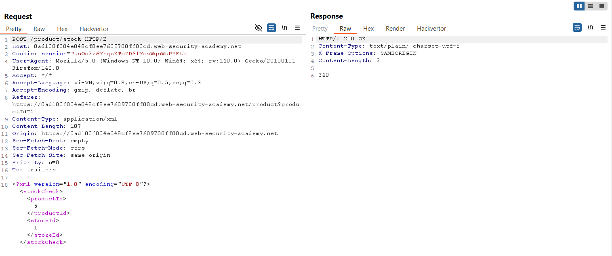
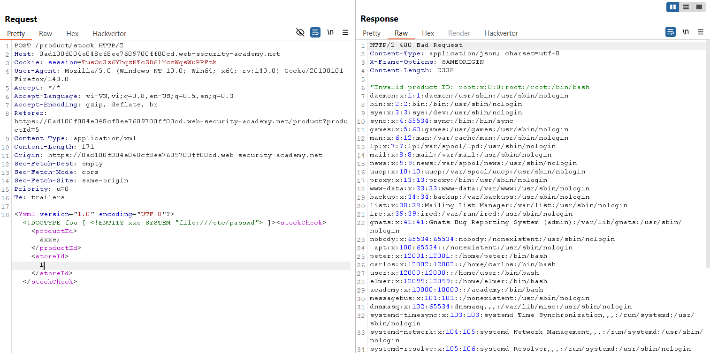
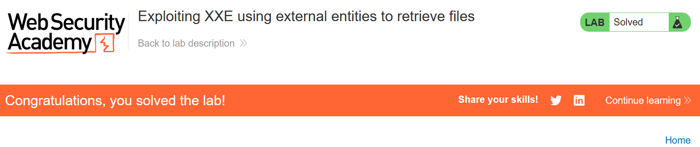

# Write-up: Exploiting XXE using external entities to retrieve files

### Tổng quan
Khai thác lỗ hổng XML External Entity (XXE) trong chức năng kiểm tra kho hàng (check stock), sử dụng external entity để đọc file nội bộ `/etc/passwd` từ server, tận dụng việc server xử lý XML không an toàn, và hoàn thành lab.

### Mục tiêu
- Inject XML external entity vào chức năng check stock để truy xuất nội dung file `/etc/passwd`.

### Công cụ sử dụng
- Burp Suite Community
- Firefox Browser

### Quy trình khai thác
1. **Thu thập thông tin (Reconnaissance)**
- Kiểm tra chức năng check stock trên giao diện web với một sản phẩm bất kỳ
- Trong Burp Suite Proxy, bắt được yêu cầu:
    
    - **Quan sát**: Yêu cầu gửi dữ liệu XML, gợi ý khả năng tồn tại lỗ hổng XXE do server xử lý XML:

2. **Khai thác (Exploitation)**
- Gửi yêu cầu `POST /product/stock` tới Burp Repeater, thêm external entity để đọc file `/etc/passwd`
    - **Phản hồi**: Server trả về lỗi `"Invalid product ID"` kèm nội dung file `/etc/passwd`
        
    - **Giải thích**: Lỗ hổng XXE cho phép sử dụng external entity &xxe; để truy xuất file nội bộ `/etc/passwd` do server không vô hiệu hóa xử lý external entities trong XML parser.

- Kiểm tra trạng thái lab:
    

### Bài học rút ra
- Hiểu cách khai thác lỗ hổng XXE bằng external entities để truy xuất file nội bộ trên server.
- Nhận thức tầm quan trọng của việc vô hiệu hóa xử lý external entities trong XML parser và kiểm tra đầu vào XML để ngăn chặn XXE.

### Tài liệu tham khảo
- PortSwigger: XML External Entity (XXE) Injection

### Kết luận
Lab này cung cấp kinh nghiệm thực tiễn trong việc khai thác lỗ hổng XXE, sử dụng Burp Repeater để inject external entity, truy xuất file nội bộ, và hiểu cách bảo vệ hệ thống khỏi XXE. Xem portfolio đầy đủ tại https://github.com/Furu2805/Lab_PortSwigger.

*Viết bởi Toàn Lương, Tháng 7/2025.*