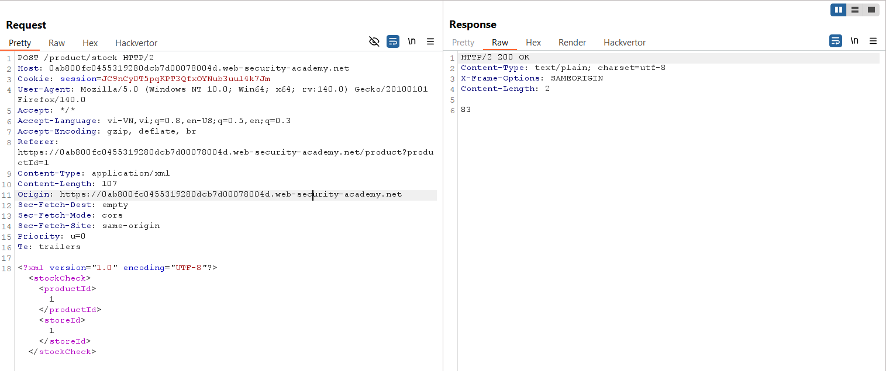
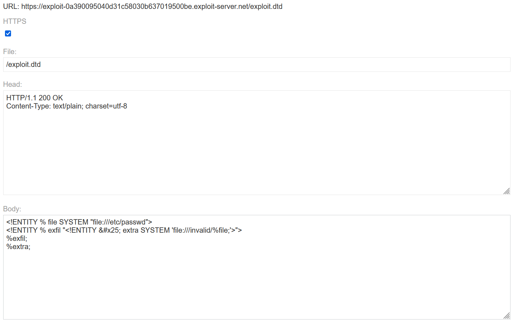
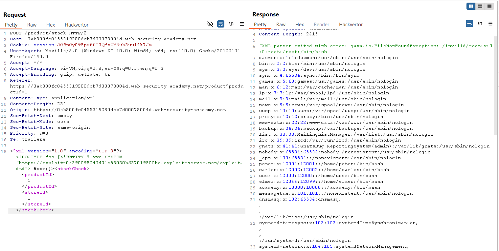
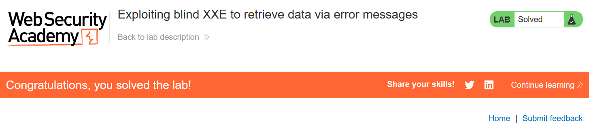

# Write-up: Exploiting blind XXE to retrieve data via error messages

### Tổng quan
Khai thác lỗ hổng Blind XML External Entity (XXE) trong chức năng kiểm tra kho hàng (check stock), sử dụng external DTD độc hại được host trên exploit server để kích hoạt lỗi hiển thị nội dung file `/etc/passwd`, tận dụng việc server xử lý XML không an toàn, và hoàn thành lab.

### Mục tiêu
- Inject external DTD qua XXE để kích hoạt lỗi chứa nội dung file `/etc/passwd`.

### Công cụ sử dụng
- Burp Suite Pro
- Firefox Browser
- Exploit Server (cung cấp bởi lab)

### Quy trình khai thác
1. **Thu thập thông tin (Reconnaissance)**
- Kiểm tra chức năng check stock trên giao diện web với một sản phẩm bất kỳ
- Trong Burp Suite Proxy, bắt được yêu cầu:
    
    - **Quan sát**: Yêu cầu gửi dữ liệu XML, gợi ý khả năng tồn tại lỗ hổng Blind XXE do server xử lý XML nhưng không hiển thị kết quả trực tiếp:

2. **Khai thác (Exploitation)**
- Tạo file DTD độc hại (exploit.dtd) và tải lên exploit server(ví dụ: `https://exploit-0a390095040d31c58030b637019500be.exploit-server.net/exploit.dtd`):
    
    - Giải thích DTD:
        - `<!ENTITY % file SYSTEM "file:///etc/passwd">`: Định nghĩa entity `file` để đọc nội dung file `/etc/passwd`
        - `<!ENTITY % eval "...">`: Định nghĩa entity `eval` để tạo entity `exfil` gửi nội dung `%file` qua HTTP tới domain Burp Collaborator.
        - `%eval; %exfil;`: Kích hoạt logic để gửi yêu cầu HTTP chứa nội dung `/etc/passwd`.

- Gửi yêu cầu `POST /product/stock` tới Burp Repeater, nhúng external DTD:
    
    - **Phản hồi**: Server trả về lỗi chứa nội dung file `/etc/passwd`

    - **Giải thích**: Lỗ hổng Blind XXE cho phép server tải DTD từ exploit server, thực thi entity để đọc `/etc/passwd` và gửi qua HTTP tới domain Collaborator (`ynpbs1fdonf8wjmjib9uq33iv910psdh.oastify.com`), kích hoạt lỗi hiển thị nội dung file do tham chiếu tới file không tồn tại.

- Kiểm tra trạng thái lab:
    

### Bài học rút ra
- Hiểu cách khai thác lỗ hổng Blind XXE bằng external DTD để đọc dữ liệu nội bộ và kích hoạt lỗi hiển thị dữ liệu qua out-of-band interaction.
- Nhận thức tầm quan trọng của việc vô hiệu hóa xử lý external entities và external DTD trong XML parser để ngăn chặn XXE.

### Tài liệu tham khảo
- PortSwigger: XML External Entity (XXE) Injection
- PortSwigger: Blind XXE vulnerabilities

### Kết luận
Lab này cung cấp kinh nghiệm thực tiễn trong việc khai thác Blind XXE bằng external DTD, sử dụng exploit server để đọc file nội bộ và kích hoạt lỗi hiển thị dữ liệu. Xem portfolio đầy đủ tại https://github.com/Furu2805/Lab_PortSwigger.

*Viết bởi Toàn Lương, Tháng 7/2025.*