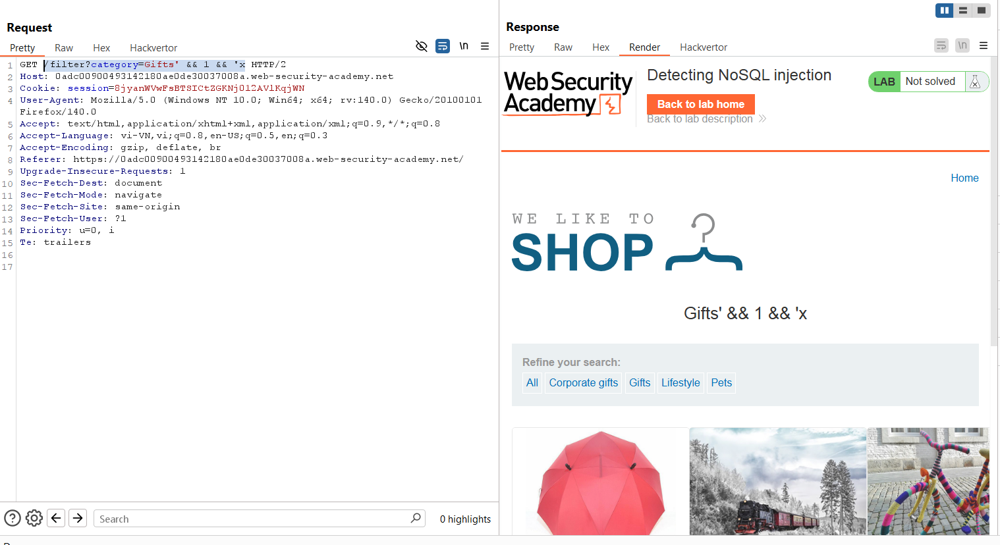
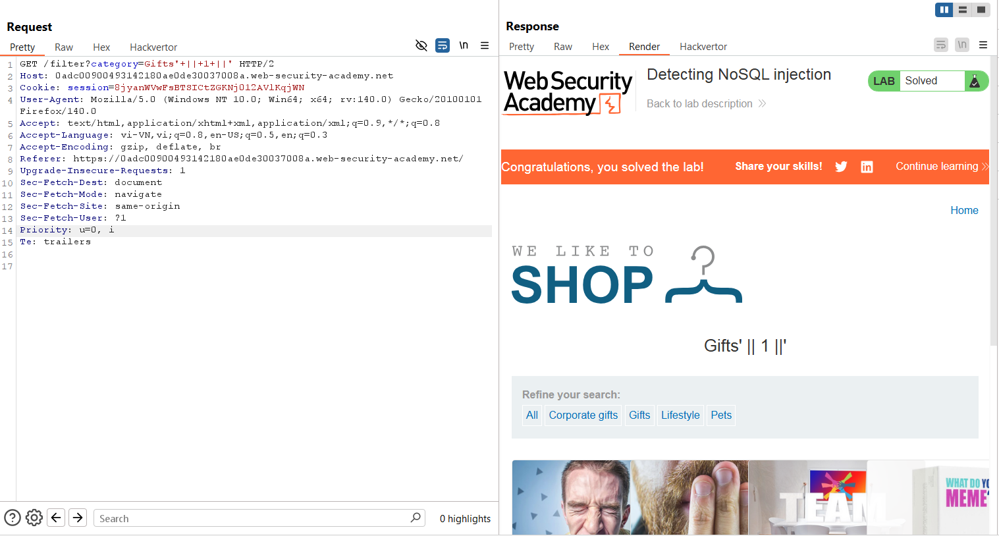

# Write-up: Detecting NoSQL injection

### Tổng quan
Khai thác lỗ hổng NoSQL injection trong chức năng lọc danh mục sản phẩm (filter category) của ứng dụng sử dụng MongoDB, tiêm payload để bypass logic lọc và hiển thị các sản phẩm chưa phát hành, hoàn thành lab.

### Mục tiêu
- Thực hiện tấn công NoSQL injection để hiển thị các sản phẩm chưa phát hành.

### Công cụ sử dụng
- Burp Suite Community
- Firefox Browser

### Quy trình khai thác
1. **Thu thập thông tin (Reconnaissance)**
- Kiểm tra chức năng lọc danh mục sản phẩm trên giao diện web với tham số category
- Trong Burp Suite Proxy, bắt được yêu cầu:
    ```
    GET /filter?category=Gifts HTTP/2
    Host: lab-id.web-security-academy.net
    ```
    - **Quan sát**: Ứng dụng sử dụng MongoDB NoSQL, gợi ý khả năng tồn tại lỗ hổng NoSQL injection trong tham số category

2. **Khai thác (Exploitation)**
- Gửi yêu cầu `GET /filter?category=Gifts` tới Burp Repeater, thử tiêm payload NoSQL injection:
    `GET /filter?category=Gifts' && 1 && 'x HTTP/2`
    - **Phản hồi**: Server trả về kết quả kèm điều kiện, xác nhận tham số `category` dễ bị NoSQL injection.
        

- Sửa payload để bypass logic lọc và hiển thị sản phẩm chưa phát hành:
    `GET /filter?category=Gifts' || 1 || ' HTTP/2`
    - **Phản hồi**: Server trả về danh sách sản phẩm, bao gồm các sản phẩm chưa phát hành:
        

### Bài học rút ra
- Hiểu cách khai thác lỗ hổng NoSQL injection trong MongoDB để bypass logic lọc và truy xuất dữ liệu không được phép.
- Nhận thức tầm quan trọng của việc xác thực và làm sạch input trong các ứng dụng sử dụng NoSQL database để ngăn chặn injection.

### Tài liệu tham khảo
- PortSwigger: NoSQL Injection

### Kết luận
Lab này cung cấp kinh nghiệm thực tiễn trong việc phát hiện và khai thác NoSQL injection trong MongoDB, bypass logic lọc để truy xuất dữ liệu nhạy cảm, và hiểu cách bảo vệ ứng dụng khỏi NoSQL injection. Xem portfolio đầy đủ tại https://github.com/Furu2805/Lab_PortSwigger.

*Viết bởi Toàn Lương, Tháng 7/2025.*