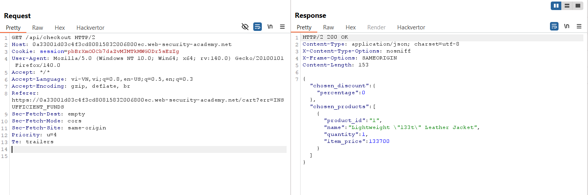
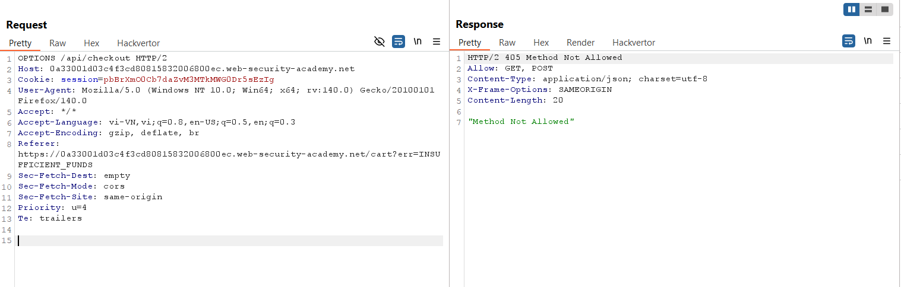
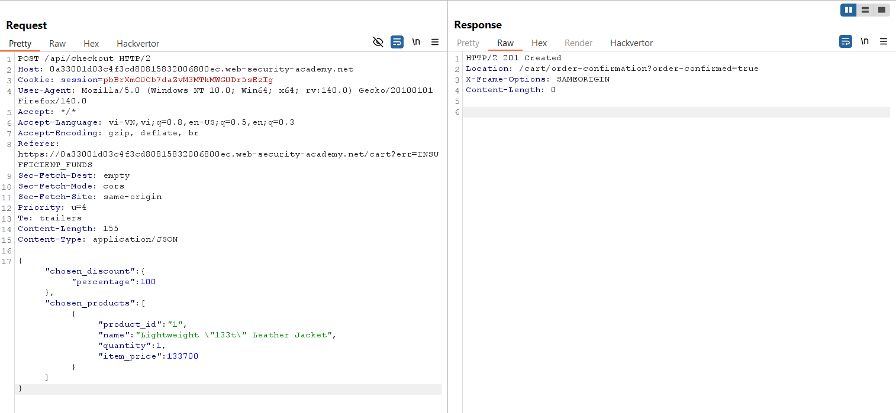
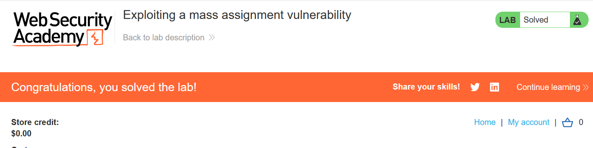

# Write-up: Exploiting a mass assignment vulnerability

### Tổng quan
Khai thác lỗ hổng mass assignment trong API endpoint `/api/checkout`, thêm tham số `chosen_discount` vào body JSON của yêu cầu `POST` để áp dụng giảm giá 100%, mua sản phẩm "Lightweight l33t Leather Jacket" với giá 0 và hoàn thành lab.

### Mục tiêu
- Khai thác lỗ hổng mass assignment để mua sản phẩm "Lightweight l33t Leather Jacket" với giá 0 bằng cách thao túng tham số giảm giá.

### Công cụ sử dụng
- Burp Suite Community
- Firefox Browser

### Quy trình khai thác
1. **Thu thập thông tin (Reconnaissance)**
- Đăng nhập tài khoản `wiener`:`peter` và thêm sản phẩm "Lightweight l33t Leather Jacket" vào giỏ hàng, thử thanh toán.
- Trong Burp Suite Proxy, quan sát yêu cầu khi thanh toán:  `GET /api/checkout`
    - **Phản hồi**: Thanh toán thất bại 
    - **Quan sát**: Endpoint `/api/checkout` xử lý thanh toán, gợi ý khả năng tồn tại lỗ hổng mass assignment:
        

2. **Khai thác (Exploitation)**
- Gửi yêu cầu `GET /api/checkout` tới Burp Repeater, thử kiểm tra các phương thức được hỗ trợ:
    - **Phản hồi**: Trả về header `Allow: GET, POST`, xác nhận endpoint hỗ trợ cả GET và POST.
        

- Sửa yêu cầu thành `POST` với body JSON, sửa giá trị của tham số `chosen_discount`: 
    ```
    {"chosen_discount":{"percentage":100},"chosen_products":[{"product_id":"1","name":"Lightweight \"l33t\" Leather Jacket","quantity":1,"item_price":133700}]}
    ```
    - **Phản hồi**: Thanh toán thành công, sản phẩm được mua với giá 0 do giảm giá 100%:
        
    - **Giải thích**: Lỗ hổng mass assignment cho phép thêm tham số `chosen_discount` vào body JSON, khiến server áp dụng giảm giá `100%` mà không kiểm tra quyền truy cập, do không có cơ chế xác thực hoặc lọc trường dữ liệu.
- Kiểm tra trạng thái lab:
    

### Bài học rút ra
- Hiểu cách khai thác lỗ hổng mass assignment trong API để thao túng các tham số không được kiểm soát, như chosen_discount, nhằm thay đổi logic ứng dụng.
- Nhận thức tầm quan trọng của việc kiểm tra và giới hạn các trường dữ liệu được phép trong API để ngăn chặn mass assignment.

### Tài liệu tham khảo
- PortSwigger: Mass Assignment

### Kết luận
Lab này cung cấp kinh nghiệm thực tiễn trong việc khai thác lỗ hổng mass assignment để bypass logic thanh toán, mua sản phẩm với giá 0, và hiểu cách bảo vệ API khỏi các cuộc tấn công tương tự. Xem portfolio đầy đủ tại https://github.com/Furu2805/Lab_PortSwigger.

*Viết bởi Toàn Lương, Tháng 7/2025.*