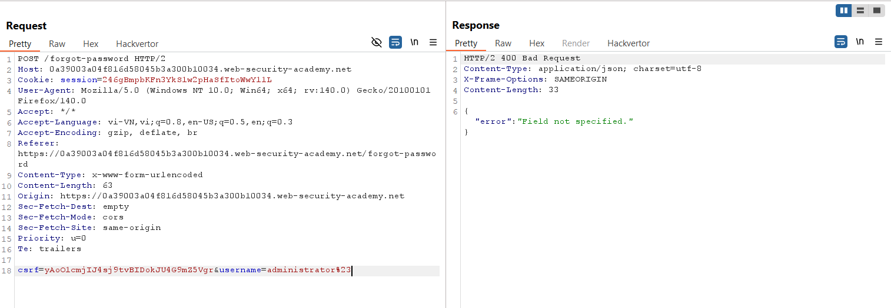
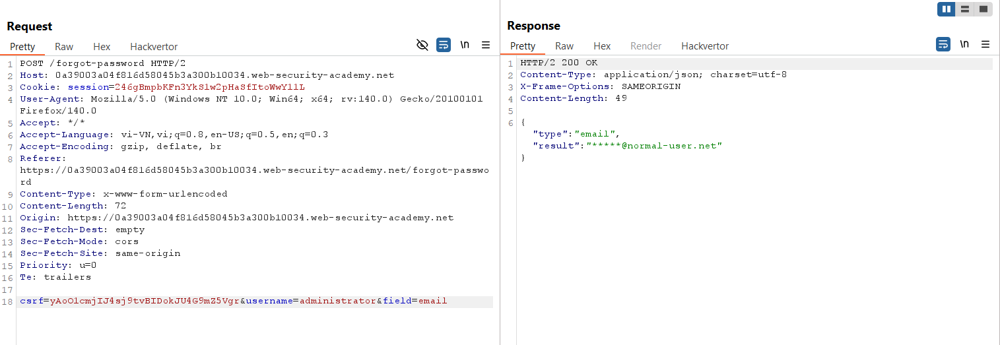
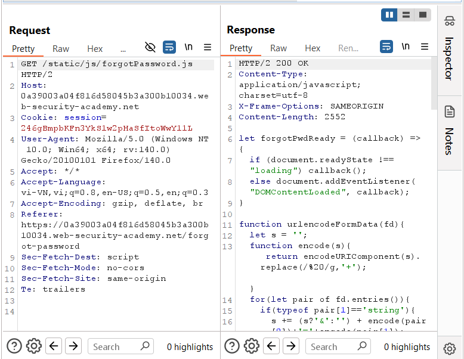
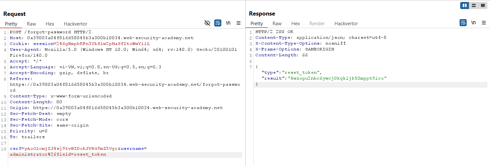
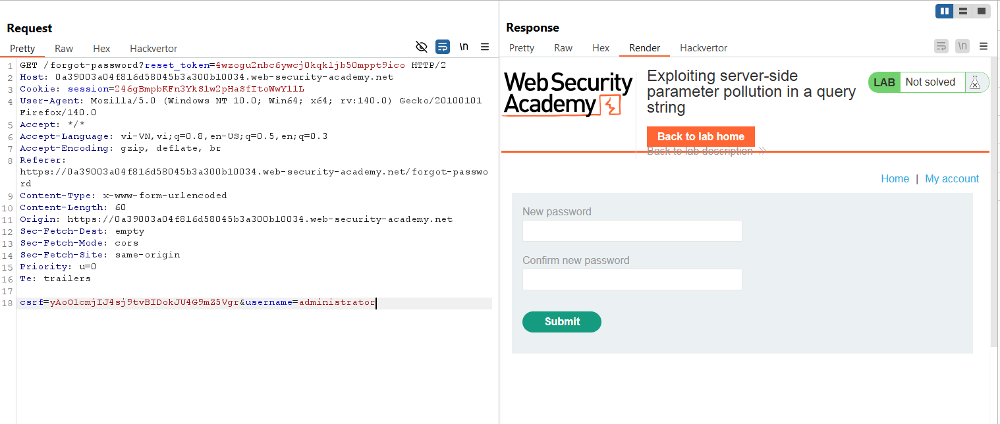
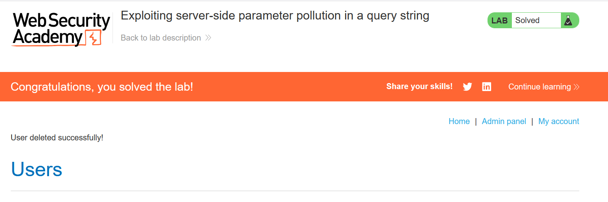

# Write-up: Exploiting server-side parameter pollution in a query string

### Tổng quan
Khai thác lỗ hổng server-side parameter pollution trong query string của yêu cầu `POST /forgot-password`, thao túng tham số `username` và `field` để truy xuất `reset_token` của tài khoản `administrator`, đổi mật khẩu, đăng nhập, xóa tài khoản `carlos` và hoàn thành lab.

### Mục tiêu
- Khai thác server-side parameter pollution để lấy reset_token của administrator, đổi mật khẩu, đăng nhập và xóa tài khoản carlos.

### Công cụ sử dụng
- Burp Suite Community
- Firefox Browser

### Quy trình khai thác
1. **Thu thập thông tin (Reconnaissance)**
- Kiểm tra chức năng quên mật khẩu, gửi yêu cầu:  
    - Gửi yêu cầu tới Burp Repeater, thử server-side parameter pollution: `username=administrator%23`
    - **Phản hồi**: `"error"`: `"Field not specified."`, gợi ý cần thêm tham số `field`:
        

- Thử thêm `field=email`: `username=administrator%26field=email`
    - **Phản hồi**: Trả về dữ liệu username và email, xác nhận tham số field hợp lệ:
        

- Kiểm tra file `/static/js/forgotPassword.js` trong Burp Proxy:
    
    - **Phản hồi**: Phát hiện tham số `reset_token` được sử dụng trong chức năng đổi mật khẩu.

2. **Khai thác (Exploitation)**
- Thử lấy `reset_token` của `administrator`: `username=administrator%26field=reset_token`
    - **Phản hồi**: Trả về `reset_token` là `4wzogu2nbc6ywcj0kqkljb50mppt9ico`:
        

- Sử dụng token để truy cập trang đổi mật khẩu: `GET /forgot-password?reset_token=4wzogu2nbc6ywcj0kqkljb50mppt9ico`
    - **Phản hồi**: Truy cập được trang đổi mật khẩu, đặt mật khẩu mới là `1111`:
        

- Đăng nhập tài khoản `administrator`:`1111`:
    - Truy cập admin panel, xóa tài khoản carlos và hoàn thành lab:
        

- **Giải thích**: Lỗ hổng server-side parameter pollution cho phép thao túng query string (`username` và `field`) để truy xuất `reset_token` từ endpoint nội bộ, do server không kiểm tra chặt chẽ input.

### Bài học rút ra
- Hiểu cách khai thác server-side parameter pollution trong query string để truy xuất dữ liệu nhạy cảm, như `reset_token`, từ endpoint nội bộ.
- Nhận thức tầm quan trọng của việc xác thực và làm sạch tham số trong query string để ngăn chặn parameter pollution.

### Tài liệu tham khảo
- PortSwigger: Server-Side Parameter Pollution

### Kết luận
Lab này cung cấp kinh nghiệm thực tiễn trong việc khai thác server-side parameter pollution để lấy token nhạy cảm, bypass xác thực, thực hiện hành động quản trị, và hiểu cách bảo vệ API khỏi các cuộc tấn công tương tự. Xem portfolio đầy đủ tại https://github.com/Furu2805/Lab_PortSwigger.

*Viết bởi Toàn Lương, Tháng 7/2025.*